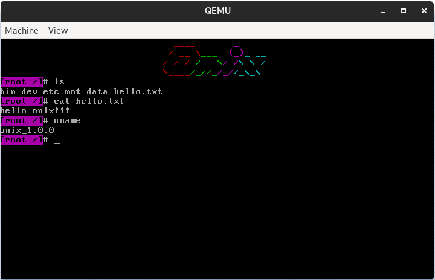

# Onix - 操作系统实现

- [本项目地址](https://github.com/StevenBaby/onix)

- [相关 bilibili 视频](https://www.bilibili.com/video/BV1gR4y1u7or/)

- [参考文献](./docs/others/参考文献.md)

## 问题及答案

> Pull Request 请提交到 dev 分支！！！

- [问题及答案](./docs/others/问题及答案%20(Question%20and%20Answer).md)
    - [gcc -m32 链接错误](./docs/others/问题及答案%20(Question%20and%20Answer).md#gcc--m32-%E9%93%BE%E6%8E%A5%E9%94%99%E8%AF%AF)
    - [无法调试汇编代码](./docs/others/问题及答案%20(Question%20and%20Answer).md#%E6%97%A0%E6%B3%95%E8%B0%83%E8%AF%95%E6%B1%87%E7%BC%96%E4%BB%A3%E7%A0%81)

## 相关软件版本参考

- bochs >= 2.7 [^bochs]
- qemu >= 6.2.0 [^qemu]
- gcc >= 11.2.0 [^gcc]
- gdb == 12.1 [^gdb]
- nasm == 2.15.05
- binutils >= 2.38
- vmware >= 16.1
- vscode == 1.74.3

## 参考

[^bochs]: <https://bochs.sourceforge.io>
[^qemu]: <https://www.qemu.org/docs/master/>
[^gcc]: <https://gcc.gnu.org/>
[^gdb]: <https://www.sourceware.org/gdb/>
[^nasm]: <https://www.nasm.us/>

