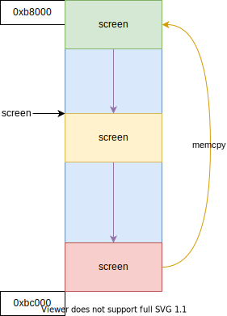

# 基础显卡驱动

## 显卡模式

- CGA (Color Graphics Adapter)
    - 图形模式
        - 160 * 100
        - 320 * 240
        - 640 * 200
    - 文本模式
        - 40 * 25
        - 80 * 25
- EGA (Enhanced Graphics Adapter)
- MCGA (Multi Color Graphics Array)

## CRTC (Cathode Ray Tube Controller)

CGA 使用的 MC6845 芯片；

- CRT 地址寄存器 0x3D4
- CRT 数据寄存器 0x3D5
- CRT 光标位置 - 高位 0xE
- CRT 光标位置 - 低位 0xF
- CRT 显示开始位置 - 高位 0xC
- CRT 显示开始位置 - 低位 0xD

## 控制字符

控制字符是指 ASCII 码表开头的 32 个字符 (0x00 ~ 0x1F) 以及 DEL(0x7F)；

通常一个指定类型的终端都会采用其中的一个子集作为控制字符，而其它的控制字符将不起作用。例如，对于 VT100 终端所采用的控制字符如下表所示：

| 控制字符 | 八进制 | 十六进制 | 描述                                                                 |
| -------- | ------ | -------- | -------------------------------------------------------------------- |
| NUL      | 0      | 0x00     | 在输入时忽略，不保存在输入缓冲中                                     |
| ENQ      | 5      | 0x05     | 传送应答消息                                                         |
| BEL      | 7      | 0x07     | 从键盘发声响                                                         |
| BS       | 10     | 0x08     | 将光标移向左边一个字符位置处；若光标已经处在左边沿，则无动作         |
| HT       | 11     | 0x09     | 将光标移到下一个制表位；若右侧已经没有制表位，则移到右边缘处         |
| LF       | 12     | 0x0A     | 此代码导致一个回车或换行操作                                         |
| VT       | 13     | 0x0B     | 作用如LF                                                             |
| FF       | 14     | 0x0C     | 作用如LF                                                             |
| CR       | 15     | 0x0D     | 将光标移到当前行的左边缘处                                           |
| SO       | 16     | 0x0E     | 使用由 SCS 控制序列设计的 G1 字符集                                  |
| SI       | 17     | 0x0F     | 选择 G0 字符集，由 ESC 序列选择                                      |
| XON      | 21     | 0x11     | 使终端重新进行传输                                                   |  |
| XOFF     | 23     | 0x13     | 使中断除发送 XOFF  和 XON 以外，停止发送其它所有代码                 |
| CAN      | 30     | 0x18     | 如果在控制序列期间发送，则序列不会执行而立刻终止，同时会显示出错字符 |
| SUB      | 32     | 0x1A     | 作用同 CAN                                                           |  |
| ESC      | 33     | 0x1B     | 产生一个控制序列                                                     |  |
| DEL      | 177    | 0x7F     | 在输入时忽略 不保存在输入缓冲中                                      |

## 滚屏操作

## 控制序列

控制序列已经由 ANSI(American National Standards Institute 美国国家标准局)制定为标准： X3.64-1977

控制序列是指由一些非控制字符构成的一个特殊字符序列，终端在收到这个序列时并不是将它们直接显示在屏幕上，而是采取一定的控制操作，比如：

- 移动光标
- 删除字符
- 删除行
- 插入字符
- 插入行

ANSI 控制序列由以下一些基本元素组成：

- 控制序列引入码(Control Sequence Introducer - CSI)：表示一个转移序列，提供辅助的控制并且本身是影响随后一系列连续字符含义解释的前缀。通常，一般 CSI 都使用 `ESC[`
- 参数(Parameter)：零个或多个数字字符组成的一个数值
- 数值参数(Numeric Parameter)：表示一个数的参数，使用 `n` 表示
- 选择参数(Selective Parameter)：用于从一功能子集中选择一个子功能，一般用 `s` 表示；通常，具有多个选择参数的一个控制序列所产生的作用，如同分立的几个控制序列；例如：`CSI sa;sb;sc F` 的作用是与 `CSI sa F CSI sb F CSI sc F` 完全一样的
- 参数字符串(Parameter String)：用分号 `;` 隔开的参数字符串
- 默认值(Default)：当没有明确指定一个值或者值是 0 的话，就会指定一个与功能相关的值
- 最后字符(Final character)：用于结束一个转义或控制序列

下图是一个控制序列的例子：取消所有字符的属性，然后开启下划线和反显属性。`ESC [ 0;4;7m`

下表是一些常用的控制序列列表，其中 E 表示 0x1B，如果 n 是 0 的话，则可以省略： `E[0j == E[J`

| 转义序列 | 功能                           |
| -------- | ------------------------------ |
| E[nA     | 光标上移 n 行                  |
| E[nB     | 光标下移 n 行                  |
| E[nC     | 光标右移 n 个字符位置          |
| E[nD     | 光标左移 n 个字符位置          |
| E[n`     | 光标移动到字符 n 位置          |
| E[na     | 光标右移 n 个字符位置          |
| E[nd     | 光标移动到行 n 上              |
| E[ne     | 光标下移 n 行                  |
| E[nF     | 光标上移 n 行，停在行开始处    |
| E[nE     | 光标下移 n 行，停在行开始处    |
| E[y;xH   | 光标移到 x,y 位置              |
| E[H      | 光标移到屏幕左上角             |
| E[y;xf   | 光标移到位置 x,y               |
| E[nZ     | 光标后移 n 制表位              |
| E[nL     | 插入 n 条空白行                |
| E[n@     | 插入 n 个空格字符              |
| E[nM     | 删除 n 行                      |
| E[nP     | 删除 n 个字符                  |
| E[nJ     | 檫除部分或全部显示字符         |
|          | n = 0 从光标处到屏幕底部；     |
|          | n = 1 从屏幕上端到光标处；     |
|          | n = 2 屏幕上所有字符           |
| E[s      | 保存光标位置                   |
| E[nK     | 删除部分或整行：               |
|          | n = 0 从光标处到行末端         |
|          | n = 1 从行开始到光标处         |
|          | n = 2 整行                     |
| E[nX     | 删除 n 个字符                  |
| E[nS     | 向上卷屏 n 行（屏幕下移）      |
| E[nT     | 向下卷屏 n 行（屏幕上移）      |
| E[nm     | 设置字符显示属性：             |
|          | n = 0 普通属性（无属性）       |
|          | n = 1 粗（bold）               |
|          | n = 4 下划线（underscore）     |
|          | n = 5 闪烁（blink）            |
|          | n = 7 反显（reverse）          |
|          | n = 3X 设置前台显示色彩        |
|          | n = 4X 设置后台显示色彩        |
|          | X = 0 黑 black X = 1 红 red    |
|          | X = 2 绿 green X = 3 棕 brown  |
|          | X = 4 蓝 blue X = 5 紫 magenta |
|          | X = 6 青 cyan X = 7 白 white   |
|          | 使用分号可以同时设置多个属性， |
|          | 例如：E[0;1;33;40m             |

## 参考文献

- <http://www.osdever.net/FreeVGA/home.htm>
- <http://www.osdever.net/FreeVGA/vga/crtcreg.htm>
- <https://bochs.sourceforge.io/techspec/PORTS.LST>
- <https://en.wikipedia.org/wiki/Color_Graphics_Adapter>
- <https://en.wikipedia.org/wiki/Enhanced_Graphics_Adapter>
- <https://en.wikipedia.org/wiki/Multi-Color_Graphics_Array>
- 赵炯 - 《Linux内核完全注释》
