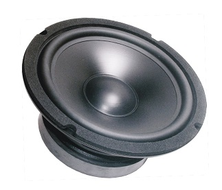

# 蜂鸣器

`\a\n`

## 扬声器

音频是录音设备在特定的时刻记录当时空气的张力值。

- 位数：音频张力量化位数，采样的精度。
- 采样率：每秒钟的采样数量，通常为 44100 Hz，或者 48000 Hz，人耳能听到的频率为 20 ~ 20000 Hz，而成年人一般只能听到 20 ~ 15000 Hz，所以根据 **奈奎斯特采样定律** 44100 Hz 的音频完全可以满足人耳的需要。采样率表示了，录音设备每秒采集数据的次数，也就是 bit 位数，每秒采集相应次数的数值，用来记录一秒内声音张力的变化；
- 声道：声轨的数量，一般位为单声道或者立体声；
- 码率（比特率）：每秒播放的字节数，可以估计出缓冲区大小，也就是 位数 * 采样率，一些编码方式可能有压缩，所以码率一般不是恒定的值；

----

PC Speaker 是 PC 兼容机中最原始的声音设备，特点是独特的蜂鸣效果，所以有时也被称为蜂鸣器；

扬声器有两种状态，输入和输出，状态可以通过键盘控制器中的端口号 `0x61` 设置，该寄存器结构如下：

| 位  | 描述            |
| --- | --------------- |
| 0   | 计数器 2 门有效 |
| 1   | 扬声器数据有效  |
| 2   | 通道校验有效    |
| 3   | 奇偶校验有效    |
| 4   | 保留            |
| 5   | 保留            |
| 6   | 通道错误        |
| 7   | 奇偶错误        |

需要将 0 ~ 1 位置为 1，然后计数器 2 设置成 方波模式，就可以播放方波的声音。

## 440 Hz

`A4 = 440Hz` 第一国际高度；

- 小提琴：GDAE
- 吉他：EADGBE
- 二胡：DA
- 琵琶：ADEA

## qemu 音频驱动

- ALSA
- coreaudio
- dsound
- oss
- PulseAudio
- SDL
- spice
- wav

## 参考文献

- <http://blog.ccyg.studio/article/593eaa9a-7457-4561-ad97-7fabacb6c05d/>
- <https://wiki.osdev.org/%228042%22_PS/2_Controller>
- <https://www.cs.usfca.edu/~cruse/cs630f08/lesson15.ppt>
- <https://wiki.osdev.org/PC_Speaker>
- <https://www.kraxel.org/blog/2020/01/qemu-sound-audiodev/>
- <https://www.qemu.org/docs/master/system/qemu-manpage.html>
- <https://www.freedesktop.org/wiki/Software/PulseAudio/>
