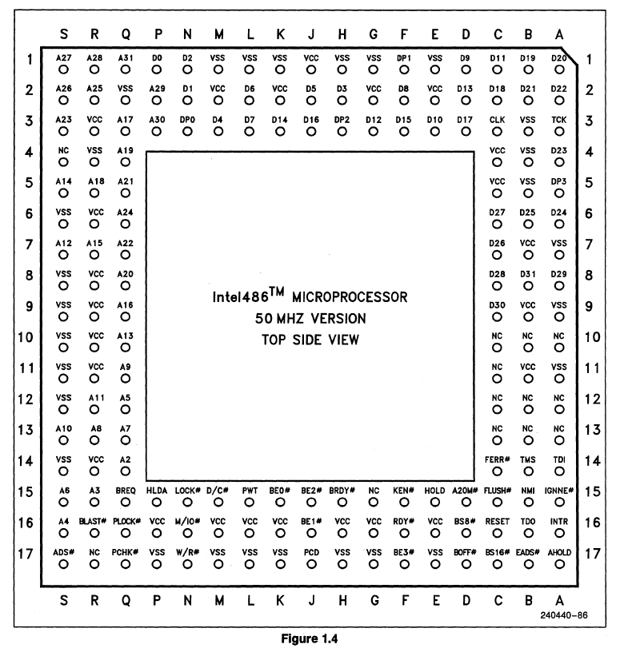
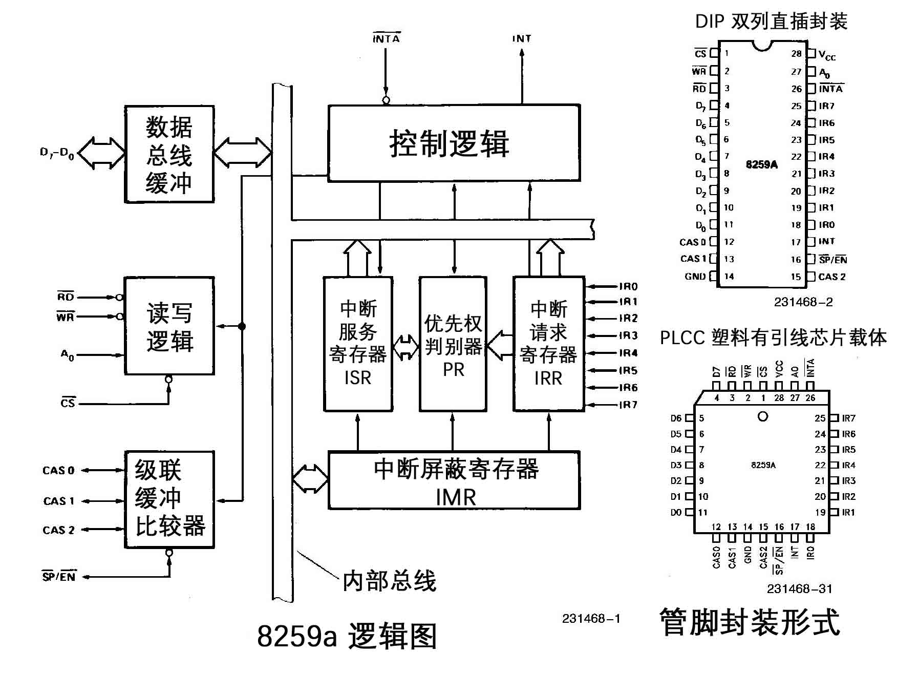

# 外中断原理

## 指令执行流程


- 取指：将 eip 指向的指令读入处理器
- 译码：将指令的微程序写入流水线 (多级 cache)
- 执行：执行指令
- 中断：处理中断

## EFLAGS 程序状态字


- IF: Interrupt Flag 外中断允许标志，CPU 外中断的总开关

```s
sti; 设置 IF 位 (set interrupt)，允许外中断
cli; 清除 IF 位 (clear interrupt)，禁止外中断

pushf; 将 elags 压入栈中
popf; 将栈顶弹出到 eflags
```

## 80486 CPU 引脚图



## 中断机制

PIC Programmable Interrupt Controller 可编程中断控制器

在使用 80x86 组成的 PC 机中，采用了两片 8259a 可编程中断控制芯片。每片可以管理 8 个中断源。通过多片的级联方式，能构成最多管理 64 个中断向量的系统。在 PC/AT 系列兼容机中，使用了两片 8259a 芯片，共可管理 15 个中断向量。其级连示意图下图所示。其中从芯片的 INT 引脚连接到主芯片的 IR2 引脚上。主 8259a 芯片的端口基地址是 0x20，从芯片是 0xa0；


可屏蔽中断是通过 INTR 信号线进入 CPU，一般可独立运行的外部设备，如打印机、声卡等，其发出的中断都是可屏蔽中断，都共享这一根 INTR 信号线通知 CPU。中断控制器 8259a 就是用来作中断仲裁的；

下面是 8259A 内部结构逻辑示意图：



- INT: 8259A 选出优先级最高的中断请求后，发信号通知 CPU；
- INTA: INT Acknowledge，中断响应信号，位于 8259A 中的 INTA 接收来自 CPU 的 INTA 接口的中断响应信号；
- IMR: Interrupt Mask Register，中断屏蔽寄存器，宽度是8 位，用来屏蔽某个外设的中断；
- IRR: Interrupt Request Register，中断请求寄存器，宽度是 8 位。它的作用是接受经过 IMR 寄存器过滤后的中断信号并锁存，此寄存器中全是等待处理的中断；
- PR: Priority Resolver，优先级仲裁器，当有多个中断同时发生，或当有新的中断请求进来时，将它与当前正在处理的中断进行比较，找出优先级更高的中断；
- ISR: In-Service Register，中断服务寄存器，宽度是 8 位，当某个中断正在被处理时，保存在此寄存器中；

以上介绍的寄存器都是 8 位，这是有意这样做的，其原因是 8259A 共 8 个 IRQ 接口，可以用 8 位寄存器中的每一位代表 8259A 的每个 IRQ 接口，类似于接口的位图，这样在后续的操作中，操作寄存器中的位便表示处理来自对应的 IRQ 接口的中断信号。

---

### 中断启动流程

当某个外设发出一个中断信号时，由于主板上已经将信号通路指向了 8259A 芯片的某个 IRQ 接口，所以该中断信号最终被送入了 8259A；

8259A 首先检查 IMR 寄存器中是否已经屏蔽了来自该 IRQ 接口的中断信号。IMR 寄存器中的位，为 1，则表示中断屏蔽，为 0，则表示中断放行；

如果该 IRQ 对应的相应位己经被置 1，即表示来自该 IRQ 接口上的中断已经被屏蔽了，则将该中断信号丢弃；否则，将其送入 IRR 寄存器，将该 IRQ 接口所在 IRR 寄存器中对应的位设为 1。IRR 寄存器的作用**相当于**待处理中断队列；

在某个恰当时机，优先级仲裁器 PR 会从 IRR 寄存器中挑选一个优先级最大的中断，此处的优先级决判很简单，就是 IRQ 接口号越低，优先级越大，所以 IRQ0 优先级最大；

之后，8259A 会在控制电路中，通过 INT 接口向 CPU 发送中断信号，信号被送入了 CPU 的中断接口；

当 CPU 将当前指令执行完后，进入中断检测的阶段，于是检测到有新的中断到来了；

于是，马上通过自己的 INTA 接口向 8259A 的 INTA 接口回复一个中断响应信号，表示现在 CPU 我已准备好啦，8259A 你可以继续后面的工作了；

8259A 在收到这个信号后，立即将刚才选出来的优先级最大的中断在ISR 寄存器中对应的位设为 1，此寄存器表示当前正在处理的中断，同时要将该中断从 **待处理中断队列** 寄存器 IRR 中去掉，也就是在IRR 中将该中断对应的位设为 0；

之后，CPU 将再次发送 INTA 信号给 8259A，这一次是想获取中断对应的中断向量号；

用起始中断向量号 + IRQ 接口号便是该设备的中断向量号，由此可见，外部设备虽然会发中断信号，但它并不知道还有中断向量号这回事，不知道自己会被中断代理 (如8259A) 分配一个这样的整数。

随后， 8259A 将此中断向量号通过系统数据总线发送给 CPU，CPU 从数据总线上拿到该中断向量号后，用它做中断向量表或中断描述符表中的索引，找到相应的中断处理程序井去执行；

----

### 中断处理流程

如果 8259A 的 EOI 通知 (End Of Interrupt) 被设置为非自动模式 (手工模式)，中断处理程序结束前必须向 8259A 发送 EOI；

8259A 在收到 EOI 后，将当前正处理的中断在 ISR 寄存器中对应的位设为 0；

如果 EOI 通知 被设置为自动模式，在刚才 8259A 接收到第二个INTA 信号后，也就是 CPU 向 8259A 要中断向量号的那个 INTA, 8259A 会自动将此中断在 ISR 寄存器中对应的位设为 0；

并不是进入了 ISR 后的中断就可以被 CPU 处理了，它还是有可能被后者换下来的。

比如，在 8259A 发送中断向量号给 CPU 之前，这时候又来了新的中断，如果它的来源 IRQ 接口号比 ISR 中的低，也就是优先级更高，原来 ISR 中准备上 CPU 处理的旧中断，其对应的位就得清 0，同时将它所在的 IRR 中的相应位恢复为 1，随后在 ISR 中将此优先级更高的新中断对应的位设为 1，然后将此新中断的中断向量号发给 CPU。如果新来的中断优先级较低，依然会被放进 IRR 寄存器中等待处理；

## 参考文献

1. [486_DX_Microprocessor_Data_Book_(October_1992)](https://en.wikichip.org/w/images/8/80/486_DX_Microprocessor_Data_Book_%28October_1992%29.pdf)
2. [Intel 8259a Datasheet](https://pdos.csail.mit.edu/6.828/2010/readings/hardware/8259A.pdf)
3. 赵炯 - 《Linux 内核完全注释》
4. 郑刚 - 《操作系统真象还原》
