# 中断上下文

## 目录

- 中断上下文
- 异常信息演示

## 中断上下文

```c++
// 用于省略函数的栈帧
#define _ofp __attribute__((optimize("omit-frame-pointer")))
```



## 参考文献

- <https://gcc.gnu.org/onlinedocs/gcc-4.7.0/gcc/Function-Attributes.html>
- <https://pdos.csail.mit.edu/6.828/2018/readings/i386/PUSHA.htm>
