# 内存管理初步

从 loader 的内存检测结果获取可用内存区域，操作形式尽可能兼容 grub multiboot

以下是目前的内存分布图：

- 386/486 内存分页是以 4K = 4096B = 0x1000B 为单位；
- 奔腾处理器引入了以 4M 为单位的页；

## 参考文献

- <https://www.gnu.org/software/grub/manual/multiboot2/multiboot.html>
- <https://en.wikipedia.org/wiki/Memory_management_unit>
