# 内存映射原理 (分页机制)

## 目录

- 原理
- 代码
- bochs 映射演示
- 缺页演示

## 内存管理机制

- 分段：
    - 内存描述符
    - 平坦模型：只分一个段，也就是不分段
- 分页：4KB

---

**内存映射机制图**



---

- 逻辑地址：程序访问的地址
- 线性地址：程序访问的地址 + 描述符中的基地址
- 物理地址：实际内存的位置
- 虚拟地址：虚拟内存的地址

平坦模型中，逻辑地址和线性地址是相同的；

内存映射是将线性地址转换成物理地址的过程；

---

## 内存分页

- 进程内存空间：程序员在编写程序的时候不知道具体运行的机器
- 虚拟内存：可以使用硬盘来模拟内存

由于一页内存是 4KB，32位总共可以访问 4G 的内存，于是将内存分成了 4G/4K = 1M 个页；

$$
1M = 1024 \times 1024 = 2^{10} \times 2^{10} = 2^{20}
$$

现在要做线性地址和物理地址的一一映射关系，这个映射关系存储在内存中，由于系统中没有 20bit 的数据结构，所以用 32bit 的数据结构来存，那么就需要一个如下的数组来存储：

```c++
u32 page_table[1 << 20];
```

其中 `1 << 20` 就是 1M， 由于总共有 1M 个页，一页占用了 4B，所以这个数组尺寸是 4M，这个数组也就是页表；

这个数组也存储在内存中，4M = 1024 * 4K，也就是需要 1024 个页来存储；

由于每个进程都需要一个页表来映射内存，如果直接用这种方式的话，每个进程都需要至少 4M 的内存来存储页表，但是，并不是所有的进程都用到所有 4G 的空间，所以这种方式很不划算，而且 386 的年代，内存比较小，显然不能这样干。

所以就有了页目录，用来表示这 1024 个页，用到了那些页，一页页表用 4B 表示，恰好是 4KB，页表 **恰好** 占用一页的内存；

如果进程只用到了很少的内存的话，就可以只用两个页来表示，这样可以表示 4M 的内存，一页页目录，一页页表，总共用到了 8K，比上面的 4M 节约了不少。当然，如果进程确实用到了全部 4G 的空间，那么就会比 4M 再多一页页目录，不过一般进程不会用到所有的内存，而且操作系统也不允许；

上面的恰好，实际上是有意设计的，之所以恰好，就是因为页的大小是 4KB，这也解释了为什么分页的大小是4KB，如果分成其他的大小，可能页表和页目录就不那么恰好了，当然 4M 的页也是恰好的，只需要一个页表就能表示全部的内存。

但是，分页，页表，页目录的这种策略也并不完全恰好，表示一页 20bit 就够了，但是却用了 32 bit，也就是说 12 bit 可以用来干别的事情；

事实上确实用来干别的事情了，用来表示这页内存的属性，这些属性如下：

**页表**


**页目录**


```c++
typedef struct page_entry_t
{
    u8 present : 1;  // 在内存中
    u8 write : 1;    // 0 只读 1 可读可写
    u8 user : 1;     // 1 所有人 0 超级用户 DPL < 3
    u8 pwt : 1;      // page write through 1 直写模式，0 回写模式
    u8 pcd : 1;      // page cache disable 禁止该页缓冲
    u8 accessed : 1; // 被访问过，用于统计使用频率
    u8 dirty : 1;    // 脏页，表示该页缓冲被写过
    u8 pat : 1;      // page attribute table 页大小 4K/4M
    u8 global : 1;   // 全局，所有进程都用到了，该页不刷新缓冲
    u8 ignored : 3;  // 该安排的都安排了，送给操作系统吧
    u32 index : 20;  // 页索引
} _packed page_entry_t;
```

这个结构体是有意构造的，恰好占 4 个字节，一页内存可以表示下面这样一个数组；

```c++
page_entry_t page_table[1024];
```

## 内存映射

---

**CR3 寄存器**  Control Register


---

**CR0 寄存器**


1. 首先准备一个页目录，若干页表
2. 将映射的地址写入页表，将页表写入页目录
3. 将页目录写入 cr3 寄存器
4. 将 cr0 最高位 (PG) 置为 1，启用分页机制

## Onix 实践

> 一个实际的要求就是 **映射完成后，低端 1M 的内存要映射的原来的位置**，因为内核放在那里，映射完成之后就可以继续执行了。

```c++
// 得到 cr3 寄存器
u32 get_cr3();

// 设置 cr3 寄存器，参数是页目录的地址
void set_cr3(u32 pde);

// 将 cr0 寄存器最高位 PG 置为 1，启用分页
static void enable_page();
```

- 思考：如何在分页启用时 修改 页目录 和 页表？

## 关键词

- 快表：Translation Lookaside Buffers(TLB)
- 页目录 (Page Directory)
- 页表 (Page Table)
- 页框 (Page Frame)：就是映射的页

## 参考文献

- Intel® 64 and IA-32 Architectures Software Developer's Manual Volume 3 Chapter 4 Paging
- <https://en.wikipedia.org/wiki/I386>
