# 内核内存映射

## 目录

- 内存映射
- bochs 页映射调试

---

```c++
// 将最后一个页表指向页目录自己，方便修改
// 不过，这样会浪费掉最后 4M 的线性地址空间，只能用来管理页表；
page_entry_t *entry = &pde[1023];
entry_init(entry, IDX(KERNEL_PAGE_DIR));
```

将前 8M 的内存映射到，自已原先的位置，供内核使用；



映射完成之后的页面分布：



## 刷新快表

- `mov cr3, eax`
- `invlpg`

```c++
// 刷新虚拟地址 vaddr 的 快表 TLB
static void flush_tlb(u32 vaddr)
{
    asm volatile("invlpg (%0)" ::"r"(vaddr)
                 : "memory");
}
```

----

## 参考文献

- 郑刚 - 《操作系统真象还原》，人民邮电出版社
- <https://wiki.osdev.org/TLB>
- <https://www.felixcloutier.com/x86/invlpg>
