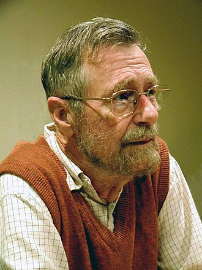

# 互斥和信号量

## 原子操作（单处理机）

在单处理机系统中，单个指令总是原子的，所以对于单指令例如 `xchg` 或者 `inc` 等都是原子的。

但，如果一个操作需要多个 CPU 指令，由于每条指令结束之后都可能发生中断，而发生上下文切换，那么这个操作就可能不会很好的完成。所以就可能需要加锁机制来防止这种情况发生。但加锁很可能不高效，所以为了执行原子操作的指令序列，有时候禁止中断可能反而更高效。

## 信号量

信号量是一种最古老而且应用最广泛的保证互斥的方法，此概念是由荷兰人 E.W.Dijkstra 在 1965 年提出的，其原型来自于铁路上的信号灯。计算机中信号量是个整数值，由于 Dijkstra 是荷兰人，他用 P(Proberen) 尝试减少 和 V(Verhogen) 增加，来表示信号的变化，但 PV 操作语义并不明显，因此这里使用 `up` 和 `down` 来表示对信号量的增减，当然也有人使用 `wait` 和 `signal` 来表示信号量的操作。

## 互斥量

当信号量使用 0/1 二值来表示时，就是互斥量，表示临界区只能有一个进程可以取得。

```c++
typedef struct mutex_t
{
    bool value;     // 信号量
    list_t waiters; // 等待队列
} mutex_t;

void mutex_init(mutex_t *mutex);   // 初始化互斥量
void mutex_lock(mutex_t *mutex);   // 尝试持有互斥量
void mutex_unlock(mutex_t *mutex); // 释放互斥量
```

## Dijkstra



The academic study of concurrent computing started in the 1960s, with Dijkstra (1965) credited with being the first paper in this field, identifying and solving the **mutual exclusion problem**. He was also one of the early pioneers of the research on principles of d**istributed computing**. His foundational work on concurrency, semaphores, mutual exclusion, deadlock (deadly embrace), finding **shortest paths in graphs**, fault-tolerance, **self-stabilization**, among many other contributions comprises many of the pillars upon which the field of distributed computing is built. Shortly before his death in 2002, he received the ACM PODC Influential-Paper Award in distributed computing for his work on self-stabilization of program computation. This annual award was renamed the Dijkstra Prize (Edsger W. Dijkstra Prize in Distributed Computing) the following year. As the prize, sponsored jointly by the Association for Computing Machinery (ACM) Symposium on Principles of Distributed Computing (PODC) and the European Association for Theoretical Computer Science (EATCS) International Symposium on Distributed Computing (DISC), recognizes that "No other individual has had a larger influence on research in principles of distributed computing".

## 参考文献

1. <https://en.wikipedia.org/wiki/Edsger_W._Dijkstra>
2. <https://wiki.osdev.org/Atomic_operation>
3. <https://wiki.osdev.org/Synchronization_Primitives>
4. <https://wiki.osdev.org/Mutual_Exclusion>
5. <https://wiki.osdev.org/Semaphore>
6. [郑刚 / 操作系统真象还原 / 人民邮电出版社 / 2016](https://book.douban.com/subject/26745156/)
