# 信号

## 信号简介

在 UNIX 系统中，信号是一种 **软件中断** 处理机制。信号机制提供了一种处理异步事件的方法。例如，

1. 用户在终端键盘上键入 `CTRL+C` 组合键来终止一个程序的执行。该操作就会产生一个 `SIGINT` (SIGnal INTerrupt) 信号，并被发送到当前前台执行的进程中；
2. 当进程设置了一个报警时钟，到期时，系统就会向进程发送一个 `SIGALRM` 信号；
3. 当发生硬件异常时，系统也会向正在执行的进程发送相应的信号；
4. 另外，一个进程也可以向另一个进程发送信号，使用 `kill()` 函数向同组的子进程发送终止执行信号。

通常使用一个 32 位无符号长整数，中的比特位表示各种不同信号（一种位图结构），因此最多可表示 32 个不同的信号。

## 信号处理方式

对于进程来说，当收到一个信号时，可以由三种不同的处理或操作方式。
1. 忽略该信号：
    大多数信号都可以被进程忽略。但有两个信号忽略不掉：`SIGKILL` 和 `SIGSTOP`。不能被忽略掉的原因是能为超级用户提供一个确定的方法来终止或停止指定的任何进程。另外，若忽略掉某些硬件异常而产生的信号（如除0错误），则进程的行为或状态就可能变得不可知了。
2. 捕获该信号：
    为了进行该操作，我们必须首先告诉内核在指定的信号发生时调用我们自定义的信号处理函数。在该处理函数中，我们可以做任何操作，当然也可以什么不做，起到忽略该信号的同样作用。自定义信号处理函数来捕获信号的一个例子是：如果我们在程序执行过程中创建了一些临时文件，那么我们就可以定义一个函数来捕获 `SIGTERM`（终止执行）信号，并在该函数中做一些清理临时文件的工作。`SIGTERM` 信号是 `kill` 命令发送的默认信号。
3. 执行默认操作：
    内核为每种信号都提供一种默认操作。通常这些默认操作就是终止进程的执行。

## 信号处理流程

```c++
 // 信号处理函数
void sig_handler(int signr)
{
    // 为处理下一次信号发生
    // 重新设置自己的处理函数
    signal(SIGINT, sig_handler); 
    // 信号处理的内容
}

int main ()
{
    // 主程序中设置自己的信号处理函数
    signal(SIGINT, sig_handler); 
    // 主程序其他内容
}
```




## 参考

- 赵炯 / Linux内核完全注释 / 机械工业出版社 / 2005