# 系统调用 mmap,munmap

目前的内存布局：



实现系统调用，以调整文件映射内存。

```c++
void *mmap(void *addr, size_t length, int prot, int flags, int fd, off_t offset);
int munmap(void *addr, size_t length);
```

Linux 系统 `mmap` 支持的参数比较多，可以参考相关文档，这里只实现 **共享内存** 和 私有内存。

## 参考

- <https://man7.org/linux/man-pages/man2/mmap.2.html>
- <https://www.open-std.org/jtc1/sc22/open/n4217.pdf>
