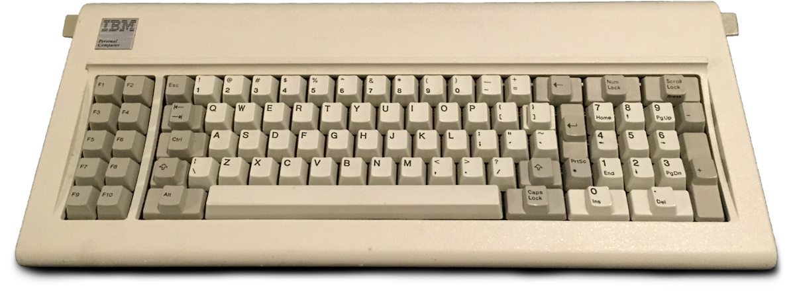
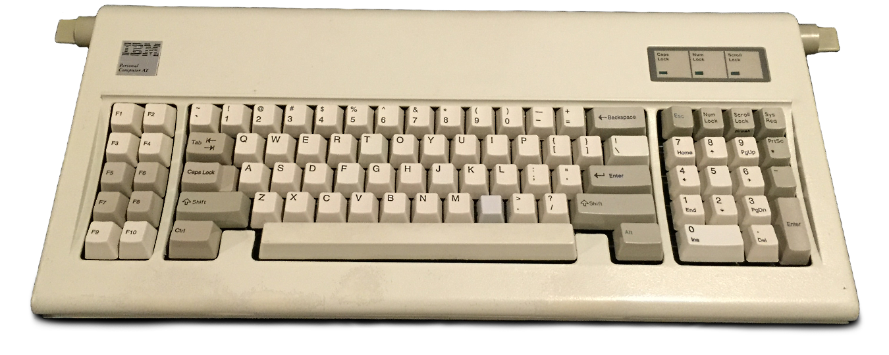
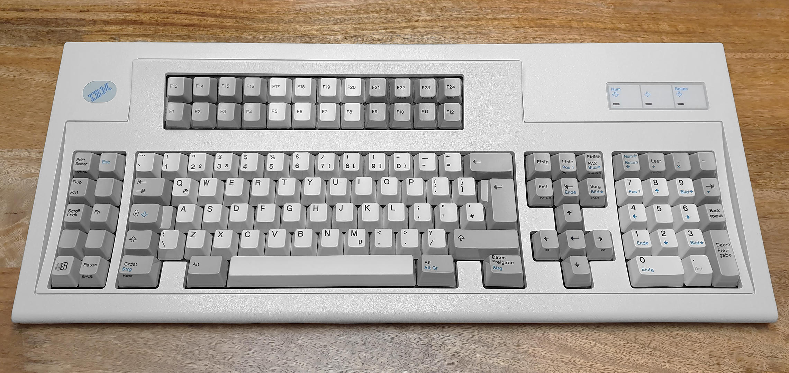
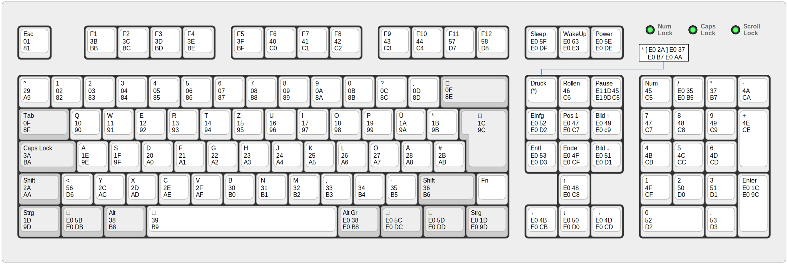

# 键盘驱动

PS/2 键盘控制器是一个独立的设备，早期内部通常是 Intel 8042 或兼容芯片，现在是高级集成外设 (Advanced Integrated Peripheral) 的一部分。名字可能有些误导，因为 8042 除了键盘控制器以外，还有很多其他的功能，比如：

- 系统重置
- A20 线控制器

## 键盘扫描码

键盘扫描码是按键对应的编码方式，根据不同的编码方案，键盘扫描码有三种：

- scan code 1
- scan code 2
- scan code 3

第一套扫描码是最早的键盘使用的，他就是 XT 键盘使用的扫描码，XT 键盘如下图所示：

第二套扫描码，也就是现在使用的扫描码，用在 AT 键盘上，AT 键盘如下图所示，第二套扫描码的控制器是 8048：

第三套扫描码用在 IBM PS/2 系列高端计算机所用的键盘上，还有一些商业版 UNIX 系统的计算机也用到它，不过这种键盘如今很少看到了，因此第三套扫描码也几乎很少用到，这种键盘如下图所示：

所以，第二套扫描码几乎是目前使用键盘的标准，因此大多数键盘向 8042 发送的扫描码都是第二套扫描码；

----

第一套键盘扫描码：

键盘扫描码分为：

- 通码：按下按键产生的扫描码
- 断码：抬起按键产生的扫描码

## 转换

最初的 IBM-PC 键盘使用 XT 键盘，使用第一套键盘扫描码，新的 AT 键盘使用第二套扫描码，这种变化产生了兼容性的问题，不同的键盘会产生不同的扫描码，为了避免这种兼容性的问题，键盘控制器支持转换模式，如果控制器转换有效，就会将第二套扫描码转换成第一套扫描码；无论扫描码转换是否有效，都无法利用软件来得到原始的扫描码，也就是说，如果通过控制器接收到了一个字节 `0xb5`，你是无法知道原始数据是不是 `0xb5`；如果软件希望使用第二套扫描码，或者第三套扫描码，就需要禁用这种转换。

键盘默认是开启这种转换的，所以程序员只需要处理第一套键盘扫描码。

## 8042 控制器

| 端口 | 操作类型 | 用途       |
| ---- | -------- | ---------- |
| 0x60 | 读/写    | 数据端口   |
| 0x64 | 读       | 状态寄存器 |
| 0x64 | 写       | 控制寄存器 |

数据端口用于读取数据和写入数据；

状态寄存器：

0. 输出缓冲区状态：1 表示输出缓冲区满
1. 输入缓冲区状态：1 表示输入缓冲区满
2. 系统标志位：加电时置为 0，自检通过时置为 1
3. 命令/数据位：1 表示输入缓冲区的内容是命令，0 表示输入缓冲区的内容是数据
4. 1 表示键盘启用，0 表示键盘禁用
5. 1 表示发送超时 （存疑）
6. 1 表示接受超时 （存疑）
7. 奇偶校验出错

控制寄存器：用不上，见参考文献；

## 参考文献

- <https://www.win.tue.nl/~aeb/linux/kbd/scancodes-1.html>
- <https://wiki.osdev.org/PS/2_Keyboard>
- <https://wiki.osdev.org/PS/2>
- <https://wiki.osdev.org/%228042%22_PS/2_Controller>
- [郑刚 / 操作系统真象还原 / 人民邮电出版社 / 2016](https://book.douban.com/subject/26745156/)
- <https://www.ceibo.com/eng/datasheets/Intel-8048-8049-8050-plcc-dip.pdf>
- <http://www.mcamafia.de/pdf/pdfref.htm>
- <http://www.mcamafia.de/pdf/ibm_hitrc07.pdf>
- <https://en.wikipedia.org/wiki/Scancode>
