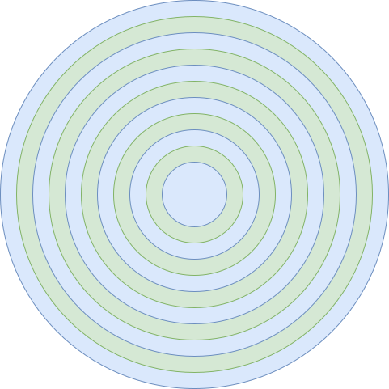

# 磁盘调度电梯算法

由于磁盘性能的主要瓶颈在磁盘的寻道时间，也就是磁头臂的移动时间，所以要尽可能避免磁头臂的移动。电梯算法的作用是让磁头的综合移动距离最小，从而改善磁盘访问时间。

## LBA 和 CHS

-  LBA (Logical Block Addressing)：逻辑块寻址，逻辑上认为磁盘的扇区编号从 0 开始依次递增，处理起来更方便；
-  Sector: 扇区，磁盘最小的单位，多个扇区够称一个磁道
-  Head: 磁头，用于读写盘面，一个磁盘可能有多个磁头，一个磁道读写完成，就换另一个磁头；
-  Cylinder：柱面，或者也可以认为是磁道 (Track)，同一个位置的所有磁道共同构成了柱面；当所有磁道都读写完时，就需要切换磁道，也就产生了寻道的问题。因此柱面是磁盘读写最大的单位。

下面是 LBA 和 CHS 的转换公式：

- CYL = LBA / (HPC * SPT)

- HEAD = (LBA % (HPC * SPT)) / SPT

- SECT = (LBA % (HPC * SPT)) % SPT + 1

- LBA = ( ( CYL * HPC + HEAD ) * SPT ) + SECT - 1

其中：

- CYL 表示柱面 (Cylinder)
- HEAD 表示磁头 (Head)
- SECT 表示扇区 (Sector)
- LBA 表示逻辑块地址 (Logical Block Addressing)
- HPC 表示柱面磁头数 (Head Per Cylinder)
- SPT 表示磁道扇区数 (Sector Per Track)

## 参考文献

1. [赵炯 / Linux内核完全注释 / 机械工业出版社 / 2005](https://book.douban.com/subject/1231236/)
2. <https://en.wikipedia.org/wiki/Elevator_algorithm>
