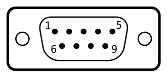
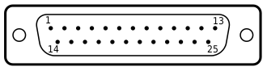

# 串口设备驱动

串口 [^serial] 是一种 IBM-PC 兼容机上的传统通信端口，使用串口连接外设已经被如 USB(Universial Serial Bus) 等新的通信方式所取代，不过串口仍然广泛应用于工业硬件领域，如数控机床 (CNC Computer Numerical Control)，和商业设备如 POS(Point of Sale) 机，历史上很多拨号上网的调制解调器（猫）通常以串口连接计算机通信，UART 硬件芯片底层反应了这一点。

PC 微机的串行通信使用的异步串行通信芯片是 INS 8250 或 NS16450 兼容芯片，统称为 UART(Universial Asynchronous Receiver/Transceiver 通用异步接收发送器)。负责串口的编码和解码工作，现代串口通常使用 RS-232 标准 [^rs232]，可以使用很多不同的连接器，DE-9 [^ds] 接口是现代系统应用最广泛的串口连接器。

| 接口  | 示例图                                   |
| ----- | ---------------------------------------- |
| DE-9  |  |
| DB-25 |     |


串口驱动对系统开发者来说实现起来要比 USB 简单的多，**通常用于调试的目的**，无需复杂的硬件操作，可以在操作系统初始化的早期使用串口。

## 串口编程

对 UART 的编程实际上是对其内部寄存器执行读写操作。因此可将 UART 看作是一组寄存器集合，包含发送、接收和控制三部分。UART 内部有 10 个寄存器，供 CPU 通过 `in/out` 指令对其进行访问。

## 端口

大多数情况下，前两个串口的端口地址是固定的，当然计算机可能有更多的串口，但之后端口地址就不可靠了。

- 0x3F8 ~ 0x3fE 对应 COM1 串口
- 0x2F8 ~ 0x2FE 对应 COM2 串口

一旦有了 COM 端口的基址，就可以加一个偏移值来访问其中的一个数据寄存器，其中一个寄存器保存着条件 DLAB(Divisor Latch Access Bit) 是除数锁存访问位，是 线控制寄存器 的位 7，当该位 置位时，偏移量 0 和 1 被映射到设置端口波特率的除数寄存器的低字节和高字节。当该位清除时，偏移量 0 和 1 被映射到他们正常的寄存器，DLAB 位只影响前两个寄存器，其他寄存器会忽略此设置。详细端口如下所示：

| 偏移 | DLAB | 描述                             |
| ---- | ---- | -------------------------------- |
| 0    | 0    | 读写数据                         |
| 0    | 1    | 读/写 波特率因子低字节 (LSB)     |
| 1    | 0    | 读写中断允许寄存器               |
| 1    | 1    | 读/写 波特率因子高字节 (MSB)     |
| 2    | -    | 中断识别和 IO 控制寄存器         |
| 3    | -    | 线控制寄存器，最重要的是 DLAB 位 |
| 4    | -    | 调制解调器控制寄存器             |
| 5    | -    | 线状态寄存器                     |
| 6    | -    | 调制解调器状态寄存器             |
| 7    | -    | 暂存寄存器                       |

---

### 寄存器 1 DLAB = 0 中断允许寄存器

要在中断模式下与串口通信，必须正确设置中断允许寄存器(见上表)。为了确定应该启用哪些中断，必须将具有以下位的值 (0 = disabled, 1 = enabled) 写入中断允许寄存器:

| 位   | 描述      |
| ---- | --------- |
| 0    | 数据可用  |
| 1    | 传输器空  |
| 2    | 中断/错误 |
| 3    | 状态变化  |
| 其他 | 保留      |

---

### 寄存器 2 中断识别和 FIFO 控制寄存器

  - 位 0：
      - 0：有待处理中断
      - 1：无中断
  - 位 2 ~ 1：
      - 11 接收状态有错中断，优先级最高
      - 10 已接收到数据中断，优先级第 2
      - 01 发送保持寄存器空中断，优先级第 3
      - 00 调制解调器状态改变中断，优先级第 4
  - 其他：保留

---

### 寄存器 3 线控制寄存器

通过线路传输的串行数据可以设置许多不同的参数。通常，发送设备和接收设备要求向每个串行控制器写入相同的协议参数值，以成功通信。

现在你可以认为 8N1 (8位，无奇偶校验位，一个停止位) 几乎是默认的。

---

波特率

串行控制器(UART)有一个内部时钟，每秒运行 115200 滴答，还有一个时钟除数，用于分频控制波特率。这与可编程中断计时器 (PIT) 使用的系统类型完全相同。

为了设置端口的速度，计算给定波特率所需的除数，并将其写入除数寄存器。例如，1 的约数为 115200 波特，2 的约数为 57600 波特，3 的约数为 38400 波特，等等。

不要试图使用除数 0 来获得无限的波特率，这是行不通的。大多数串行控制器将产生一个未指定和不可预测的波特率 (无论如何，无限的波特率将意味着无限的传输错误，因为它们是成比例的)

设置控制器的除数：

1. 设置行控制寄存器的最高位，这是 DLAB 位，允许访问除数寄存器
2. 将除数的最小有效字节发送到 [PORT + 0]
3. 将除数的最高有效字节发送到 [PORT + 1]
4. 清除行控制寄存器的最高位

---

数据位

一个字符的位数是可变的。当然，比特越少速度越快，但存储的信息越少。如果您只发送 ASCII 码文本，您可能只需要 7 位。

通过写入线控制寄存器 [PORT + 3] 的两个最低有效位来设置该值。

字符长度(位)

| 位 1 | 位 0 | 字符长度（位） |
| ---- | ---- | -------------- |
| 0    | 0    | 5              |
| 0    | 1    | 6              |
| 1    | 0    | 7              |
| 1    | 1    | 8              |

---

停止位

串口控制器可配置为在每个字符后发送若干位的数据。这些可靠的比特可以被控制器用来验证发送和接收设备是同步的。

当长度为 5 位时，停止位只能设置为 1 或 1.5。对于其他字符长度，停止位只能设置为 1 或 2。

要设置停止位数，请设置线控寄存器 [PORT + 3] 的第2位。

| 位 2 | 停止位                   |
| ---- | ------------------------ |
| 0    | 1                        |
| 1    | 1.5 / 2 (取决于字符长度) |

---

奇偶校验位

可以使控制器在传输数据的每个字符的末尾增加或期望一个奇偶校验位。使用这个奇偶校验位，如果有一个数据位因干扰而反转，就会引起奇偶校验错误。奇偶校验类型包括 NONE、EVEN、ODD、MARK 和 SPACE。

如果奇偶校验设置为 NONE，则不添加奇偶校验位，也不期望添加奇偶校验位。如果一个信号是由发送方发送的，而接收方并不期望它，那么它很可能会导致错误。

如果奇偶校验位是 MARK 或 SPACE，则奇偶校验位应该分别总是设置为 1 或 0。

当奇偶校验设置为 “EVEN” 或 “ODD” 时，控制器将所有数据位的值与奇偶校验位相加，计算奇偶校验的精度。如果将端口设置为偶校验，则校验结果必须为偶数。如果将其设置为奇校验，则结果必须为奇数。

要设置端口奇偶校验，请设置线控寄存器 [port + 3] 的第 3、4 和 5 位。

| 位 5 | 位 4 | 位 3 | 奇偶校验 |
| ---- | ---- | ---- | -------- |
| -    | -    | 0    | NONE     |
| 0    | 0    | 1    | ODD      |
| 0    | 1    | 1    | EVEN     |
| 1    | 0    | 1    | MARK     |
| 1    | 1    | 1    | SPACE    |

---

### 寄存器 4 调制解调器控制寄存器

调制解调器控制寄存器是硬件握手寄存器的一部分。虽然大多数串行设备不再使用硬件握手，但仍然包括在所有 16550 兼容 UART 设备。这些可以用作通用输出端口，或用于执行握手。通过写入调制解调器控制寄存器，它将使这些线处于活动状态。

| 位    | 名称         | 英文                      | 含义                                   |
| ----- | ------------ | ------------------------- | -------------------------------------- |
| 0     | 数据终端就绪 | Data Terminal Ready (DTR) | 控制数据终端准备引脚                   |
| 1     | 发送请求     | Request to Send (RTS)     | 控制发送请求引脚                       |
| 2     | 引脚 1       | Out 1                     | 控制硬件引脚 1, PC 中未实现            |
| 3     | 引脚 2       | Out 2                     | 控制硬件引脚 2, PC 中启用中断          |
| 4     | 本地回环     | Loop                      | 提供本地环回特性，用于 UART 的诊断测试 |
| 5 ~ 7 | 0            | 0                         | 未使用                                 |

大多数 PC 串口使用 OUT2 来控制电路，断开(三态) IRQ 线。这使得多个串口可以共享一条 IRQ 线，只要一次只启用一个端口。

环回模式是一种诊断特性。当位 4 被设置为逻辑 1 时，发生以下情况：

- 发送端串行输出 (SOUT) 被设置为标记(逻辑 1)状态;
- 接收端串行输入 (SIN) 断开;
- 发送端移位寄存器的输出被 回环 到接收端移位寄存器的输入;
- 四个 MODEM 控制输入 (DSR, CTS, RI 和 DCD) 断开;
- 四个调制解调器控制输出 (DTR、RTS、out1 和 out2) 内部连接到四个调制解调器控制输入
- 调制解调器控制输出引脚被迫处于非活动状态(高)
- 在环回模式下，发送的数据立即被接收
- 这个特性允许处理器验证 UART 的发送和接收数据路径
- 在环回模式下，接收端和发送端中断完全工作，他们的消息来源是外部的。

调制解调器控制中断也可以工作，但是中断的来源现在是调制解调器控制寄存器的较低的四位，而不是四个调制解调器控制输入。中断仍然由中断启用寄存器控制。

---

### 寄存器 5 线状态寄存器

线状态寄存器对于检查错误和启用轮询非常有用。

| 位  | 名称                                      | 含义                               |
| --- | ----------------------------------------- | ---------------------------------- |
| 0   | Data ready (DR)                           | 数据就绪可读                       |
| 1   | Overrun error (OE)                        | 数据溢出丢失                       |
| 2   | Parity error (PE)                         | 奇偶校验错误                       |
| 3   | Framing error (FE)                        | 停止位丢失                         |
| 4   | Break indicator (BI)                      | 数据输入中有中断                   |
| 5   | Transmitter holding register empty (THRE) | 设置传输缓冲区为空(即数据可以发送) |
| 6   | Transmitter empty (TEMT)                  | 如果发送端空                       |
| 7   | Impending Error                           | 输入缓冲区中的单词出现错误         |

---

### 寄存器 6 调制解调器状态寄存器

这个寄存器提供来自外围设备的控制线的当前状态。除了当前状态信息之外，调制解调器状态寄存器的四位还提供了变化信息。当来自调制解调器的控制输入改变状态时，这些位被设置为逻辑 1。当 CPU 读取调制解调器状态寄存器时，它们被重置为逻辑 0。

| 位  | 名称                                   | 含义                                      |
| --- | -------------------------------------- | ----------------------------------------- |
| 0   | Delta Clear to Send (DCTS)             | 表明 CTS 输入自上次读取以来已经改变了状态 |
| 1   | Delta Data Set Ready (DDSR)            | 表示 DSR 输入自上次读取以来已经改变了状态 |
| 2   | Trailing Edge of Ring Indicator (TERI) | 表示芯片的 RI 输入从低状态变为高状态      |
| 3   | Delta Data Carrier Detect (DDCD)       | 表示 DCD 输入自上次读取以来已经改变了状态 |
| 4   | Clear to Send (CTS)                    | 反转 CTS 信号                             |
| 5   | Data Set Ready (DSR)                   | 反转 DSR 信号                             |
| 6   | Ring Indicator (RI)                    | 反转 RI 信号                              |
| 7   | Data Carrier Detect (DCD)              | 反转 DCD 信号                             |

如果 MCR 第 4 位(LOOP 位) 被设置，高 4 位将镜像调制解调器控制寄存器中设置的 4 个状态输出线。

---

### 寄存器 7 暂存寄存器

这是一个通用的 8 位存储。NS 建议在这个寄存器中存储 FCR (FIFO 控制寄存器) 的值，以供进一步使用，但这不是强制性的，我不建议(见下文)。这个寄存器只适用于 16450+，标准的 8250 没有暂存寄存器(不过有些版本有)。

在一些单板上(特别是RS-422/RS-485单板)，这个寄存器有特殊的意义(使接收/发送驱动程序等)，在多端口串行适配器中，它经常被用来选择几个端口的中断级别，并确定哪个端口触发了中断。所以你不应该在程序中使用它。

所以可以认为是硬件专用的寄存器。

---

## 一些可能的疑问

### 波特率

串行线在两种状态之间切换的速度。这并不等同于 bps，因为实际上有启动位和停止位。

在 8/N/1 线，10 Baud = 1 字节 (1个起始位，1个停止位，8 个数据位)。调制解调器比普通串行线更复杂，因为它有多个波形，但对于操作系统来说，这无关紧要。

串口能够可靠运行的最快波特率一般为 115200 波特。

### 波特率因子

UART 用来除以它的内部时钟，以获得实际预期的波特率。

### 停止位

在每个字符之间发送的 NULL，以使发送端和接收端同步。

### UART

通用异步接收/收发器 (Universial Asynchronous Receiver/Transceiver)：在串行线路上每位接收一个字节的芯片，反之亦然。

### COM 和 Serial

Serial Port 是串口的意思，这个无需多做解释，但是传统上系统会将串口命名为 COM (COMmunication port)，这来自 MS-DOS 操作系统，并被很多设备沿用了下来。我觉得属于一种历史的包袱 [^com]。

## qemu

qemu 虚拟机配置串口 [^qemu] 的方式如下：

```
QEMU+= -chardev stdio,mux=on,id=com1 # 字符设备 1
# QEMU+= -chardev vc,mux=on,id=com1 # 字符设备 1
QEMU+= -chardev udp,id=com2,port=6666,ipv4=on # 字符设备 2
QEMU+= -serial chardev:com1 # 串口 1
QEMU+= -serial chardev:com2 # 串口 2
```

其中：

- `stdio` 表示将字符输出到终端
- `vc` 是 qemu 默认的虚拟终端，可以在 TAB (View -> Show Tabs)中打开
- `udp` 用 udp 协议传输字符数据，主要可以用 netcat 来调试


### netcat

可以用 nc [^nc] 建立服务器端，监听端口号 6666：

    nc -ulp 6666

用 nc 建立客户端，连接刚建好的服务器：

    nc -u localhost 6666

这样就可以互相通信了。同样 nc 可以监听 6666 端口以调试 qemu 的串口。

## 参考文献

[^serial]: <https://wiki.osdev.org/Serial_Ports>
[^rs232]: <https://en.wikipedia.org/wiki/RS-232>
[^ds]: <https://en.wikipedia.org/wiki/D-subminiature>
- 赵炯 - 《Linux内核完全注释》
- <https://www.sci.muni.cz/docs/pc/serport.txt> 挺有趣的一篇文章
[^com]: <https://stackoverflow.com/questions/27937916/whats-the-difference-between-com-usb-serial-port>
[^qemu]: <https://www.qemu.org/docs/master/system/qemu-manpage.html> 关于 qemu 的配置
[^nc]: <https://netcat.sourceforge.net/>
