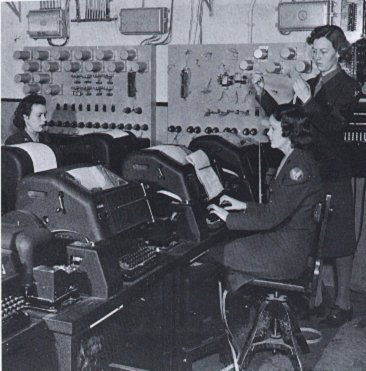

# TTY 设备

根据 [^tty_demystified] 中的描述。

(TeleTYpewriter, TTY) 原指电传打字机，电传打字机曾经在世界各地以大型网络方式连接起来，称为电传，用于传输商业电报，但彼时电传打字机尚未连接到任何计算机。

随着科技的发展与进步，很多电传打字机的模型和功能略有不同，于是产生了一个软件兼容层，来处理不同打字机之间的通信协议。现在物理的电传打字机已经绝迹，除非你参观电子设备的博物馆。不过 TTY 这种兼容层设备在 UNIX 世界保留了下来。

可以认为 TTY 电传打字机设备是一种中间的兼容层，用以处理不同字符设备之间的通信。这些设备可能是控制台、键盘、串口等。

除此以外 TTY 通常还和进程的会话和任务相关。

可以使用 `stty -a` 查看 TTY 设备的配置信息。

## 参考

[^tty_demystified]: <https://www.linusakesson.net/programming/tty/index.php>
