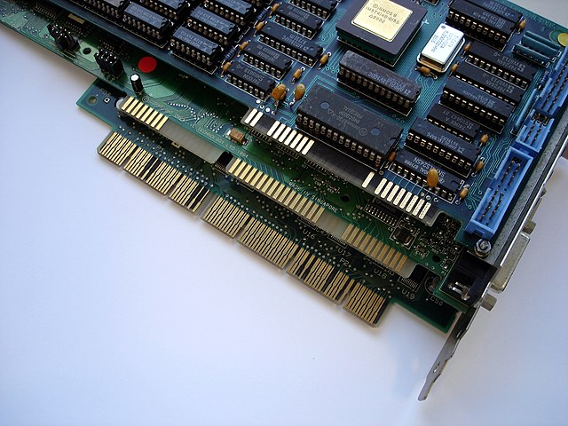
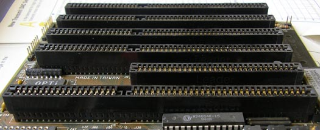

# ISA 总线

工业标准体系结构(ISA Industry Standard Architecture) [^isa] 总线是在 1981 年为最初的 IBM PC 创建的。彼时彼刻，它是一个 8 位，5 MHz 总线(2.39MB/s)，但后来升级到 16 位，8MHz (8.33MB/s)。时至今日，ISA 总线非常陈旧，速度慢得令人难以置信，但它仍然常见于较老的机器中，许多最常见的基本设备都连接到它。由于这个原因，许多操作系统仍然支持它。它正在慢慢地被现代机器中常见的超级 I/O 芯片所取代。有关总线的历史和实现细节的更多信息，请访问 [维基百科](http://wikipedia.org/wiki/Industry_Standard_Architecture) [^wiki] 关于该主题的页面。

---

## ISA DMA 要点

Direct Memory Access 直接存储访问

ISA DMA 的要点是：

- ISA DMA 与 PCI 总线控制 DMA 不一样;

- ISA DMA 通道 1、2 和 3 可用于 8 位传输到 ISA 外设;

- ISA DMA 通道 5、6 和 7 可用于向 ISA 外设的 16 位传输;

- 传输不能跨越物理 64KB 边界，并且不能大于 64KB;

- 传输必须在物理上是连续的，并且只能以最低的 16MB 物理内存为目标;

- ISA DMA 很慢-理论上是 4.77 MB/s，但由于 ISA 总线协议，更像是 400 KB/s;

- ISA DMA 释放了 CPU 资源，但是给内存总线增加了非常重的负载;

- 目前很少有设备使用 ISA DMA，只有：
    - 内部软盘
    - 一些嵌入式声音芯片
    - 一些并行端口
    - 一些串行端口

---

注:

- Sound Blaster 和 Sound Blaster PRO 只支持 8 位 DMA;

- Sound Blaster 16+ 支持 8 位和 16 位 DMA;

- 软盘控制器只支持 8 位 DMA，并且硬连接使用 DMA 通道 2。

---

## PC DMA

现代 PCI 控制器总是有自己的 **总线控制 DMA**，这比 ISA DMA 要好得多。甚至 USB 软驱都用 PCI 总线控制来发送他们的 DMA 数据，通过 PCI USB 控制器。PCI 总线主控可以访问内存与 32 位寻址。较新的 PCI 卡开始支持 64 位寻址。典型的 PCI 卡使用 **分散-聚集** 总线主控，其中一个页内存被用作数据内存的页目录。这几乎完全克服了所有形式的 DMA 的 **只能使用物理内存** 的限制。

## ISA DMA 背景

ISA DMA [^isa_dma]，像 ISA 本身一样，是现代 PC 的一个附件。它由内部软盘控制器、ISA 声卡、ISA 网卡和并口(如果它们支持 ECP 模式) 使用。虽然中断、键盘和计时器接口电路有明显的相关用途，但 ISA DMA 控制器及其编程接口仍然停留在它们最初设计的 20 世纪 70 年代。

DMA 背后的想法是，你可以建立一个 **通道**，其中一个地址指向内存，以及要传输的数据的长度。一旦设置好，CPU 就可以告诉拥有通道的外围设备去做它应该做的事情(例如读取一个扇区)。然后 CPU 就可以做其他事情了。当内存总线不被 CPU 使用时，DMA 芯片接管并在外围设备和内存之间传输数据，而不涉及 CPU。当传输完成时(例如，整个扇区已被发送到软驱)，DMA 芯片随后发出结束信号。DMA 芯片甚至可以在数据耗尽时发出信号，允许系统定位要在同一 DMA 事务中传输的下一个数据块。DMA 可以大大提高系统的速度，英特尔(设计了 DMA 控制器芯片)借鉴了上世纪 60 年代所有设备都有 DMA 通道的主机(当时 CPU 不是全部在一个芯片上，而且非常慢)。

当然，所有好的想法都有缺点，虽然英特尔并不能因为即将描述的事情而受到指责，但 IBM 肯定可以。

刚开始有个人电脑的时候，电脑速度很慢。IBM 从天堂往下看，说：“安装一个 DMA 控制器，应该会加快速度。” IBM 的初衷是好的，但是它的集成出了问题，因为 DMA 控制器无法满足系统的需求。PC/AT 标准包含 2 个 Intel 8237A DMA 芯片，作为主/从机连接。第二个芯片是 Master，它的第一线路 (通道 4) 被第一个芯片，也就是 Slave 芯片使用。(这与中断控制器不同，中断控制器的第一个芯片是Master)。

8237A 是为旧的 8080 8位处理器设计的，这可能是造成这么多 DMA 问题的主要原因。IBM 为其 PC 选择的 8088 和 8086 处理器对于 DMA 控制器来说太先进了。

之前提到过，DMA 控制器能够发出完成信号，甚至请求更多信息。不幸的是，这将使扩展槽太大，因此 IBM 关闭了所有到 DMA 芯片的连接。您唯一知道传输何时完成的时间是外设发出中断信号的时间。这意味着所有使用 ISA DMA 通道的外设都被限制为不超过64 KB 的传输，以免扰乱 DMA 控制器。

即使在 PC/AT 上，IBM 也开始绕过 PC/XT 中使用的 ISA DMA，并对硬盘使用 ATA PIO 模式。这是因为上面列出的 64 KB限制，以及 286 处理器可以在 6MHz 下执行 16 位事务。即使是 ISA 总线也可以以高达 12 MHz 的速度运行，远远快于 DMA 控制器 4.77 MHz 的运行速度。

扩展卡的设计者也对 DMA 功能的缺乏感到不满，尤其是依赖数据传输速度的 “硬卡” 硬盘扩展卡制造商。

为了绕过 “内置” DMA 控制器的限制，扩展卡制造商开始将自己的 DMA 控制器放到扩展卡上。它们的工作方式与 “车载” DMA 完全相同，在处理器不注意的时候 **窃取内存总线周期**，从而从整体上提高系统的性能。这些 **ISA 总线主控** 通常仍然限制在较低的 16 MB 内存，但没有 4.77 MHz 的问题。这种趋势一直延续到 PCI 总线的诞生，最终在 PC 中完全取代 ISA 总线。

---

## 技术细节

每个 8237 [^8037] DMA 芯片有 4 个 DMA 通道。第一个芯片是 DMA0 ~ DMA3，第二个芯片是 DMA4 ~ DMA7。第一个 DMA 控制器用于 8 位传输，而第二个控制器用于 16 位传输。在一些教程或其他 wiki 文章中，您有时会看到第二个 DMA 芯片(通道 4 ~ 7) 被标记为 **主控制器**，而第一个(通道 0 到 3)被称为 **从控制器**。这是非常混乱的，这些术语在这里将不会再使用。

DMA 通道 0 是不可用的，因为它被用于短时间内的 DRAM 内存刷新，并因此保留(即使现代计算机不使用它)。DMA 通道 4 不能用于外设，因为它用于级联其他 DMA 控制器。

DMA 控制器的内部地址寄存器只有 16 位。为了扩展这一点，IBM 为每个通道增加了一个外部 “页面寄存器” 字节，允许访问 16 MB 内存(总共 24 位)。如果 DMA 传输跨越了 64KB 的边界，内部地址寄存器将换行到零，并且外部页寄存器不递增。DMA 控制器将很高兴地继续使用它在新地址找到的任何数据进行传输。

基于 ISA 的 DMA 控制器被指定运行在 4.77MHz。没有例外。如果系统的“前端”(内存)总线运行在 133MHz，在传输每个 ISA DMA 字节/字 时，它将被人为地降至 4.77 MHz。这包括 EISA 和 PS/2 32位控制器，即使这些控制器有一个额外的页寄存器(允许 4GB 寻址空间) 和 32 位传输的能力。(这些 DMA 控制器只存在于 EISA 和 MCA 系统上，它们现在已经过时了，这里不再作进一步描述。)

---

## 编程细节

### 16 位的问题

16 位通道 (5、6 和 7) 有一个特殊的寻址方案来处理它们增加地址的方式。内部寄存器增加 1，但是内存地址需要在每次访问之间增加 2。解决方案是，CPU 存储在 DMA 控制器中的“起始地址”需要右移 1 位。在每次内存访问中，这个内部的 16 位地址值增加 1，然后取这个值并向左移动 1 位(清除较低的位)，然后作为地址使用。然后以正常的方式追加外部“页寄存器”寻址字节。重要的是要注意，内部地址的上位在向左移位时会丢失，它没有被or转换为页寄存器字节。这阻止了大于 64KB 的 DMA 传输工作，尽管它们在技术上应该适用于 16 位通道，因为地址寄存器将有效地绕到零，而不会增加页寄存器字节。

### 物理内存 VS 分页

分页内存映射是由 CPU 独占控制的。DMA 的全部意义就是绕过 CPU。因此，DMA 不能访问任何虚拟内存地址。所有的 DMA 总是只在物理内存地址上完成。ISA DMA 有 16MB 的物理地址限制。

由于 DMA 独立于 CPU 运行，所以操作系统分配一块连续的物理内存块用于 DMA 传输是很重要的，在 DMA 传输完成之前，操作系统要防止该内存块用于任何其他目的，或交换出去。

注意: VM86 模式不使用物理地址。内存地址是假的。在 VM86 模式下，操作系统必须代表应用程序模拟任何 DMA 事务。

### 缓冲区大小

一个典型的 1.44MB 软盘可以在一次传输中轻松地传输 36 个扇区的数据。这只有 18KB。具有最差格式的最大内部软盘可能能够一次传输 84 个扇区。这仍然只有 42 KB。SoundBlaster 卡在 64KB 的缓冲区下运行最好。从来没有必要尝试双缓冲 ISA DMA 传输，因为它们太慢了。最多有 6 个可用的 DMA 通道，不需要为每个通道分配整整 64 KB。把所有这些放在一起，任何操作系统都应该能够很容易地从 256 KB 的池中分配它所需的所有 ISA DMA 物理内存，甚至只分配其中的一半。

### 触发器

PC上的许多设备 (例如 ATA 磁盘驱动器) 使用 8 位 IO 端口接收 16 位值。这是使用触发器完成的。设备首先期望低字节。一旦它接收到一个字节，触发器就会改变状态，然后设备就会期望得到高字节。当接收到高字节时，触发器再次改变状态，设备期待一个新的低字节。通常，每个 16 位 **寄存器** 将有自己的触发器，但 ISA DMA 控制器在这方面有一个问题。

在 8237 芯片上，只有一个触发器。16 位寄存器中有 8 个。而且可能有多达三个设备驱动程序同时竞争使用一个触发器。

这就产生了两个严重的问题。一个是 **竞争问题**。另一个原因是，很难确定这种转变目前处于何种状态。处理触发器状态问题的标准解决方案是每次您想使用触发器时将其重置为 **低字节** 状态，这样您就可以在发送字节之前确定它处于适当的状态。对于 **争用** 只有两种解决方案：要么使用一个锁，要么只允许一个 ISA DMA 驱动程序，这样争用就不可能了。

### 屏蔽 DRQ

设置 DMA 传输总是需要设置传输的 “两端”。也就是说，无论哪个外设拥有 DMA 通道，都需要被告知通过 DMA 传输数据块。DMA 控制器需要被告知内存地址、传输长度、可能的 **传输模式** 和 传输方向(读或写)。因此，这两件事情中的一件总是需要先完成，通常是外设在准备传输第一个字节之前有很长的延迟时间。但是，如果您先设置外围设备，它的第一个 DMA 请求信号(通常称为 DRQ)可能会在您设置 DMA 控制器的过程中到达。

答案是在初始化 DMA 控制器时屏蔽特定通道的 DRQ。下面描述了三种临时禁用通道的方法。

### 传输长度

存储到每个 计数寄存器 中的值总是传输长度(字节或字) 减 1。如果你忘记减去这一项，你在传输时就会得到一个错误。

### 中断完成后

在 PC 机中实现时，DMA 控制器不能发送中断。希望无论哪个外设拥有每个 DMA 通道，都能在传输完成时向 CPU 发送一个中断。但是，如果传输出现错误而失败，一些外设可能不会发送中断。和往常一样，超时很重要。

### 寄存器

主 DMA 控制器和从 DMA 控制器非常相似，因此(为了节省空间)将它们合并到下表中。请不要被这个迷惑。注意：对于通道 5 到 7 上的地址和计数寄存器，请参阅上面的 16 位问题。

每个 8237A 有 18 个寄存器，通过 I/O 端口总线进行寻址：

| 通道 0~3 端口 | 通道 4~7 端口 | 尺寸(位) | 读写  | 功能                                   |
| ------------- | ------------- | -------- | ----- | -------------------------------------- |
| 0x00          | 0xC0          | 16       | 写    | 起始地址寄存器 通道 0/4 (不可用)       |
| 0x01          | 0xC2          | 16       | 写    | 计数寄存器 通道 0/4 (不可用)           |
| 0x02          | 0xC4          | 16       | 写    | 起始地址寄存器 通道 1/5                |
| 0x03          | 0xC6          | 16       | 写    | 计数寄存器 通道 1/5                    |
| 0x04          | 0xC8          | 16       | 写    | 起始地址寄存器 通道 2/6                |
| 0x05          | 0xCA          | 16       | 写    | 计数寄存器 通道 2/6                    |
| 0x06          | 0xCC          | 16       | 写    | 起始地址寄存器 通道 3/7                |
| 0x07          | 0xCE          | 16       | 写    | 计数寄存器 通道 3/7                    |
| 0x08          | 0xD0          | 8        | 读    | 状态寄存器                             |
| 0x08          | 0xD0          | 8        | 写    | 命令寄存器                             |
| 0x09          | 0xD2          | 8        | 写    | 请求寄存器                             |
| 0x0A          | 0xD4          | 8        | 写    | 单通道掩码寄存器                       |
| 0x0B          | 0xD6          | 8        | 写    | 模式寄存器                             |
| 0x0C          | 0xD8          | 8        | 写    | 触发器重置寄存器                       |
| 0x0D          | 0xDA          | 8        | 读    | 中间寄存器                             |
| 0x0D          | 0xDA          | 8        | 写    | 主控重置寄存器                         |
| 0x0E          | 0xDC          | 8        | 写    | 掩码重置寄存器                         |
| 0x0F          | 0xDE          | 8        | 读/写 | 多通道掩码寄存器 (文档未记录, 但有效!) |

每个通道也有一个外部的 R/W 页地址寄存器，包含 24 位传输内存地址的上 8 位:

| 端口 | 功能                         |
| ---- | ---------------------------- |
| 0x87 | 通道 0 页地址寄存器 (不可用) |
| 0x83 | 通道 1 页地址寄存器          |
| 0x81 | 通道 2 页地址寄存器          |
| 0x82 | 通道 3 页地址寄存器          |
| 0x8F | 通道 4 页地址寄存器 (不可用) |
| 0x8B | 通道 5 页地址寄存器          |
| 0x89 | 通道 6 页地址寄存器          |
| 0x8A | 通道 7 页地址寄存器          |

### 有用的寄存器

#### 单通道掩码寄存器 0x0A 和 0xD4(写入)

| 位  | 功能    |
| --- | ------- |
| 0   | SEL0    |
| 1   | SEL1    |
| 2   | MASK_ON |

这些寄存器用于仅在主 DMA 芯片或从 DMA 芯片上为单个通道屏蔽(或取消屏蔽) DRQ。也就是说，如果您不想找出所有其他通道的掩码状态，您可以一次为一个通道掩码/解掩码 DRQ。使用 SEL 0 和 1 位选择通道，使用 MASK_ON 位设置或清除通道屏蔽。注意，由于级联，屏蔽 DMA 通道 4 将屏蔽 7、6、5 和 4。

#### 多通道掩码寄存器 0x0F 和 0xDE(读和写)

| 位  | 功能  |
| --- | ----- |
| 0   | MASK0 |
| 1   | MASK1 |
| 2   | MASK2 |
| 3   | MASK3 |

将适当的位设置为 0 或 1 允许您为这些通道(分别)打开或屏蔽 DRQ。使用这个寄存器意味着您的驱动程序需要知道在那个时刻所有通道所需的掩码状态。有几种方法可以做到这一点，但是一种方法就是首先读取寄存器。注意，由于级联，屏蔽 DMA 通道 4 将屏蔽 7、6、5 和 4。

#### DMA 模式寄存器 0x0B 和 0xD6(写入)

| 位  | 功能 |
| --- | ---- |
| 0   | SEL0 |
| 1   | SEL1 |
| 2   | TRA0 |
| 3   | TRA1 |
| 4   | AUTO |
| 5   | DOWN |
| 6   | MOD0 |
| 7   | MOD1 |

设置这个寄存器有点棘手，因为它高度依赖于为 DMA 控制器编程的外设。然而，外设的驱动程序是需要设置这个寄存器的实体，它应该知道外设需要什么模式。

- SEL0 和 SEL1 选择你想要改变的通道；
- TRA0 和 TRA1 选择传输类型；
    - 0b00 运行控制器自检；
    - 0b01 外设正在写入内存；
    - 0b10 外设正在从内存读取；
    - 0b11 无效；
- AUTO：当这个位被置位，在传输完成后，通道重置自己的地址和你编程到它的计数值。这对于软盘传输非常有用。在一个轨道中读取-值设置自己立即再次读取。对于写操作，你只需要改变传输模式，而不是地址。有些扩展卡不支持自动初始化 DMA，如 Sound Blaster 1.x。如果使用自动初始化 DMA，这些设备将会崩溃。Sound Blaster 2.0 和之后的版本都支持自动初始化 DMA。
- DOWN：当设置时，反转数据的内存顺序。内存从高位地址向下访问到低位地址(每次传输时地址递减)。
- MOD0 和 MOD1：基于 DMA 控制器所连接的外设，这可能会出现一些问题。DMA 控制器有几种模式:
    - 0b00：按需传输；
    - 0b01：单次 DMA 传输；
    - 0b10：块 DMA 传输；
    - 0b11：级联模式(用于级联另一个 DMA 控制器)；

对于外设来说，单一传输模式比不能一次缓存大量数据要好。非 82077aa 软盘控制器、Sound Blaster 和 Sound Blaster Pro 应使用单传输 DMA 模式。

块传输模式适用于能够缓冲整个信息块的外设，例如硬盘控制器。

按需传输模式适用于间歇启动和停止的外设，如磁带机。驱动器可以尽可能长时间地读取全部的信息，并暂停传输以移动到磁带的另一部分。较新的软盘控制器也可以很好地用于需求传输，因为它们有 FIFO 缓冲区来存储正在读写的信息(但您需要正确地设置 FIFO)。外围设备控制信息流，由于信息流是不间断的，因此可以获得性能。这些后面的计算机中的 CPU 通常有缓存，可以在 DMA 请求传输期间不间断地继续工作。旧的计算机在 CPU 等待内存总线可用时速度会变慢。

- 复位寄存器 0x0C 和 0xD8(写入)
- 主控复位寄存器 0x0D 和 0xDA(写入)
- 掩码复位寄存器 0x0E 和 0xDC(写入)

发送任何值到重置寄存器来激活它们。主控重置 设置触发器低，清除状态，并设置所有掩码位 ON。掩码重置将所有掩码位设置为关闭。

前文中的以下语句需要在真实的硬件上验证，因为它很可能是错误的:“必须在任何 16 位事务之前发送 重置触发器 命令。在 DMA 控制器接收到第二个字节后，触发器不会重置。”

### 其他寄存器

#### 状态寄存器 0x08 和 0xD0(读取)

| 位  | 功能 |
| --- | ---- |
| 0   | TC0  |
| 1   | TC1  |
| 2   | TC2  |
| 3   | TC3  |
| 4   | REQ0 |
| 5   | REQ1 |
| 6   | REQ2 |
| 7   | REQ3 |

- REQ 0~3：DMA 请求未决
- TC0~3：传输完成
- 读取这个寄存器将清除 TC 位

这个寄存器不是很重要，因为 8237 不能发送中断请求来告诉它已经完成了。通常不需要轮询这个寄存器，因为当事务完成时，外围设备(在 DMA 的另一端)会发送一个中断。

#### 命令寄存器 0x08 和 0xD0(写入)

| 位  | 功能  |
| --- | ----- |
| 0   | MMT   |
| 1   | ADHE  |
| 2   | COND  |
| 3   | COMP  |
| 4   | PRIO  |
| 5   | EXTW  |
| 6   | DRQP  |
| 7   | DACKP |

这个寄存器确实显示了 8237 与 PC 硬件是多么不兼容。

- 让我们从 EXTW 和 COMP 开始，这两种方法在移除一个时钟周期的情况下将 DMA 传输速度提高了 25%。它能起作用吗？不，不得行；
- PRIO，当清零时，这允许 DMA 优先级旋转，允许共享数据总线的所有外围设备自由地使用。它能起作用吗？不，不得行；
- MMT 和 ADHE，你知道 IBM 个人电脑从 1981 年开始就可以进行内存到内存的传输吗？没错，硬件精灵，硬件帧从一个位置缓冲到另一个位置。它能起作用吗？不，不得行；
- COND，万岁，这是控制寄存器中唯一有用的位。设置此位将禁用 DMA 控制器，这是一种设置多个 DMA 通道而不屏蔽每个通道的方法；

#### 请求寄存器 0x09 和 0xD2(写入)

用于内存到内存传输和设置优先级旋转，绝对没用(**absolutely useless**)。

#### 中间寄存器 0x0D 和 0xDA(读取)

从未在 PC 上实现过。无用的。

## 延伸阅读

- "ISA System Architecture, 3rd Edition" by Tom Shanley and Don Anderson ISBN 0-201-40996-8

    <http://vtda.org/books/Computing/Hardware/ISASystemArchitectureThirdEd_TomShanleyDonAnderson.pdf>

## 参考文献

[^isa]: <https://wiki.osdev.org/ISA>
[^wiki]: <http://wikipedia.org/wiki/Industry_Standard_Architecture>
[^isa_dma]: <https://wiki.osdev.org/ISA_DMA>
[^8037]: <http://www.brokenthorn.com/Resources/OSDev21.html>
