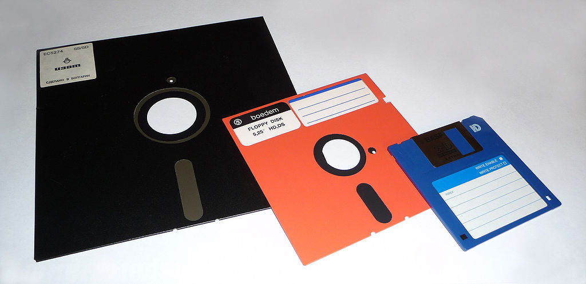

# 软盘驱动

## 当前内存布局


## 概述

软盘控制器(FDC Floppy Disk Controller)是一种传统设备，用于在桌面 x86 系统上控制内部 3.5/5.25 英寸软盘驱动器设备。为此产生了一系列的芯片，包括 8272A, 82078, 82077SL 和 82077AA，82077AA 是最先进的，并且从 1991 年开始生产。对于较新的系统，该芯片的一个模型已经嵌入到主板芯片组中。



### 在实模式中访问软盘

对于 bootloader 或 CPU 为实模式运行的操作系统，请使用 BIOS 功能 INT 13H AH=2(读) 或 AH=3(写) 访问软驱。

您需要知道 驱动器号 (通常为 0 或 1)，并将该值输入 DL；

可以在 x86 实模式 (BIOS) 的 ATA 文章中找到更详细的信息，因为在实模式中访问软盘与访问硬盘(使用 CHS 模式)是相同的。

本文的其余部分将讨论，如何为软盘子系统创建保护模式的驱动程序。

> 注意: Extended BIOS INT 13H 功能不支持软盘。

> 注意：在最后一次 BIOS 软盘访问超时后，BIOS 时钟中断处理程序需要处理关闭软盘的马达。最后一次访问可能正在尝试加载引导加载程序。因此，在遥远的未来，如果 BIOS 收到更多的时钟滴答(如果您曾经返回到实模式)，它可能会为您关闭软盘马达一次。

### 软盘子系统是丑陋的

多年以来，x86 体系的操作系统控制的许多设备都添加了功能性补丁。这使得他们在编写驱动程序时非常不顺畅。软盘子系统可能是最糟糕的。随着功能的发展，一些位的定义实际上在意义上是相反的，是过时的。有几个命令需要在两个不同的位置复制相同的信息，如果复制的信息不匹配，命令就会失败。从来没有添加明确的标志来识别控制器在哪个 **模式** 下运行。另外，软盘子系统是残留的主要子系统，用于访问过时的、糟糕的 ISA DMA 系统进行数据传输。

### 实际的驱动

在过去，曾经有 5.25 英寸的低密度、高密度和单面驱动器，这些驱动器类型中的每一种都有介质。以前也有 3.5 英寸的低密度介质。现在这些都不存在了。现在，您通常会遇到的唯一实际硬件是 3.5 英寸、1.44MB 的驱动器。

一个 1.44MB 的软盘通常格式化为 80 个柱面、2 个磁头 和 每个磁道 18 个扇区。驱动器用螺栓连接在一起的两个头记录两面。他们不能独立地寻道。圆盘一侧的 **磁道** 总是与另一侧的磁道完全相反。(在许多软盘驱动程序代码示例中对此存在一种误解)，您只需要寻找一个头就可以找到一个特定的柱面，这样两个头都可以读写该柱面。

### CHS 和 LBA

软驱专用于 CHS 寻址，总有两个磁头，但驱动器(和控制器)还必须知道磁盘的每个磁道有多少个柱面和扇区。

通常，如上所述，每个磁道是 80 个柱面和 18 个扇区。在通常的 CHS 模式中，柱面和磁头从 0 开始计数，但扇区数字从 1 开始计数。也就是说，合法的柱面号通常是 [0, 79]，磁头是是 0 或 1，扇区号是 [1, 18]。要求扇区编号为 0 总是不合法的，这是原型驱动程序代码错误的主要来源。

然而，在 LBA(Logic Block Address 逻辑块寻址) 中寻址更符合逻辑，因为第一个扇区位于 0(像一个数组)。两者之间的转换相当简单。公式如下:

- CYL = LBA / (HPC * SPT)
- HED = (LBA % (HPC *SPT)) / SPT
- SEC = (LBA % (HPC *SPT)) % SPT + 1
- LBA = (CYL * HPC + HEAD) * SPT + SEC - 1

其中：

- CYL：柱面数
- HED：磁头数
- SEC：扇区数
- LBA：逻辑块地址
- HPC：Head Per Cylinder 每柱面磁头数
- SPT：Sector Per Track 每磁道扇区数

### DMA 数据传输

软盘通常使用 ISA DMA (这与 PCI BusMastering DMA 不同)来进行数据传输。

软盘硬连接到 DMA 通道 2。另一种进行数据传输的方式被称为 **PIO模式** (见下文)。

要进行 DMA 数据传输：

- 设置 DMA 通道 2(如 DMA 文章中所述)
- 设置总传输字节数 - 1
- 目标缓冲区物理地址和传输方向

* 如果需要的话，则初始化/重置控制器(见下文)
* 如果需要的话，还需要选择驱动器(见下文)
* 使用 Specify 设置用于 DMA 的软驱控制器
* 找到正确的柱面（找柱面就是寻道）
* 发出感知中断命令
* 然后发出标准的读/写命令
* 数据传输是无形的
* 当传输完成时，控制器将发送一个 IRQ6 中断
* 然后读取 **结果** 字节，看看是否有任何错误，详见下文。

### PIO 数据传输（不够友好，待验证）

PIO 数据传输既可以使用轮询，也可以使用中断。使用 PIO 模式传输数据的速度比 ISA DMA 传输快 10%，但是在 CPU 周期需求方面会有巨大的成本。但是，如果您的操作系统或应用程序是单任务的，那么无论如何 CPU 周期都不能用于其他任何事情，所以您可以使用 PIO 模式。

通常，控制器有一个 16 字节的缓冲区，当缓冲区计数达到驱动程序设置的 **阈值** 时，控制器希望发送一个 IRQ6。如果您在多任务环境中使用 PIO 模式软盘传输(这是个坏主意)，那么在中断处理程序代码中，应该使用 IRQ6 事件通过一些系统缓冲区来填充或耗尽软盘控制器的缓冲区。

如果你在单请求环境中使用 PIO 模式，那么 IRQ6 只会浪费 CPU 周期，你应该使用轮询来代替。通常可以通过设置数字输出寄存器的位 3(值=8) 来关闭 IRQs(见下文)。如果您愿意，甚至可以为特定的命令打开或关闭该位，这样您就可以接收某些类型的中断，而不是其他类型的中断。

要进行 PIO 数据传输:

- 如果需要，初始化/重置控制器(见下文)
- 如果需要，选择驱动器(见下文)
- 寻找到正确的柱面
- 发出感知中断命令
- 然后发出标准的读/写命令
- 发送命令后
    - 要么轮询主状态寄存器中的 RQM 位，以确定控制器何时希望将数据移进/移出 FIFO 缓冲区
    - 要么等待IRQ6做同样的事情
- 当传输完成时，读取 **结果** 字节，看看是否有任何错误。详见下文。

### 大多数命令悄无声息地执行

只有少数命令/条件会产生中断:复位(仅在轮询模式下)、寻道、校正或 读/写/验证/格式化命令之一。有些命令也不产生任何结果字节。如果您想验证静默命令是否真的有效，那么惟一能做的事情就是使用 DUMPREG 命令检查控制器的当前状态。

### 时间问题

在真正的硬件上，确实存在时间问题。寻道延迟和运动延迟是任何程序员都会想到的。如果驱动器在马达达到速度时发送一个 IRQ 就好了，但它没有。您可能没有想到的两件事是，相当新的硬件在输出 命令/参数 字节之间可能仍然需要人为的延迟，以及在输入 “结果” 字节之间可能也需要人为的延迟。为了知道何时可以发送/检索下一个字节，MSR 中有一些比特需要测试。简单地硬编码输出/输入字节之间的特定延迟并不是一个好主意。循环 20 次，并每次测试 MSR 中 RQM 位的值，应该总有足够的延迟。

然而，在多任务环境中，使用 IO 端口读取产生延迟(或轮询 MSR)会导致较差的性能，你可能想让驱动休眠尽可能短的时间(微睡眠)。

考虑到软盘驱动器在不工作时马达通常不转，所以在实际对软盘进行读写操作之前，我们需要等待马达启动并达到正常的运行速度。与计算机的运行速度相比，这段时间较长，通常需要 0.5 秒左右的时间。

另外，当对一个磁盘的读写操作完毕，我们也需要让驱动器停止转动，以减少对磁盘表面的摩擦。但我们也不能在对磁盘操作完后就立刻让它停止转动。因为，可能马上又需要对其进行读写操作。因此，在一个驱动器没有操作后，还是需要让驱动器空转一段时间，以等待可能到来的读写操作，若驱动器在一个较长时间内都没有操作，则程序让它停止转动。这段维持旋转的时间可设定在大约 3 秒左右。

当一个磁盘的读写操作发生错误，或某些其它情况导致一个驱动器的马达没有被关闭。此时我们也需要让系统在一定时间之后自动将其关闭。Linus 在 Linux 中把这个延时值设定在 100 秒。

### 可靠性

在真正的硬件中，软驱是非常不可靠的。在模拟器上，这并不重要；但对于想要用于实际硬件的代码，请确保在出现任何错误后，重试每个命令至少两次。

## CMOS 0x10

关于 CMOS 的其他信息，可以参考 [时间](../04%20中断和时钟/037%20时间.md)

这个寄存器包含操作系统可能发现的一些有用的 CMOS 值。它描述了可能连接到系统的两个软盘驱动器的 **类型**。高位部分描述主总线上的 **主软驱**，而低位部分描述主总线上的 **从软驱**；

每个4位，描述了相关联的软驱类型:

| 值  | 类型                 |
| --- | -------------------- |
| 0x0 | 没有驱动器           |
| 0x1 | 360 KB 5.25 寸驱动器 |
| 0x2 | 1.2 MB 5.25 寸驱动器 |
| 0x3 | 720 KB 3.5 寸驱动器  |
| 0x4 | 1.44 MB 3.5 寸驱动器 |
| 0x5 | 2.88 MB 3.5 寸驱动器 |

- 0 ~ 3 位表示从软盘类型；
- 4 ~ 7 位表示主软盘类型；

## 寄存器

软盘控制器通过 9 个寄存器编程，可通过 IO 端口 0x3F0 ~ 0x3F7 访问。像往常一样，在 PC 架构上，一些 IO 端口访问不同的控制器寄存器，这取决于你是读还是写它们。请注意，代码片段和数据表根据三元组(例如SRA, MSR, DIR, CCR等)来命名这些寄存器。使用标准的 `outb` 和 `inb` 命令来访问寄存器。

软盘寄存器的基本集合可以在以下枚举中找到:

```c++
enum FloppyRegisters
{
    STATUS_REGISTER_A                = 0x3F0, // read-only
    STATUS_REGISTER_B                = 0x3F1, // read-only
    DIGITAL_OUTPUT_REGISTER          = 0x3F2,
    TAPE_DRIVE_REGISTER              = 0x3F3,
    MAIN_STATUS_REGISTER             = 0x3F4, // read-only
    DATARATE_SELECT_REGISTER         = 0x3F4, // write-only
    DATA_FIFO                        = 0x3F5,
    DIGITAL_INPUT_REGISTER           = 0x3F7, // read-only
    CONFIGURATION_CONTROL_REGISTER   = 0x3F7  // write-only
};
```

所有命令、参数信息、结果码和硬盘数据传输都通过 FIFO 接口。MSR 包含 **繁忙** 位标志，必须在通过 FIFO 读取/写入每个字节之前检查。DOR 控制软驱电机，软驱选择，并复位。其他寄存器包含的信息很少，通常访问的也很少。

注：IO 端口 0x3F6 是 ATA(硬盘) 备用状态寄存器，不被任何软驱控制器使用。

如上所述，最常见的控制器芯片有3种模式，寄存器中的许多位标志根据模式不同而不同(或相反)，然而，所有重要的寄存器和位标志在模式之间保持相同。它们如下:

### TDR 磁带驱动寄存器 

磁带驱动器寄存器 (TDR, Tape Drive Register) 是一个读写寄存器，在所有模式下都是相同的。根据 Intel 82077AA 的文档，两个最低有效位形成 1 到 3 之间的数字(0 是无效值，驱动器 0 可能不被选择)，将磁带支持分配给四个驱动器中的一个特定驱动器。**它可能与现代用途无关，不受任何模拟器的支持，而且可能不值得实现支持，除非您有所有真正的硬件来测试此功能**。

### DOR 数字输出寄存器

数字输出端口 DOR (数字控制端口) 是一个 8 位寄存器，它控制驱动器马达开启、驱动器选择、启动/复位 FDC 以及允许/禁止 DMA 及中 断请求。

| 助记符      | 位   | 值   | 功能                           |
| ----------- | ---- | ---- | ------------------------------ |
| MOTD        | 7    | 0x80 | 驱动器 3 马达开启              |
| MOTC        | 6    | 0x40 | 驱动器 2 马达开启              |
| MOTB        | 5    | 0x20 | 驱动器 1 马达开启              |
| MOTA        | 4    | 0x10 | 驱动器 0 马达开启              |
| IRQ         | 3    | 8    | 允许中断和 DMA                 |
| RESET       | 2    | 4    | 0 = 进入重置模式, 1 = 常规操作 |
| DSEL1 and 0 | 0, 1 | 3    | 选择驱动器                     |

> 注: IRQ/DMA 启用位(位3，值= 8)不能在 PS/2 模式中清除，所以对于 PIO 传输，你应该确保有一个 IRQ6 处理程序，以防 IRQ 发生。要使 DMA 发挥作用，必须设置该位。

> 注：如果要执行访问磁盘的命令(请参阅下面的命令列表)，则相应的磁盘必须使其电机旋转(并达到最高速度)，并且必须首先在 DOR 中设置其 **选择** 位。

> 注：切换 DOR 复位状态需要 4 微秒的延迟。使用 DSR 复位模式可能更聪明，因为硬件在适当的延迟后会自动 **解除** 复位模式。

### MSR 主状态寄存器 (只读)

FDC 的主状态寄存器也是一个 8 位寄存器，用于反映软盘控制器 FDC 和软盘驱动器 FDD 的基本状态。通常，在 CPU 向 FDC 发送命令之前或从 FDC 获取操作结果之前，都要读取主状态寄存器的状态位，以判别当前 FDC 数据寄存器是否就绪，以及确定数据传送的方向。

| 助记  | 位  | 值   | 功能                     |
| ----- | --- | ---- | ------------------------ |
| READY | 7   | 0x80 | 数据就绪 (RQM)           |
| DIO   | 6   | 0x40 | 表示传输方向， 1:读 0:写 |
| NDMA  | 5   | 0x20 | 表示非 DMA 方式          |
| BUSY  | 4   | 0x10 | 命令忙 (CB)              |
| ACTD  | 3   | 8    | 驱动器 3 寻道（忙）      |
| ACTC  | 2   | 4    | 驱动器 2 寻道            |
| ACTB  | 1   | 2    | 驱动器 1 寻道            |
| ACTA  | 0   | 1    | 驱动器 0 寻道            |

两个重要的位是 RQM 和 DIO。NDMA 和 BUSY 在轮询 PIO 模式中也很有用。

最重要的是 RQM，它是在可以(或必要)从 FIFO 端口读/写数据时设置的

NDMA 标志着命令 **执行阶段** 的结束和 **结果阶段** 的开始。

应检查 DIO 和 BUSY 以验证正确的命令终止 (**结果阶段** 的结束和 **命令阶段** 的开始)

### CCR 和 DSR

配置控制寄存器 (CCR, Configuration Control Register) 和 数据速率选择寄存器 (DSR Datarate Select Register)。

- DSR 的低 2 位与 CCR 相匹配，设置其中一个就会设置另一个
- DSR 和 CCR 的高 6 位默认为 0，并且可以始终安全地设置为 0
- 即使它们有不同的位定义，你总是用相同的值来设置它们
- 而且 DSR 和 CCR 中的一个或另一个在任何现代系统中都可以被忽略
- 另外，您也可以同时设置它们，以最大限度地兼容古老的芯片组

低 2 位指定与驱动器之间的数据传输速率，对于 1.44MB 或 1.2MB 的软驱，您希望这两位都设置为零。因此，通常情况下，您只需要在启动后将 CCR 设置为零一次(因为 BIOS 可能没有这样做，除非它启动了软盘)。

注：复位过程不会影响这个寄存器。然而，如果您在总线上有不同类型的驱动器，它们使用不同的数据率，那么您需要在选择其他驱动器时切换数据率。当 FDC 处于 **复位状态** 时，似乎也可以修改这个寄存器。

注2：一些教程似乎声称更改/设置数据速率会导致 IRQ6，这是错误的。

用于设置 DSR 或 CCR 的数据速率:

| 速率    | 值  | 驱动器类型  |
| ------- | --- | ----------- |
| 500Kbps | 0   | 1.44M, 1.2M |
| 300Kbps | 1   | -           |
| 250Kbps | 2   | -           |
| 1Mbps   | 3   | 2.88M       |

### 数据寄存器

FDC 的数据端口对应多个寄存器 (只写型命令寄存器和参数寄存器、只读型结果寄存器) ，但任一时刻只能有一个寄存器出现在数据端口 0x3F5。在访问只写型寄存器时，主状态控制的 DIO 方向位必须为 0 (CPU -> FDC)，访问只读型寄存器时则反之。在读取结果时只有在 FDC 不忙之后才算读完结果，通常结果数据最多有 7 个字节。

### 数字输入寄存器

数字输入寄存器 (DIR, Digital Input Register) 只有第 7 位对软盘有效，用来表示盘片更换状态。其余七位用于硬盘
控制器接口。

### 状态寄存器

有 3 个寄存器保存关于最后遇到的错误的信息，ST0 寄存器信息与大多数命令的结果字节一起传递回来。读/写命令的结果字节中返回 ST1 和 ST2 信息。也可以使用 Dumpreg 命令检索它们。

**ST0**

顶部 2 位(值=0xC0) 在复位过程后设置，轮询开启。在任何其他时间设置的任何一位都是错误指示。第 5 位(值=0x20) 在每次重新校准、寻道或隐含寻道之后设置，其他的部分是没有用的。

**ST1**

ST1 寄存器提供了更多关于读/写操作期间错误的细节。

如果软盘上的扇区太少，无法完成读/写，则设置第 7 位(值=0x80)。这通常是由于在设置 DMA 字节计数时没有减去 1 造成的。如果您的驱动程序太慢，无法及时从 FIFO 端口获得字节，则设置位 4(值=0x10)。如果介质是写保护，则设置位 1(值=2)。其余的位用于各种类型的数据错误，指示坏的介质，或坏的驱动器。

**ST2**

ST2 寄存器提供了更多(无用的)关于读/写操作期间错误的细节。

这些位都表示各种类型的数据错误，要么是坏的介质，要么是坏的驱动器。

## 软盘控制器命令

软盘控制器共可以接受 15 条命令。每个命令均经历三个阶段：

- 命令阶段
- 执行阶段
- 结果阶段

命令阶段：是 CPU 向 FDC 发送命令字节和参数字节。每条命令的第一个字节总是命令字节（命令码）。 其后跟着0 ~ 8 字节的参数。

执行阶段：是 FDC 执行命令规定的操作。在执行阶段 CPU 是不加干预的，一般是通过 FDC 发出中断请求获知命令执行的结束。如果CPU 发出的 FDC 命令是传送数据，则 FDC 可以以中断方式或 DMA 方式进行。中断方式每次传送 1 字节。DMA 方式是在 DMA 控制器管理下，FDC 与内存进行数据的传输直至全部数据传送完。此时 DMA 控制器会将传输字节计数终止信号通知 FDC，最后由 FDC 发出中断请求信号告知 CPU 执行阶段结束。

结果阶段是由 CPU 读取 FDC 数据寄存器返回值，从而获得 FDC 命令执行的结果。返回结果数据的长度为 0 ~ 7 字节。对于没有返回结果数据的命令，则应向 FDC 发送检测中断状态命令获得操作的状态。

### 选项位

按位或 将这些位放到上面的读/写/格式化/验证命令中。

- MT：值=0x80，多磁道模式。在磁道结束时，控制器会自动从磁头 0 切换到磁头 1，这允许您用一个命令读/写两倍的数据；
- MF：值=0x40，MFM 磁编码方式，总是将其设置为读/写/格式化/验证操作，否则是 FM 编码方式；
- SK：值=0x20，跳过模式，忽略这一点，把它清除掉，除非你有一个非常好的理由不这样做；

### 马达延迟

注意：Linux 软盘驱动程序源代码有一个评论，声称打开 DOR 中的 MOTC 或 MOTD 位可以完全锁住一些系统。这种说法似乎不太可能?

当你打开软盘驱动器的马达时，它需要几毫秒的时间来旋转，达到数据传输所需的(稳定的)速度。

控制器有电子设备来处理转速的大变化，但它有其局限性。如果在电机启动后立即开始读/写，**锁相环将无法锁定数据信号**，你将得到一个错误。

在完成读取(或写入)后，通常应该再等待两秒钟来关闭电机。(在关闭马达之前，把磁头寻道 0 号磁道（柱面）可能是聪明的做法)，你可以让马达开得更久一些，但这可能会让用户觉得软盘还在传输数据，而且花费的时间非常长。让电机开着的原因是，您的驱动程序可能不知道是否有一个扇区读写队列将被执行。如果有更多的驱动器将立即访问，他们将不需要等待电机旋转起来。

电机启动时的延迟建议如下:

- 300 毫秒 (对于 3.5 英寸的软盘)；
- 500 毫秒 (对于 5.25 英寸的软盘)；

这些值应该足够让任何软盘驱动器正确旋转。事实上，50ms 应该足够了；

另一个函数方法根本不是延迟或等待，而是进入一个循环，并不断重试任何命令，直到它工作。3.5 英寸的磁盘每 200ms 旋转一次，因此每次重试实际上都是一种延迟。

### 扇区间隙的长度

有两种不同的间隙长度由软件控制，用于指定扇区之间空白的数量，软盘硬件使用间隙长度来帮助找到 **扇区的开始** 标记，并避免不同软盘驱动器的速度变化引起的问题。例如，在较慢的驱动器上写入扇区会导致扇区占用磁盘上更多的物理空间，可能会覆盖下一个扇区。

第一个间隔长度 (通常称为 **GPL1** ) 用于读取或写入数据，并设置软盘应该期望的扇区之间的间隔长度(但不改变这个间隔)。

第二个 (通常称为 GPL2 ) 是 **format track** 命令的间隙长度，它指定要使用的扇区之间的空间量。

实际的间隙长度取决于许多因素，但是 GPL1 总是比 GPL2 小一点，因此软盘硬件开始期望下一个扇区接近空白的末端。

这些间隙长度的标准值可以在软盘控制器数据表中找到。然而，通过减少间隙长度，可以在每个轨道上挤压更多的扇区。例如，通过在格式化时使用间隙长度 0x1C (读写时使用间隙长度 0x0C ) 而不是 0x54(读写时使用间隙长度 0x1B)，可以格式化一个普通的 1440 KB 的软盘，每个磁道有 21 个扇区，从而创建一个 1680Kb 的软盘。这些磁盘在非常老的计算机上可能是不可靠的 (精度和速度变化可能更糟)，但被认为是足够可靠的，微软发布一个版本的 Windows 在 1680KB 软盘 (Windows 95 在一组 12 软盘)。也可以在每个磁盘上格式化 3 个额外的圆柱体，总共 83 个。

### 坏柱面（磁道）的硬件控制

FDC 子系统有一个处理不可靠介质的内置方法。然而，使用它可能不是一个好主意。它涉及在介质上找到一个坏扇区，然后在格式化过程中将整个轨道或圆柱标记为坏的。

如果你尝试这样做，那么你不能简单地寻找一个柱面。所有的柱面得到 **重新映射** 与新的 **磁道**。

每当查找一个柱面时，都需要使用 ReadID 命令来验证所查找的柱面是否包含实际需要的数据。

因此，这消除了使用隐含查找的任何可能性，并为大多数读/写操作添加了额外的步骤。


### 重新初始化

BIOS 可能会使控制器保持默认状态。驱动轮询模式开启，FIFO 关闭，阈值 = 1，隐含寻道关闭，锁定关闭。

对于控制器来说，这是一个糟糕的状态，你的操作系统将需要修复它。对于 Specify 命令的正确值，BIOS 可能也没有比 OS 更好的猜测(这些值是特定于特定驱动器的)。当然没有理由相信 BIOS 已经正确地完成了其中的任何一项。

所以，当你的操作系统初始化时:

1. 向控制器发送版本命令；
2. 验证结果字节是否为 0x90：
    1. 如果不是，则终止并不支持软盘子系统可能是一个好主意；
    2. 基于本文的几乎所有代码都可以工作，即使在最老的芯片组上也可以；
    3. 但是有一些命令不能工作；
3. 如果你不想在每个 Reset 过程之后发送另一个 Configure 命令，那么:
    1. 向控制器发送一个更好的 Configure 命令，建议是: 驱动轮询模式关闭，FIFO 开启，阈值=8，隐含寻道开启，预补偿 0；
    2. 发送一个 Lock 命令；
4. 执行 Controller Reset 操作；
5. 向每个驱动器发送一个校准命令；

### 控制器重置

对于任何软盘命令，第二个最常见的故障模式是软盘控制器永远锁定。此条件通过超时检测到，需要使用 Reset 来修复。在初始化期间还需要一次重置。希望它是您唯一需要做的。

1. 选择使用:
    1. DOR 中的第 2 位(值=4)：保存 DOR 的当前值/“原始”值，写入一个0到DOR，等待4微秒，然后将原始值(第2位总是设置)写回DOR；
    2. 或 DSR 中的第 7 位(值=0x80)：为 DSR 预计算一个良好的值(通常为 0) 与 0x80 进行按位或运算。将该值写入 DSR；
2. 等待产生的 IRQ6 (除非你在 DOR 中关闭了 IRQ6)
3. 当(且仅当) 驱动轮询模式打开时，发送 4 个 Sense Interrupt 命令(必需的)；
4. 如果你的操作系统/驱动从来没有发送过一个 Lock 命令，那么你可能需要发送一个新的 Configure 命令(FIFO 设置在重置中丢失了)；
5. 选择一个驱动器作为用于下一个要访问的驱动器；

注：重置清除所有的指定信息，因此下一个选择过程必须发送一个新的指定命令(使用某种标志来告诉驱动程序这样做)；

注：模拟器通常会在重置后将 Disk Change 标志设置为 `true`，但这不会发生在真正的硬件上，这是所有模拟器共同的错误。另一个 bug 是，如果磁盘轮询模式关闭，大多数模拟器不会触发 IRQ6；

注：重置不会改变驱动器轮询模式或隐含寻道设置；

### 驱动器选择

系统上的每个软盘驱动器可能是不同类型的，在访问不同类型的驱动器之间切换时，需要修复控制器中的 Specify 和 Datarate 设置。控制器不会记住每个驱动器的设置。它唯一记住的每个驱动器的数字是当前柱面。

1. 将正确的 Datarate 设置发送到 CCR。通常这是一个 0 (1.44MB 的软驱)；
2. 如果新选择的驱动器与以前选择的驱动器类型不同(或从 PIO 模式更改为 DMA 模式)，则发送一个新的 Specify 命令；
3. 正确设置 DOR 中的 **驱动器选择** 位(和其他标志)，包括可能打开驱动器的电机位(如果它将很快被访问)；

### 检测介质

用户可以随时从软驱中换出介质，如果您的驱动程序向驱动器发送命令，并且命令失败，这可能就是原因；

1. 把驱动马达位打开；
2. 读 DIR。如果磁盘更改位标志设置为 true，那么软盘驱动器门被打开，因此操作系统需要测试驱动器中是否有新磁盘；

### 等待

等待驱动器可以通过多种方式完成，这是一个特定于操作系统的设计决策。您可以轮询 PIT 的值，等待它倒数到某个值。您可以以某种格式轮询包含“当前时间”的内存位置，等待它达到某个值。您的操作系统可以实现一个实时回调，其中驱动程序中的一个特定函数将在特定的时间被调用。或者你可以实现某种形式的多任务 **阻塞**，将驱动进程置于 **睡眠** 状态，并且在一定的时间长度内不分配任何时间片。

### 重新校正命令

该命令用来让磁头退回到 0 磁道，通常用于在软盘操作出错时对磁头重新校正定位。

其命令码是 0x07，参数是指定的驱动器号 0~3；

该命令无结果阶段，程序需要通过执行 **检测中断状态** 来获取该命令的执行结果。

### 磁头寻道命令

该命令让选中驱动器的磁头移动到指定磁道上。

- 第 1 个参数指定驱动器号和磁头号：
    - 位 0~1 是驱动器号
    - 位 2 是磁头号
    - 其它比特位无用
- 第 2 个参数指定磁道号

该命令也无结果阶段，程序需要通过执行 **检测中断状态** 来获取该命令的执行结果。

### 相对寻道

普通寻道命令允许从 0 ~ 255 之间选择柱面号的绝对值。也可以在所有情况下使用 相对寻道命令，特别是对于超过 255 个柱面的驱动器 (目前没有)。

若要使用相对查找，请将 MT 位设置为 1。要寻找更高的柱面编号，请设置 MFM 位，清除 MFM 以向后寻找更低的柱面编号。如果你寻道超过 255，会有很多额外的并发症。否则，该命令的行为与普通寻道相同。

### 设定命令

该命令用于设定软盘控制器内部的三个定时器初始值和选择传输方式，即：

- 驱动器马达步进速率 STR
- 磁头加载/卸载 (HLT/HUT) 时间
- 是否采用 DMA 方式来传输数据

参数：

- 设定命令=0x3
- 第一个参数字节= SRT << 4 | HUT
- 第二个参数字节= HLT << 1 | NDMA
- 没有结果字节
- 没有中断

---

通过设定命令发送给控制器的这些参数 是 为了优化驱动器性能和磁头寿命。这些值与系统上安装的软驱的确切型号、条件和年代有关。由驱动发送给控制器的值总是具有自适应性。也就是说，您的驱动程序理论上应该保持对于当前 SRT 设置下寻道命令失败的频率的统计信息。如果它们总是有效，并且您的驱动程序想要优化性能，那么它可以发送一个新的 Specify 命令，将 SRT 值减少 1。然后开始记录新的数据。HLT 的读/写操作也类似。随着驱动器年龄的增长和污垢的积累，驱动会通过看到更高的统计错误率来自动补偿，并增加 SRT 和 HLT 的值。

以这种方式保持统计数据只在有问题的驱动器经常使用时有效。现在，内部软盘驱动器几乎已经过时，它毫无价值。因此，目前的建议是使用非常安全的值，而不要考虑性能。

如果您查阅个别软盘驱动器的规格表，它们通常显示最坏情况的 “track to track seek time”= SRT，但其他两个不是。

- SRT(Step Rate Time) 步进速度时间，是控制器等待磁头组件在连续柱面之间移动的时间；单位 2ms

现代 3.5 英寸软盘驱动器需要 3ms 才能实现这一点。6 到 8 毫秒是一个非常安全的时间。要计算给定时间的 SRT 设置值，请使用 SRT_value = 16 -(毫秒* data_rate / 500000)。对于 1.44 MB 的软盘和 8ms 的延迟，这将给出“ SRT_value = 16 - (8 * 500000 / 500000) ” 或参数值 8。

- HLT(Head Load Time) 磁头加载时间，是控制器在激活磁头和实际执行读写之间应该等待的时间；单位 4ms

一个合理的值大约是 10ms。30ms 是一个非常安全的长度。要计算给定时间的 HLT 设置值，请使用 HLT_value = milliseconds * data_rate / 1000000。对于 1.44 MB 的软盘和 10ms 的延迟，这将得到 HLT_value = 10 * 500000 / 1000000 或 5。

- HUT(Head Unload Time) 磁头卸载时间，是控制器在停用头部前应等待的时间；单位 32ms

从给定的时间，使用 HUT_value =毫秒* data_rate / 8000000 来计算 HUT 设置的值。对于 1.44 MB 的软盘和 240 ms 的延迟，这将给出 HUT_value = 24 * 500000 / 8000000 或 15。然而，最聪明的做法似乎是将该值设置为 0(在任何模式下都是最大值)。

### 读/写命令

- 命令：
    - 读命令= MT | MFM | 0x6
    - 写命令= MT | MFM | 0x5
- 第一个参数字节 = (磁头 << 2) | 驱动器号(驱动器号必须与当前选择的驱动器匹配!)
- 第二个参数字节 = 柱面
- 第三个参数字节 = 磁头编号(是的，这是上面值的重复)
- 第四个参数字节 = 起始扇区号
- 第五个参数字节 = 2(所有软驱每个扇区使用 512 字节)
- 第六个参数字节= EOT(磁道结束，磁道上最后一个扇区号)
- 第七个参数字节= 0x1B (GAP1 默认大小)
- 第八个参数字节= 0xFF (当上面的扇区字节数为 0 时设置扇区字节数)

* 第一个结果字节= ST0 状态寄存器
* 第二个结果字节= ST1 状态寄存器
* 第三个结果字节= ST2 状态寄存器
* 第四个结果字节= 柱面号
* 第五个结果字节= 结束磁头号
* 第六个结果字节= 结束扇区号
* 第七个结果字节= 2

注：请记住这是 CHS 模式，所以扇区号从 1 开始；

注：如果您试图在没有等待 READY 设置的情况下读取结果字节，那么您可能总是会得到一个不正确的结果值 0。这也可能使您的驱动程序与 FDC 的输入/输出不同步。

注：这里没有扇区数量参数。相反，FDC 通过 DMA控制器 向 FDC 来发送 DMA 信号确定何时停止，或者在 PIO 模式下，通过 FDC 遭遇 FIFO 溢出或不足来确定何时停止。

注：软盘介质和电子驱动器是出了名的不可靠。任何读或写命令失败应该重试至少两次，除非它是写并且在 **写保护** 上失败。

### 配置命令

该命令初始化控制器特定的值：数据缓冲区 “阈值” 的值，隐含寻道有效, FIFO 禁用, 轮询启用。(和 写预补偿) 一个好的设置是：隐含寻道开启，FIFO 开启，驱动轮询模式关闭，阈值=8，预补偿 0。

如果您启用了隐含寻道，那么您不必发送查找命令(或者对查找命令发送 Sense Interrupt 命令)。

如果你发出 FIFO 禁用，那么它不能缓冲数据，你将得到一个 IRQ6 或 DMA 请求为每一个字节 (这需要快速服务，因为不然的话，传输中的下一个字节将自动导致上溢/下溢错误)；

驱动轮询模式只是为了向后软件兼容性而存在的一个麻烦。它让你在每次重置后都需要 Sense Interrupts。如果发送 Configure 命令，请始终关闭它。

一个大的阈值，如 15，将在中断之间等待 15 个字节。所以不会有很多中断，但是在 FIFO 溢出/下溢出并终止读写操作之前，你只剩下一个字节。thresh_val = threshold - 1

写预补偿是一个与驱动磁头有关的技术问题。写预补偿为 0 告诉控制器/驱动器使用制造商的默认值。除非有非常好的理由设置另一个值，否则请使用 0。

- 配置命令=0x13
- 第一个参数字节=0
- 第二个参数字节 =(隐含seek ENable << 6) | (fifo DISable << 5) | (驱动轮询模式禁用 << 4) | thresh_val (= threshold - 1)
- 第三个参数字节 = precomp_val = 0
- 没有结果字节
- 没有中断

### 版本命令

返回一个字节，取值为 0x90 时，表示软驱控制器为 82077AA。

- 版本命令=0x10
- 没有参数字节
- 没有中断
- 第一个结果字节=0x90

### 锁命令

在默认情况下，每一次控制器复位将禁用 FIFO，并将 FIFO 阈值设置为 1(thresh_val = 0)。如果你用 Configure 命令更改这些设置，并且不想在每次控制器复位后必须修复它们，那么你可以发送一个锁命令，锁位打开。您可以通过发送另一个 lock 命令并关闭锁位来释放锁。使用 MT 选项位作为锁位。

- 锁命令=0x94
- 或解锁命令=0x14
- 没有参数字节
- 没有中断
- 第一个结果字节=lock bit << 4

### 感知中断命令

该命令的主要功能是将 寻道 或 校准 命令中的任何错误代码返回给驱动程序。它还清除控制器中的一个内部位标志。在产生中断的下列三种情况下都需要它：

1. 在驱动器轮询模式打开后，执行控制器复位程序；
2. 在完成一个寻道命令(或相对寻道)之后；
3. 在重新校准命令完成之后；

只有在这些时候你才应该发送一个 Sense Interrupt，即使你在 DOR 中关闭了 IRQ 并且使用 PIO 轮询，你仍然应该发送它们。如果你在其他时间发送 Sense Interrupt 命令:命令将完成，返回0x80，然后锁住控制器，直到你进行复位。

- Sense Interrupt 命令=0x8；
- 没有参数字节；
- 没有中断；
- 第一个结果字节=ST0
- 第二个结果字节=控制器当前柱面

注：如果您试图在没有等待 RQM 设置的情况下读取结果字节，那么您可能总是会得到一个不正确的结果值 0。这也可能使您的驱动程序与 FDC 的输入/输出不同步。重置后，ST0 的正确值应为0xC0 |盘号(盘号=0 ~ 3)。校准/寻道后，ST0 的正确值应为 0x20 | 盘号 。

### 格式化操作

磁盘格式化操作过程包括把磁头定位到每个磁道上，并创建一个用于组成数据字段（场）的固定格式字段。

在马达已启动并且设置了正确的数据传输率之后，磁头会返回零磁道。此时磁盘需要在 500ms 延迟时间内到达正常和稳定的运转速度。

在格式化操作期间磁盘上建立的标识字段（ID 字段）是在执行阶段由 DMA 控制器提供。DMA 控制器被初始化成为每个扇区标识场提供磁道（C）、磁头（H）、扇区号（R）和扇区字节数的值。

例如，对于每个磁道具有 9 个扇区的磁盘，每个扇区大小是 2（512 字节），若是用磁头 1 格式化磁道 7，那么 DMA 控制器应该被编程为传输 36 个字节的数据（9 扇区 x 每扇区4 个字节），数据字段应该是：7,1,1,2，7,1,2,2，7,1,3,2，...，7,1,9,2。因为在格式化命令执行期间，软盘控制器提供的数据会被直接作为标识字段记录在磁盘上，数据的内容可以是任意的。因此有些人就利用这个功能来防止保护磁盘复制。

在一个磁道上的每个磁头都已经执行了格式化操作以后，就需要执行寻道操作让磁头前移到下一磁道上，并重复执行格式化操作。因为“格式化磁道”命令不含有隐式的寻道操作，所以必须使用寻道命令 SEEK。同样，前面所讨论的磁头到位时间也需要在每次寻道后设置。

## 参考文献

1. <https://wiki.osdev.org/Floppy>
2. <http://www.brokenthorn.com/Resources/OSDev20.html>
3. <https://www.qemu.org/docs/master/system/qemu-manpage.html>
4. <https://wiki.osdev.org/CMOS#Register_0x10>
5. [赵炯 / Linux内核完全注释 / 机械工业出版社 / 2005](https://book.douban.com/subject/1231236/)
