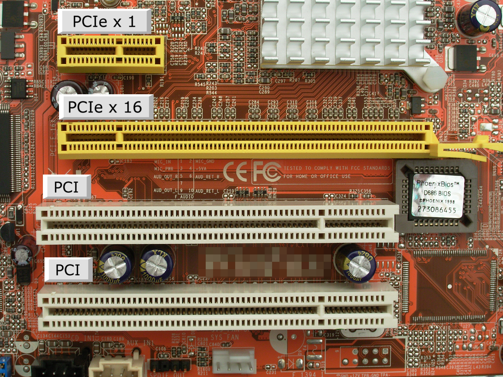
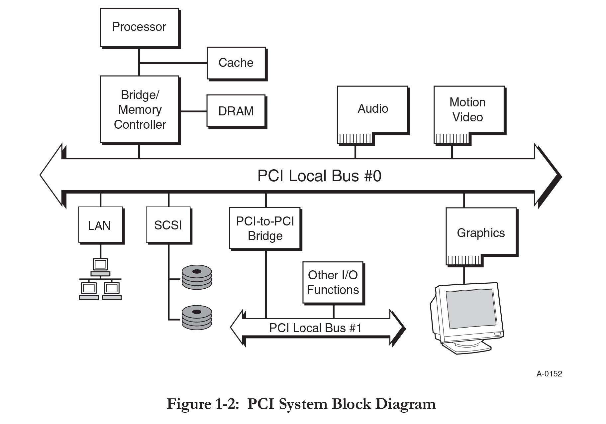
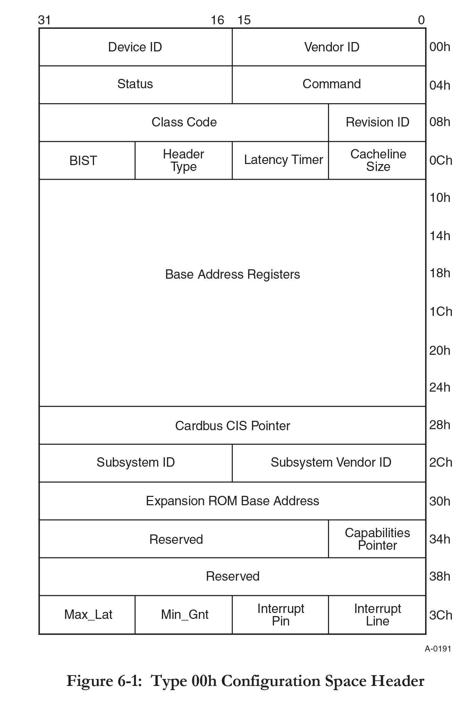
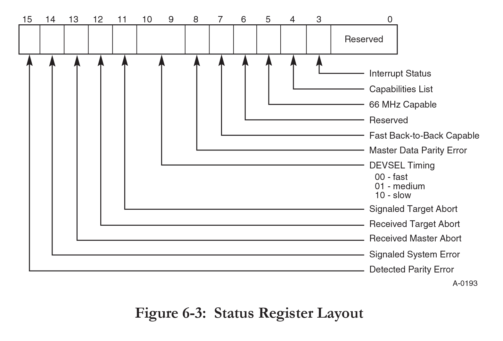
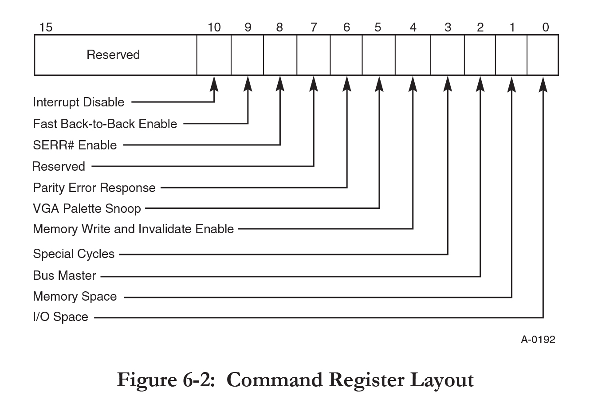

# PCI 总线

PCI Peripheral Component Interconnect [^osdev] 总线用于建立高性能低成本的局部总线，经过几代的发展，使得传输率从 132M/s 到 528 M/s。PCI 总线满足了低端桌面系统和高端局域网服务器的需求。PCI 总线组件和外接卡是处理器独立的。能有效地过渡到未来的处理器，以及与多处理器架构一起使用，多处理器架构也一样。PCI 总线的一个缺点是单总线最大可以驱动 10 个负载。

PCI 的说明文档 (Specifications) 可以在这里 [^specifications] 找到。

## 配置空间

PCI 规范通过单独的配置地址空间为 PCI 总线上的每个设备(或目标)提供了完全由软件驱动的初始化和配置。所有 PCI 设备，除了主机总线桥，都需要为此提供 256 字节的配置寄存器。

配置读写周期用于访问每个目标设备的配置空间。在配置访问期间，当确定目标的 IDSEL 信号时，选择目标。IDSEL 充当经典的片选信号。在配置周期的地址阶段，处理器通过在地址线 2 到 7 (AD[7..2]) 和字节启用行放置所需的寄存器号，可以在配置空间内的 64 个 32 位寄存器中寻址一个。

PCI 设备先天是小端存储的，这意味着所有多字节字段在较低地址具有最低有效值。这需要一个大端处理器(比如 Power PC)来执行对 PCI 设备读写数据的正确字节交换，包括对配置地址空间的任何访问。

系统必须提供一种允许访问 PCI 配置空间的机制，因为大多数 CPU 没有这种机制。这个任务通常由 Host to PCI Bridge(主机桥) 执行。定义了两种不同的机制来允许软件生成所需的配置访问。配置机制 1 是首选方法，而机制 2 是为了向后兼容而提供的。这里只描述配置机制 1，因为它是未来将使用的唯一访问机制。

## 配置机制

使用了两个 32 位的 I/O位置，第一个位置 (`0xCF8`) 被称为 `PCI_CONF_ADDR`，第二个位置 (`0xCFC`) 被称为 `PCI_CONF_DATA`。 `PCI_CONF_ADDR` 指定需要访问的配置地址，而对 `PCI_CONF_DATA` 的访问将实际生成配置访问，并将数据传输到 `PCI_CONF_DATA` 寄存器或从 `PCI_CONF_DATA` 寄存器得到数据。

`PCI_CONF_ADDR` 是一个 32 位寄存器，其格式如下表所示。第 31 位是一个启用标志，用于确定何时应该将对 `PCI_CONF_DATA` 的访问转换为配置周期。第 23 位到第 16 位允许组态软件选择系统中特定的 PCI 总线。第 15 到 11 位选择 PCI 总线上的特定设备。第 10 位到第 8 位用于选择设备中的特定功能(如果该设备支持多种功能)。

最低有效字节选择通过此方法可用的 256 字节配置空间中的偏移量。因为所有的读和写操作都必须是 32 位对齐的， `PCI_CONF_ADDR` 的最低两位必须始终为零，剩下的 6 位允许您选择 64 个 32 位字中的每一个。如果你不需要所有的 32 位，你将不得不在软件中通过对齐地址来执行非对齐访问，然后屏蔽和移位结果。

|   位    |    描述    |
| :-----: | :--------: |
|  0 ~ 7  | 寄存器偏移 |
| 8 ~ 10  |   功能号   |
| 11 ~ 15 |   设备号   |
| 16 ~ 23 |   总线号   |
| 24 ~ 30 |    保留    |
|   31    |   有效位   |

## 检测配置空间访问机制

一般有四种情况:

- 计算机不支持PCI(要么是计算机太旧，要么是您的操作系统在 PCI 被取代后的未来某个时间正在运行)
- 计算机支持机制2
- 计算机支持机制1，但不支持内存映射访问机制
- 计算机同时支持 机制1 和 内存映射访问机制

对于 BIOS 系统，int 0x1A, AX=0xB101 将告诉您系统是使用机制1 还是机制2。如果这个函数不存在，您就不能确定计算机是否支持 PCI。如果它说支持机制1，你就不知道是否也支持内存映射访问机制。

对于 UEFI 系统，假设不支持机制2 是非常安全的，你可以通过检查“PCI总线支持”协议是否存在来测试计算机是否支持 PCI。如果支持 PCI，没有简单的方法来确定(例如)计算机是否支持机制1。

对于 BIOS 和 UEFI 系统，您可以检查 ACPI 表来确定是否支持内存映射访问机制。

这就留下了一些未被发现的情况(例如，你不知道机制1 还是2 是否被支持，尽管你尝试了上面所有的机制)。对于这些情况，唯一的选择就是手动探测。这意味着两个特定的测试—是否支持机制1，如果不支持，是否支持机制2。请注意，手动探测有风险;如果没有 PCI(例如，系统只有 ISA)， IO 端口访问可能会导致未定义的行为(特别是在 ISA 总线忽略 IO 端口地址的最高 6 位的系统上，访问 IO 端口 0xCF8 和访问 IO 端口 0xF8 是一样的)

## PCI 设备结构

PCI 规范定义了 256 字节配置空间寄存器的组织，并为该空间引入了一个特定的模板。图 2 和 3 显示了 256 字节配置空间的布局。所有 PCI 兼容设备必须支持 供应商ID、设备ID、命令和状态、修订ID、类代码 和 报头类型 字段。其他寄存器的实现是可选的，这取决于设备的功能。

- Device ID(设备 ID)：

    标识特定的设备，有效的 ID 由供应商分配

- Vendor ID(供应商 ID)：

    标识设备的制造商。有效的 ID 是由 PCI-SIG [^companies] 分配的，以确保唯一性，`0xFFFF` 是一个无效的值，将在读取不存在设备的配置空间寄存器时返回

- 状态寄存器

    用于记录 PCI 总线相关事件的状态信息（见下文）

- 命令寄存器

    提供对设备生成和响应 PCI 周期的能力的控制。所有设备都支持的唯一功能是，当向该寄存器写入 0 时，除配置空间访问外，都断开设备与 PCI 总线的所有访问连接（见下文）

- Class Code (类型码)：

    一种只读寄存器，它指定设备执行的功能类型

- Subclass (子类型)：

    用于指定设备执行的特定功能

- Prog IF (Programming Interface Byte 编程接口字节)

    一种只读寄存器，它指定设备具有的寄存器级编程接口(如果有的话)

- Revision ID (修订 ID)：

    为特定设备指定修订标识符。有效的id由供应商分配。

- BIST (built-in self test 内置自检)

    表示该状态并允许控制设备 BIST

- Header Type (头类型)

    标识从字节 0x10 开始的头的其余部分的布局，还指定设备是否具有多个功能。其中 0x0 指通用设备，0x1 指 PCI - PCI 桥，0x2 指 CardBus 桥

    如果设置了该寄存器的第 7 位，则设备具有多种功能，否则为单一功能设备

- Latency Timer (延迟计时器)

    以 PCI 总线时钟为单位指定延迟计时器

- Cache Line Size (缓存线大小)

    指定系统缓存行大小，以 32 位为单位。设备可以限制其支持的缓存先大小的数量，如果将不支持的值写入该字段，设备的行为将像写入值为 0 一样

- CardBus CIS 指针

    指向卡信息结构，由 CardBus 和 PCI 之间共享硅的设备使用

- 中断线

    指定设备的中断引脚连接到系统中断控制器的哪个输入，并且由任何使用中断引脚的设备实现。对于 x86 架构，这个寄存器对应于 PIC IRQ 编号0-15(而不是I/O APIC IRQ编号)，0xFF 的值定义没有连接

- 中断引脚

    指定设备使用的中断引脚。其中：

    - 0x1 是 INTA#
    - 0x2 是 INTB#
    - 0x3 是 INTC#
    - 0x4 是 INTD#
    - 0x0 表示设备没有使用中断引脚

- 最大延迟时间

    只读寄存器，指定设备需要访问 PCI 总线的频率(以 1/4 微秒为单位)

- Min Grant

    只读寄存器，指定设备需要的突发周期长度，单位为 1/4 微秒(假设时钟频率为 33 MHz)

- 功能指针

    指向一个由设备实现的新功能链表的指针(即该函数配置空间的偏移量)。如果状态寄存器(能力列表位)的第 4 位设置为 1，则使用。底部的两位是保留的，并且应该在指针被用来访问配置空间之前被屏蔽。

## 状态寄存器

| 位     | 英文                      | 描述               |
| ------ | ------------------------- | ------------------ |
| 0 ~ 2  | Reserved                  | 保留               |
| 3      | Interrupt Status          | 中断状态           |
| 4      | Capabilities List         | 能力列表           |
| 5      | 66 MHz Capable            | 66 MHz 能力        |
| 6      | Reserved                  | 保留               |
| 7      | Fast Back-to-Back Capable | 快速背靠背能力     |
| 8      | Master Data Parity Error  | 主数据校验错误     |
| 9 ~ 10 | DEVSEL Timing             | DEVSEL 计时        |
| 11     | Signaled Target Abort     | 目标终止信号       |
| 12     | Received Target Abort     | 接收到的目标中止   |
| 13     | Received Master Abort     | 接收到的主设备终止 |
| 14     | Signaled System Error     | 系统信号错误       |
| 15     | Detected Parity Error     | 检测到奇偶校验错误 |

- Interrupt Status 中断状态

    表示设备的intx#信号的状态。如果设置为1和10位的命令寄存器(中断禁用位)设置为0，信号将被断言;否则，信号将被忽略。
 
- Capabilities List 能力列表

    如果设置为1，设备实现了一个新的能力链接列表的指针，偏移0x34;否则，链表不可用。

- 66 MHz Capable 66 MHz 能力

    如果设置为1，设备能够在66mhz运行;否则，设备运行在33mhz。

- 第 6 位

    在 PCI 本地总线规范的 3.0 版本中，该位被保留

    在规范的 2.1 版本中，该位用于表示设备是否支持用户自定义功能

- Fast Back-to-Back Capable 快速背靠背能力

    如果设置为 1，设备可以接受不来自同一代理的快速背靠背事务;否则，事务只能从同一个代理接受。

- Master Data Parity Error 主数据校验错误

    只有在满足以下条件时才设置此位。总线代理在读时断言 PERR#，或在写时观察到 PERR# 的断言，设置该位的代理充当发生错误的操作的总线主，命令寄存器的第 6 位(奇偶校验错误响应位)设置为 1。

- DEVSEL Timing DEVSEL 计时

    只读 代表设备对任何总线命令(配置空间读写除外)断言 DEVSEL# 的最慢时间的位，其中
    - 0x0 表示快速计时
    - 0x1 表示中等计时
    - 0x2 表示慢计时

- Signaled Target Abort 目标终止信号

    当目标设备使用目标终止终止一个事务时，该位将被设置为 1

- Received Target Abort 接收到的目标中止

    当它的事务被目标中止终止时，主设备将设置为 1

-  Received Master Abort 接收到的主设备终止

    当它的事务(除特殊周期事务)被主设备设置为 1 时

- Signalled System Error 系统信号错误

    当设备断定 SERR# 时，该位将被设置为 1

- Detected Parity Error 检测到奇偶校验错误

    该位将被设置为 1 每当设备检测到一个奇偶校验错误，即使奇偶校验错误处理被禁用

如前所述，PCI 设备遵循小端序。较低的地址包含字段中最不重要的部分。操作这个结构的软件必须特别注意端顺序要遵循 PCI 设备，而不是 CPU。

## 命令寄存器

| 位      | 英文                               | 描述             |
| ------- | ---------------------------------- | ---------------- |
| 0       | I/O Space                          | I/O 空间         |
| 1       | Memory Space                       | 内存空间         |
| 2       | Bus Master                         | 总线主控         |
| 3       | Special Cycles                     | 特殊周期         |
| 4       | Memory Write and Invalidate Enable |
| 5       | VGA Palette Snoop                  | VGA 调色板窥探   |
| 6       | Parity Error Response              | 奇偶校验错误响应 |
| 7       | Reserved                           |
| 8       | SERR# Enable                       | SERR# 有效       |
| 9       | Fast Back-to-Back Enable           |
| 10      | Interrupt Disable                  | 中断无效         |
| 11 ~ 15 | Reserved                           | 保留             |

- I/O Space  I/O空间

    如果设置为 1，设备可以响应 I/O 空间访问;否则，设备响应被禁用。

- Memory Space 内存空间

    如果设置为 1，设备可以响应内存空间访问;否则，设备响应被禁用。

- Bus Master 总线主控

    如果设置为 1，设备可以表现为总线主控;否则设备无法生成 PCI 访问。

- Special Cycles 特殊周期

    如果设置为 1，设备可以监控特殊周期操作;否则，设备将忽略它们。

- Memory Write and Invalidate Enable

    如果设置为 1，设备可以生成 Memory Write and Invalidate 命令;否则，必须使用 Memory Write 命令

- VGA Palette Snoop VGA 调色板窥探

    如果设置为 1，设备不响应调色板寄存器写，并将窥探数据;否则，设备将像对待所有其他访问一样对待调色板写访问。

- Parity Error Response 奇偶校验错误响应

    如果设置为 1，当检测到奇偶校验错误时，设备将采取其正常的行动; 否则，当检测到错误时，设备将设置状态寄存器的第 15 位(检测奇偶校验错误状态位)，但不会断言 PERR#(奇偶校验错误) 引脚，并将继续正常操作。

- 第 7 位：保留

    在 PCI 本地总线规范的 3.0 修订版中，该位被硬连接到 0。在该规范的早期版本中，该位由设备使用，可能已经硬连接到 0、1 或实现为读/写位

- SERR# Enable SERR# 有效

    如果设置为 1 SERR# 驱动有效;否则，驱动被禁用

- Fast Back-Back Enable

    如果设置为 1，表示允许设备生成快速的背靠背事务; 否则，快速背靠背事务只允许用于同一代理。

- Interrupt Disable 中断禁用

    如果设置为 1，则禁用设备的 INTX# 信号，否则，将启用信号

## 头类型寄存器

| 位    | 描述       |
| ----- | ---------- |
| 0 ~ 6 | 头类型     |
| 7     | 是否多功能 |

## BIST 寄存器

| 位    | 描述      |
| ----- | --------- |
| 0 ~ 3 | 完成码    |
| 4 ~ 5 | 保留      |
| 6     | 开始 BIST |
| 7     | BIST 能力 |

- BIST 能力：设备支持 BIST 时为 1
- 开始 BIST： 设备 BIST 开始后为 1，当 BIST 完成时被清除，若 BIST 开始 2 秒后 BIST 还未结束，表示设备故障；
- 完成码：若 BIST 执行成功后，应该为 0

## 基址寄存器 Base Address Registers (BAR)

基址寄存器(BAR) 可以用来保存设备使用的内存地址，或端口地址的偏移量。通常，内存地址 BAR 需要位于物理 RAM 中，而 I/O 空间 BAR 可以驻留在任何内存地址(甚至超出物理内存)。要区分它们，可以检查最低位的值。下面的表格描述了两种类型的 BAR:

内存空间 BAR 布局
| 位     | 英文                         | 描述           |
| ------ | ---------------------------- | -------------- |
| 0      | Always 0                     | 常为0          |
| 1 ~ 2  | Type                         | 类型           |
| 3      | Prefetchable                 |
| 4 ~ 31 | 16 Byte Aligned Base Address | 16字节对齐基址 |

I/O 空间 BAR 布局
| 位     | 英文                        | 描述          |
| ------ | --------------------------- | ------------- |
| 0      | Always 1                    | 常为 1        |
| 1      | Reserved                    | 保留          |
| 2 ~ 31 | 4-Byte Aligned Base Address | 4字节对齐基址 |

Memory Space BAR Layout 的 Type 字段指定基本寄存器的大小，以及它在内存中的映射位置：

- 0x0，那么基本寄存器是 32 位宽的，可以映射到 32 位内存空间中的任何位置。
- 0x2 的值意味着基址寄存器是 64 位宽的，可以映射到 64 位内存空间中的任何位置(64 位基址寄存器消耗 2 个可用的基址寄存器)
- 0x1 的值在 PCI 本地总线规范3.0版本中保留。在早期版本中，它用于支持 1MB 以下的内存空间(可以映射到 16 位内存空间中的任何位置的 16 位宽基本寄存器)

当基址寄存器被标记为可预取时，这意味着该区域没有读取的副作用(从该内存范围读取不会改变任何状态)，并且允许 CPU 从该内存区域缓存负载并突然读取它(通常是缓存行大小)。硬件还允许将重复存储合并到同一个地址，并将其合并到一个最新值的存储中。如果您正在使用分页并希望获得最大的性能，那么应该将可预取的 MMIO 区域映射为WT(透写) 而不是 UC (不可缓存)。在 x86 上，帧缓冲区是个例外，它们应该总是被映射为 WC(写合并)

## BAR 的地址和大小

当您想要检索 BAR 的实际基址时，请确保屏蔽较低的位。

- 对于 16 位内存空间 BAR，计算(BAR[x] & 0xFFF0)
- 对于 32 位内存空间 BAR，计算(BAR[x] & 0xFFFFFFF0)
- 对于 64 位内存空间 BAR，计算((BAR[x] & 0xFFFFFFF0) + ((BAR[x + 1] & 0xFFFFFFFF) << 32))
- 对于 I/O 空间 BAR，计算(BAR[x] & 0xFFFFFFFC)。

为了确定 PCI 设备需要的地址空间量，您必须保存 BAR 的原始值，将所有值都为 1 的值写入寄存器，然后将其读回来。然后可以通过屏蔽信息位、按位执行 NOT(在 C 中是'~') 并将值加 1 来确定内存的数量。然后应该恢复 BAR 的原始值。BAR 寄存器是自然对齐的，因此您只能修改所设置的位。例如，如果一个设备使用了 16MB，它的 BAR0 将被 0xFF000000 填充(解码后0x1000000)，您只能修改高 8 位。

这是由于 PCI 需要的内存区域全部是 2 的次方，可能是 1K/2K/4K/8K 等等，于是会将写入基地址的低位直接置为 0，如果某个设备需要的内存是 4K，那么内存区域的范围就是 0 ~ 0xfff，那么基地址一定是 0x_x...x000，这样可以将基地址映射到某个地方，比如 0x1000, 0xabcde000，一定不会是 0x1234，或者 0x1bcd123，那么向 BAR 写入 0xffffffff 时，会直接忽略后面的 12 位，结果会变成 0xfffff00x，其中 x 是 BAR 必须要设置的位，再读出时，将 x 变成 0，然后按位取反再加 1，就会的到长度，或者按位取反就能得到 limit。

## 类型码

Class Code、Subclass 和 Prog IF 寄存器分别用来标识设备的类型、设备的功能和设备的寄存器级编程接口。

| 字节 | 说明       |
| ---- | ---------- |
| 0    | Prog IF    |
| 1    | Subclass   |
| 2    | Class Code |

## 处理中断

如果你用的是旧的 PIC，真的很简单。您有头部的 Interrupt Line 字段，它是可读可写的(您可以更改它的值)，它表示当需要注意时哪个中断将触发 PCI 设备

## 多功能设备

多功能设备与普通 PCI 设备的行为方式相同。检测多功能设备最简单的方法是头部类型字段的第 7 位。如果设置了(value = 0x80)，则该设备是多功能的，否则就不是。在确定头类型时，请确保屏蔽此位。要检测功能的数量，您需要扫描每个功能的 PCI 配置空间，未使用的功能的供应商是 `0xFFFF`。不同功能的设备id和类码不同。功能不一定是按顺序排列的，可以只使用功能 0x0、0x1 和 0x7。

## 部分设备

- 0x8086：Intel
    - 0x1237：440FX - 82441FX PMC
    - 0x7000：82371SB PIIX3 ISA
    - 0x100e：82540EM Gigabit Ethernet Controller
- 0x1234：Qemu
    - 0x1111: QEMU Virtual Video Controller

## 延伸阅读

1. <https://en.wikipedia.org/wiki/Peripheral_Component_Interconnect>

## 说明文档

- <https://lekensteyn.nl/files/docs/PCI_SPEV_V3_0.pdf>

## 参考引用

[^osdev]: <https://wiki.osdev.org/PCI>
[^specifications]: <https://pcisig.com/specifications/conventional/>
[^companies]: <https://pcisig.com/membership/member-companies>