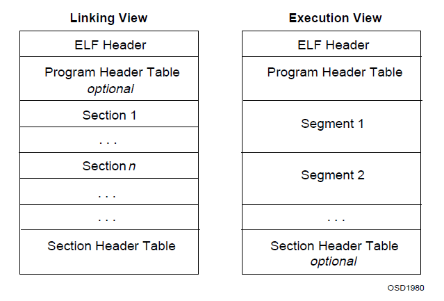

# ELF 文件解析

在二进制基础部分，已经对 ELF [^elf] 文件作了简介，ELF 是 Executable and Linking Format 的缩写，可以分为三种类型：

- 可执行文件 
- 可重定位文件 `.o`
- 共享的目标文件(动态链接库) `.so`

## 可执行文件

可执行文件的内容主要分成三个部分：

- text: 代码段，存储运行时的代码
- data: 数据端，内容不为 0 的数据，需要存储到可执行文件中；
- bss: bss 段，未初始化的数据，内容全部为 0，没有必要存储到文件中，只需要标记占用的大小；

## 文件格式



以上两种视图，给出了 ELF 文件的两种视角：

- 链接视图，从编译器/链接器角度出发，方便将代码组织成可重定位文件或者可执行文件；
- 执行视图，从加载器/运行时角度出发，方便将 ELF 文件加载到内存中执行之；

其中包括：

- ELF 文件头
- 程序头表：程序加载器使用的内容
- 若干段：
    - .text
    - .data
    - .bss
- 节头表：编译器/汇编器/链接器使用的内容

## ELF 文件头

```c++
typedef struct ELFIdent
{
    u8 ei_magic[4];    // 内容为 0x7F, E, L , F
    u8 ei_class;       // 文件种类 1-32位，2-64 位
    u8 ei_data;        // 标记大小端 1-小端，2-大端
    u8 ei_version;     // 与 e_version 一样，必须为 1
    u8 ei_pad[16 - 7]; // 占满 16 个字节
} _packed ELFIdent;

typedef struct Elf32_Ehdr
{
    ELFIdent e_ident;       // ELF 文件标记，文件最开始的 16 个字节
    Elf32_Half e_type;      // 文件类型，见 Etype
    Elf32_Half e_machine;   // 处理器架构类型，标记运行的 CPU，见 EMachine
    Elf32_Word e_version;   // 文件版本，见 EVersion
    Elf32_Addr e_entry;     // 程序入口地址
    Elf32_Off e_phoff;      // program header offset 程序头表在文件中的偏移量
    Elf32_Off e_shoff;      // section header offset 节头表在文件中的偏移量
    Elf32_Word e_flags;     // 处理器特殊标记
    Elf32_Half e_ehsize;    // ELF header size ELF 文件头大小
    Elf32_Half e_phentsize; // program header entry size 程序头表入口大小
    Elf32_Half e_phnum;     // program header number 程序头数量
    Elf32_Half e_shentsize; // section header entry size 节头表入口大小
    Elf32_Half e_shnum;     // section header number 节头表数量
} Elf32_Ehdr;

enum Etype
{
    ET_NONE = 0,        // 无类型
    ET_REL = 1,         // 可重定位文件
    ET_EXEC = 2,        // 可执行文件
    ET_DYN = 3,         // 动态链接库
    ET_CORE = 4,        // core 文件，未说明，占位
    ET_LOPROC = 0xff00, // 处理器相关低值
    ET_HIPROC = 0xffff, // 处理器相关高值
};

enum EMachine
{
    EM_NONE = 0,  // No machine
    EM_M32 = 1,   // AT&T WE 32100
    EM_SPARC = 2, // SPARC
    EM_386 = 3,   // Intel 80386
    EM_68K = 4,   // Motorola 68000
    EM_88K = 5,   // Motorola 88000
    EM_860 = 7,   // Intel 80860
    EM_MIPS = 8,  // MIPS RS3000
};

enum EVersion
{
    EV_NONE = 0,    // 不可用版本
    EV_CURRENT = 1, // 当前版本
};
```

## 程序头

加载和执行程序需要的部分；

```c++
// 程序头
typedef struct Elf32_Phdr
{
    Elf32_Word p_type;   // 段类型，见 SegmentType
    Elf32_Off p_offset;  // 段在文件中的偏移量
    Elf32_Addr p_vaddr;  // 加载到内存中的虚拟地址
    Elf32_Addr p_paddr;  // 加载到内存中的物理地址
    Elf32_Word p_filesz; // 文件中占用的字节数
    Elf32_Word p_memsz;  // 内存中占用的字节数
    Elf32_Word p_flags;  // 段标记，见 SegmentFlag
    Elf32_Word p_align;  // 段对齐
} Elf32_Phdr;

// 段类型
enum SegmentType
{
    PT_NULL = 0,    // 未使用
    PT_LOAD = 1,    // 可加载程序段
    PT_DYNAMIC = 2, // 动态加载信息
    PT_INTERP = 3,  // 动态加载器名称
    PT_NOTE = 4,    // 一些辅助信息
    PT_SHLIB = 5,   // 保留
    PT_PHDR = 6,    // 程序头表
    PT_LOPROC = 0x70000000,
    PT_HIPROC = 0x7fffffff,
};

enum SegmentFlag
{
    PF_X = 0x1, // 可执行
    PF_W = 0x2, // 可写
    PF_R = 0x4, // 可读
};
```

## 相关内容

- [010 进入内核](../01%20系统引导/010%20进入内核.md)
- [011 ELF 文件简介](../02%20二进制基础/011%20ELF%20文件格式简介.md)

## 参考

[^elf]: <https://refspecs.linuxfoundation.org/elf/elf.pdf>
