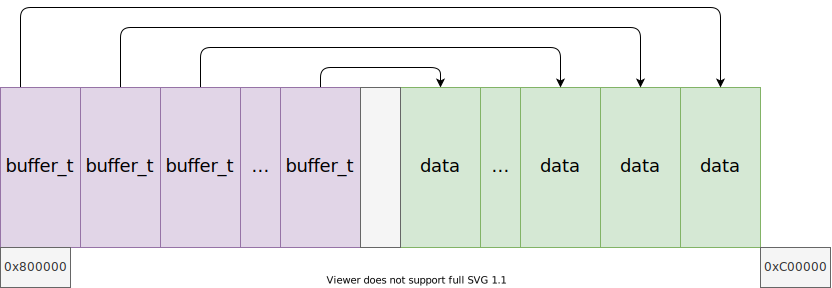

# 哈希表和高速缓冲

## 哈希表概述

哈希表：散列表，以关键字和数据 (key - value) 的形式直接进行访问的数据结构。

- 哈希函数：需要将 key 转换成整型，并且不同的 key 之间尽可能减少冲突；
- 冲突的解决方法：
    - 开放地址法
    - 拉链法
- 平均时间复杂度 $O(1)$
- 装载因子 load factor
- DDoS 攻击

## 高速缓冲

一般来说，性能不同的两个系统之间应该有一个缓冲区；

文件系统以块为单位访问磁盘，块一般是 $2^n, n \in \mathbb{N}$ 个扇区。其中 4K 比较常见；这里我们使用 1K，也就是 2 个扇区作为一块。

高速缓冲将块存储在哈希表中，以降低对磁盘的访问频率，提高性能。

另外还有一个空闲块链表；

## 内存布局

---

## 高速缓冲布局

## 参考

1. [赵炯 / Linux内核完全注释 / 机械工业出版社 / 2005](https://book.douban.com/subject/1231236/)
2. [Maurice J.Bach / UNIX操作系统设计 / 机械工业出版社 / 2000](https://book.douban.com/subject/1035710/)
