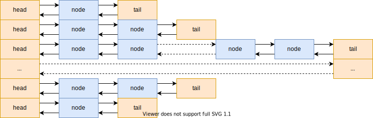

# 创建文件系统

## 高速缓冲补充

- 模运算
- 高速缓冲过程
- 缓存：
    - memcache / redis
- 缓冲：
    - 消息队列 / rabbitMQ / kafka

### 缓冲内存

---

### 哈希表

---

### 空闲链表

## 文件系统

为简单起见，本操作系统使用 minix 第一版文件系统。主要的好处是，可以抄 linux 0.11 的代码。

## 参考

- man mkfs.minix
- man losetup
