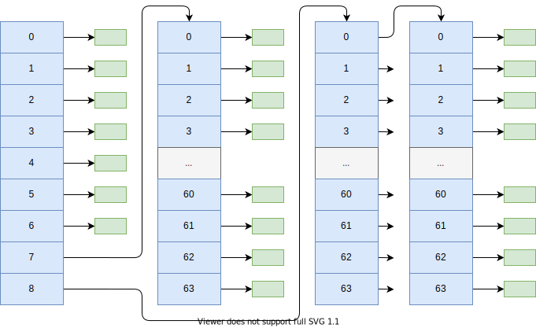

# 文件系统简介

一般常见的文件系统分为两种类型：

- 文件分配表 (File Allocation Table FAT)
- 索引表

minux 文件系统使用索引表结构；

## 块


## inode

```c++
typedef struct inode_desc_t
{
    u16 mode;    // 文件类型和属性(rwx 位)
    u16 uid;     // 用户id（文件拥有者标识符）
    u32 size;    // 文件大小（字节数）
    u32 mtime;   // 修改时间戳 这个时间戳应该用 UTC 时间，不然有瑕疵
    u8 gid;      // 组id(文件拥有者所在的组)
    u8 nlinks;   // 链接数（多少个文件目录项指向该i 节点）
    u16 zone[9]; // 直接 (0-6)、间接(7)或双重间接 (8) 逻辑块号
} inode_desc_t;
```

**勘误：**：文件系统块索引数量应该是 512 个，而不是 64 个



## 超级块

```c++
typedef struct super_desc_t
{
    u16 inodes;        // 节点数
    u16 zones;         // 逻辑块数
    u16 imap_blocks;   // i 节点位图所占用的数据块数
    u16 zmap_blocks;   // 逻辑块位图所占用的数据块数
    u16 firstdatazone; // 第一个数据逻辑块号
    u16 log_zone_size; // log2(每逻辑块数据块数)
    u32 max_size;      // 文件最大长度
    u16 magic;         // 文件系统魔数
} super_desc_t;
```


## 目录

如果inode 文件 是目录，那么文件块的内容就是下面这种数据结构。

```c++
// 文件目录项结构
typedef struct dentry_t
{
    u16 nr;        // i 节点
    char name[14]; // 文件名
} dentry_t;
```

## 参考

1. [赵炯 / Linux内核完全注释 / 机械工业出版社 / 2005](https://book.douban.com/subject/1231236/)
2. <https://wiki.osdev.org/FAT>
