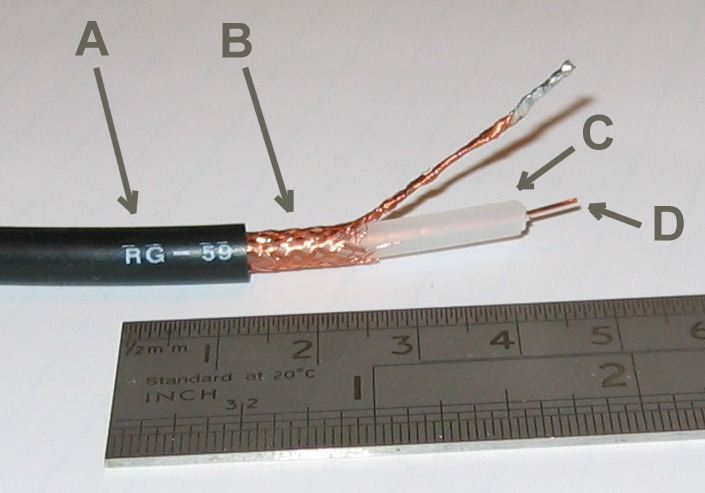
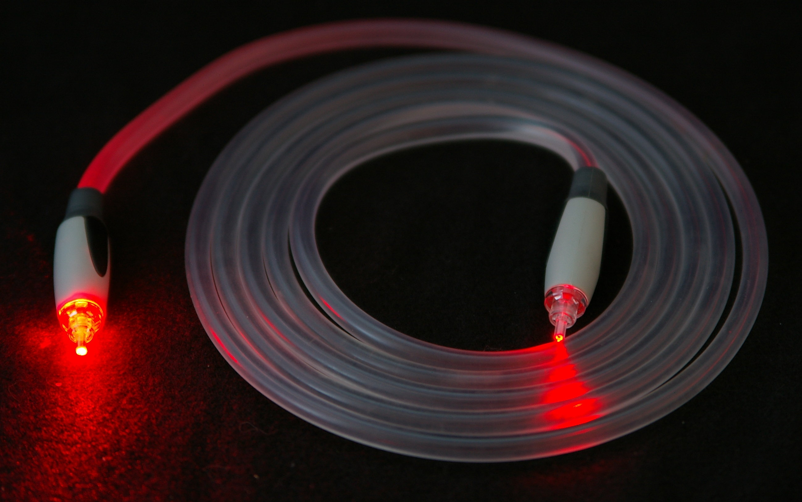

# 通信的基本原理

## 通信

> 通信就是将 **信息** 从 **信源** **传输** 到 **信宿** 的过程；

- 你妈喊你回家吃饭；
- 烽火戏诸侯；
- 调频广播；
- 通过浏览器访问某个网站；

---

- 信息：可以消除不确定性的东西；
- 信源：信息的来源；
- 信宿：信息的归宿；
- 信道：传输信号的媒介；
- 信号：信息的载体；
- 编码：将信息转换为二进制符号；
- 解码：将信号转换为信息；
- 调制：将符号转换为信号；
- 解调：将信号转换为符号；
- 噪声：信道中的不确定因素；
- 冗余：添加在信息中用于纠错或检错的内容；

## 信息论

1948 年，香农发表了《通信的数学原理》 [^shannon]，奠定了信息论的理论基础。

### 信息的度量

如果随机变量 $X$ 的概率密度函数是 $p(x)$ 那么 $X$ 的熵 (Entropy) 定义为 [^information]：

$$
H(X) = \sum_{x \in X} p(x) \log_2{1 \over p(x)}
$$

其中：

- $\log_2 {1 \over p(x)}$ 为 **自信息**，表示特定事件 $x$ 发生带来的信息量比特数，也可以感性的认为是事件 $x$ 发生时的惊讶程度；
- 对于等可能系统 $p(x)$ 是常量，于是 $H(X) = \log_2 W$，其中 $W={1 \over p(x)}$ 为状态的数量；

熵可以看做是随机变量平均不确定性的度量；

> 据说 [^tribus]，香农一开始的研究将 **熵** 称为 **不确定性**，但是在于冯·诺依曼的交流中，冯·诺依曼让香农把不确定性改为熵，原因有两个：
> 
> 1. 不确定性函数已经在统计力学中，用到了熵（克劳修斯，玻尔兹曼）；
> 2. 这更重要，没有人知道熵是什么，所以在讨论中会占到优势；

最大熵：等可能的含义就是 **我们对事实一无所知**；

奥卡姆剃刀：

- 如非必要，勿增实体；
- 最简洁的解释最好；

数据处理不等式：不存在对数据的优良操作，可以使得从数据中获得的推理得到改善

### 熵增原理

- 热力学第一定律：宇宙的能量守恒
- 热力学第二定律：宇宙的熵不减

孤立系统：没有人捣乱，构造一个等可能的分布；熵不减，向平稳状态发展；

信息和熵是对立的，孤立系统的不确定性增加；时间向前走，历史不断产生，产生了很多我们不知道的事实，这些未知的不确定性用 **熵** 来描述。所以熵增可以认为是一个错误逐渐积累的过程，这些错误会在未来的某个时刻变成生活中的问题，需要我们去回答；

> 学如逆水行舟，不进则退；

需要学习，获取信息，**对抗**熵增；

> 时时勤拂拭，勿使惹尘埃；

- 生活的熵增原理 [^just_for_fun]；
- 海森堡不确定性原理，测不准原理；

[^just_for_fun]: L. Torvalds and D. Diamond, 只是为了好玩. <a href="https://book.douban.com/press/2609">人民邮电出版社</a> 2014. Accessed: May 20, 2023. [Online]. Available: https://book.douban.com/subject/25930025/

## 物理层设备

根据 OSI(Open Systems Interconnection) 模型 [^osi] 网络可以分成五层或七层；

[^osi]: <https://en.wikipedia.org/wiki/OSI_model>

- 通信介质：
    - 网卡：
    - 中继器：重复信号，防止衰减
    - 集线器：除了接收线路以外，将信号发送到其他线路；
    - 双绞线：网线
    - 同轴电缆：传输高频信号
    - 光纤
    - 无线电
- 通信协议：
    - 串口：RS-232
    - ADSL
    - 以太网 802.3
    - WiFi 802.11
    - 蓝牙/ZigBee 802.15

### 双绞线

局域网网线使用的是双绞线 [^tp]，其中 **双绞** 表示两根信号线相互缠绕在一起，用以抑制噪声的影响。产生噪声的原因是网线周围的电磁波，当电磁波接触到金属等导体时，在其中就会产生电流。因此，如果网线周围存在电磁波，就会在网线中产生和原本的信号不同的电流。由于信号本身也是一种带有电压变化的电流，其本质和噪声产生的电流是一样的，所以信号和噪声的电流就会混杂在一起，导致信号的波形发生失真，这就是噪声的影响。

[^tp]: <https://en.wikipedia.org/wiki/Twisted_pair>

### 同轴电缆

- A: 外部塑料保护套
- B: 编织铜屏蔽层
- C: 内绝缘体
- D: 铜线

同轴电缆 [^coax] 是一种传输线，用于传输低损耗的高频电信号。它被用于电话干线、宽带互联网、高速计算机数据总线、有线电视信号、无线电发射器和接收器的天线连接线。它与其他屏蔽电缆不同，因为电缆和连接器的尺寸被精确控制，具有恒定的导体间距，这是它作为传输线有效运行所必需的。

[^coax]: <https://en.wikipedia.org/wiki/Coaxial_cable>

### ASDL

ASDL (Asymmetric Digital Subscriber Line) [^network] 表示不对称数字用户线，是一种利用假设在电线杆上的金属电话线来进行高速通信的技术，其上传和下载速率是不对称的。总的带宽一定，一般来说下载会多一点。

ASDL 的信号是由频率组成的，不同的频段、振幅、相位用以传输不同的数据，通过不同频率波的叠加可以传输更多的数据。

[^network]: 户根勤, 网络是怎样连接的. in &nbsp;图灵程序设计丛书·图解与入门系列                          ISBN: 9787115441249. <a href="https://book.douban.com/press/2609">人民邮电出版社</a>                   出品方:      <a href="https://book.douban.com/producers/42">图灵教育</a>                             原作名: ネットワークはなぜつながるのか — 知っておきたいTCP/IP、LAN、光ファイバの基礎知識, 2017. Accessed: May 20, 2023. [Online]. Available: https://book.douban.com/subject/26941639/

### 光纤

光纤 [^fiber] 的原理比较简单，光信号亮表示 1，暗表示 0。经过调制数字信号传换成光信号，接收端有可以感应光线的光敏元件，光敏元件可以根据光的亮度产生不同的电压。当光信号照射到上面时，光亮的时候就产生高电压，光暗的时候就产生低电压，这样就得到了电信号。然后再将电信号转换为数字信号。

光源在所有方向上都会发光，因此会有各种角度的光线进入纤芯，但入射角度太大的光线会在纤芯和包层（纤芯外沿部分）的边界上折射出去，只有入射角较小的光线会被包层全反射，从而在纤芯中前进。

[^fiber]: <https://en.wikipedia.org/wiki/Fiber-optic_cable>

### 无线电

无线电通过电磁波传递信息，利用磁场和电场的组合产生。当导体中通过迅速变化的电流时，导体的周围就会产生磁场，由于磁场也变化，故又产生电场。电场和磁场彼此垂直交错，相继产生，电磁波就此发送出去。天线收到电磁场的变化进而得到传递的信息。

## 参考

[^shannon]: [Shannon, Claude E. "A mathematical theory of communication." The Bell system technical journal 27.3 (1948): 379-423.](https://pure.mpg.de/rest/items/item_2383162_7/component/file_2456978/content)
[^tribus]: M. Tribus and E. C. McIrvine, “Energy and information,” Scientific American, vol. 225, no. 3, pp. 179–190, 1971.
[^information]: T. M. Cove, 信息论基础. in &nbsp;计算机科学丛书                          ISBN: 9787111220404. <a href="https://book.douban.com/press/2793">机械工业出版社</a>                                       原作名: Elements of Information Theory, 2008. Accessed: May 20, 2023. [Online]. Available: https://book.douban.com/subject/2305237/