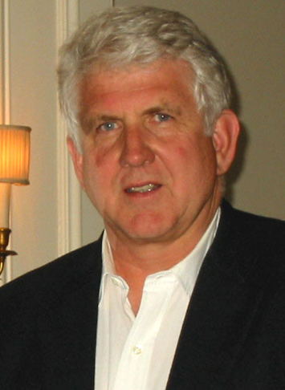
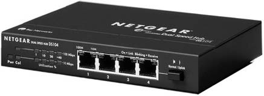
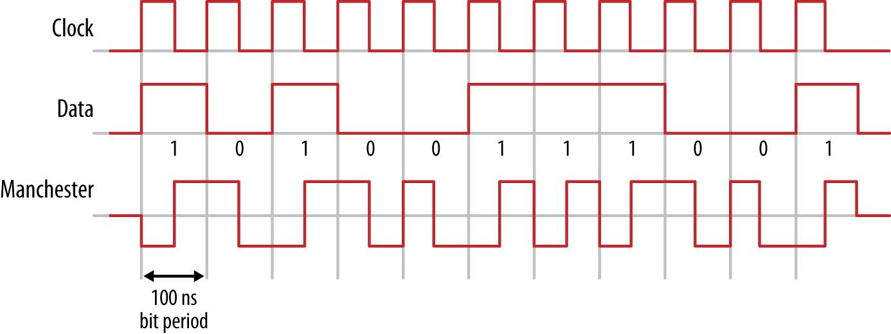

# 以太网协议

## 以太网时间轴

- 1960s，夏威夷大学 Aloha Network [^alhola]

    [^alhola]: <https://en.wikipedia.org/wiki/ALOHAnet>

    当时 诺曼·艾布拉姆森(Norman Abramson) [^norman_abramson] 和他的同事们开发了一个无线电网络，称为 **阿罗哈网络(Aloha network)**，用于在夏威夷群岛之间进行通信。该系统是开发共享公共通信信道机制的早期实验；Aloha 协议非常简单：

    [^norman_abramson]: <https://en.wikipedia.org/wiki/Norman_Abramson>

    Aloha 站点可以随时发送，然后等待确认。如果在很短的时间内没有收到确认信号，该电台就会**认为**另一个电台**同时**发出了信号，从而造成**碰撞**，合并后的信号被**混淆**，接收站听不到，也没有返回确认信号。在检测到碰撞后，两个发射站将选择一个随机的退场时间，然后以良好的成功概率重新传输它们的数据包。然而，随着流量的增加，碰撞率也会迅速增加。初代 Aloha 信道最大利用率只有 18%；

- 1973，施乐公司 Ethernet

    施乐公司的 鲍勃·梅特卡夫(Bob Metcalfe) [^Robert_Metcalfe] 通过改进 Aloha 网络，发明了一种网络系统，该系统用于连接被称为施乐阿尔托斯(Xerox Altos)的先进计算机工作站，使它们之间和高速激光打印机之间的数据传输成为可能；

    

    [^Robert_Metcalfe]: <https://en.wikipedia.org/wiki/Robert_Metcalfe>

    他开发了一个新的系统，其中包括：

    - 一个检测碰撞发生的机制 **(碰撞检测 Collision Detection)**；
    - 一个 **先听后说** 机制，即电台在发射前先听 **(载波感知 carrier sense)**；
    - 支持多个电台访问共享频道 **(多路访问 multiple access)**；

    将所有这些组件结合在一起，就得到了以太网指定的原始通道访问协议被称为带有 **碰撞检测的载波感知多路访问(CSMA/CD)** 协议。Metcalfe 还开发了一种更复杂的回退算法，该算法与 CSMA/CD 协议相结合，使以太网系统能够以高达 100% 的负载运行。

    > Metcalfe 将这个网络命名为 Ethernet；

- 1976，Ethernet: Distributed Packet Switching for Local Computer Networks [^ethernet0]；

- 1979，Metcalfe 开始着手使以太网成为一个开放标准，施乐公司同意加入一个多厂商联盟，目的是标准化一个任何公司都可以使用的以太网系统。基于以太网技术的开放式计算机通信时代正式开始于 1980 年，当时数字设备公司(Digital Equipment Corporation DEC)、英特尔(Intel) 和 施乐(Xerox) 联盟宣布了第一个 10Mb/s 以太网标准 [^ethernet1]。最初的 DIX 标准没有版权，允许任何人复制和使用它；

- 1979，Metcalfe 成立了一家公司，帮助以太网商业化。他认为，来自多个厂商的计算机应该能够通过一种共同的网络技术进行兼容的通信，使它们更有用，进而为用户提供一套巨大的新功能。**计算机通信兼容性( COMputer COMmunication COMpatibility)** 是 Metcalfe 的目标，这让他将自己的新公司命名为 3COM [^com3]，3COM 公司后来与华为成立 H3C (Huawei3Com) 公司，2008 年被惠普收购，2015 年被紫光收购，更名新华三。

    [^com3]: <https://en.wikipedia.org/wiki/3Com>

- 1980.2，IEEE (Local Area Network Standards Committee) 局域网标准会议首次召开，开启了一系列 802.x 协议；

- 1980，双绞线以太网被发明，在此之前的通信媒介是同轴电缆，同轴电缆以太网系统采用总线拓扑，其中每台计算机通过一条总线电缆发送以太网信号，电缆上任何一个地方出现故障都会导致整个网络系统中断，而排除电缆故障可能需要很长的时间；

- 1982，施乐公司也放弃了以太网名称的商标。因此，以太网标准成为世界上第一个开放的多厂商局域网标准；

- 1985，IEEE 802.3 Carrier Sense Multiple Access with Collision Detection (CSMA/CD) Access Method and Physical Layer Specification [^ethernet2]；

    [^ethernet2]: “IEEE Standards for Local Area Networks: Carrier Sense Multiple Access With Collision Detection (CSMA/CD) Access Method and Physical Layer Specifications,” ANSI/IEEE Std 802.3-1985, p. 0_1-, 1985, doi: 10.1109/IEEESTD.1985.82837.

    开始 IEEE 并没有使用 Ethernet 作为名字，而是 **802.3**，今天标准改成了 IEEE Standard for Ethernet；

- 1985，802.3c：10Mb/s 中继器标准；

- 1990，802.3i：针对建筑物中的双绞线布线系统制定了结构化布线系统标准，使基于电话行业采用的高可靠性、低成本布线的建筑物范围内的双绞线系统成为可能；

- 1995，802.3u：创建了 100Mb/s 的以太网系统标准，引入自动协商协议，自动设置速度。这使得从 10Mb/s 到 100 Mb/s 以太网系统的迁移很容易完成；

- 1997，802.3x：全双工标准；

- 1998，802.3ac：创建了 1000Mb/s 的以太网系统标准，基于双绞线和光纤；

- 2002，802.3ae：创建了 10Gb/s 基于光纤的以太网系统标准，不再依赖 CSMA/CD 控制系统，所有网络运行在全双工模式；

- 2006，802.3an：创建了 10Gb/s 基于双绞线的以太网系统标准；

- 2010，802.3az：节能的以太网标准；

- 2010，802.3ba：40 Gb/s 和 100 Gb/s 的以太网标准；

- 2022，802.3cs：IEEE Standard for Ethernet Amendment 2: Physical Layers and Management Parameters for Increased-Reach Point-to-Multipoint Ethernet Optical Subscriber Access (Super-PON)

## 以太

就像声音在空气中传播一样，光以太 [^aether] 被猜测为光（电磁波）的传输媒介，1887 年，迈克尔逊-莫雷实验证实光以太不存在。Metcalfe 选择 ether 表示一种传输比特的媒介；

[^aether]: <https://en.wikipedia.org/wiki/Luminiferous_aether>

## 以太网系统

以太网由四个部分组成：

- 帧：标准化的一组比特，用于在系统中传输数据；
- 媒体访问控制协议(Media Access Control protocol)：由一组嵌入在每个以太网接口中的规则组成，这些规则允许以太网站以半双工或全双工模式访问以太网信道；
- 信号组件：通过以太网信道发送和接收信号的标准化电子设备；
- 物理媒介：用于在连接到网络的计算机之间传输数字以太网信号的物理介质、电缆和其他硬件；

* 尽力而为

### 以太网帧

- 前导码：用于 10Mb/s 的硬件识别帧的开始，提示它开始接收数据，好比，设备清了清嗓子，开始说话了。新版的设备运行在更快的速度，实际已经无需前导码，但为了兼容性仍然保留了前导码。
- 目标地址/源地址：物理地址，也叫 MAC(Media Access Control) 地址，供应商为其生产的设备提供唯一的 MAC 地址；
- 类型/长度：大多数情况下，此字段用于识别上层协议的类型，一般是 (IP 0x0800),(ARP 0x0806)，如果值 <= 1500，则描述数据包的长度，若值 >= 1536(0x0600) 则表示类型，中间的空洞未定义；
- 数据：至少 需要 46 字节，最小长度保证了帧信号在网络上停留足够长的时间，使原始 10Mb/s 半双工系统中的每个以太网站点，都能在正确的时间限制内收到到帧。如果数据字段中携带的高级协议数据小于46 字节，则使用填充数据填充数据字段，一般会在后面补 0。
- CRC 校验和：帧的最后 4 字节是 帧校验序列(FCS Frame Check Sequence)，使用循环冗余校验码(CRC Cyclic Redundancy Check) 检测数据的完整性。

### 媒体访问控制协议

最初的 10Mb/s 半双工媒体访问控制协议 (Media Access Control Protocol MACP) 相当简单，每个以太网设备在网络上相互独立，没用中心控制节点，设备通过网线以半双工模式彼此连接，由于是半双工，所以需要 CSMA/CD 机制控制访问。

以太网使用广播机制，意思是每个以太网帧会传输到网络中的所有设备，这看起来确实低效，但是优点是设备实现相当简单。目标设备只需要匹配地址，如果不是传输给自己的数据包就丢弃。这显然有安全隐患（ARP 欺骗，MAC 泛洪攻击），不过这是后话了，先让机器跑起来再说。

在发送数据包前，设备首先监听信道，如果信道空闲，设备通过以太网帧传输数据。然后网络上的所有设备开始匹配目标地址，如果目标地址匹配，那么将继续接收数据，如果不匹配，则停止接收；当然设备可以设置 **混杂模式**，这样就可以接收所有发送到网络上的数据包了。

以太网还支持多播和广播，广播目标地址的二进制全为 1，这是一个相当特殊的 mac 地址。

CSMA/CD 协议的功能像是在一个黑暗的房间里聊天，所有的参与者只能听，在说话之前，所有人必须等待一段时间没人说话，这个过程叫 (Carrier Sense 载波感知)，当空窗期出现，所有人有均等的几乎开始说话 (Multiple Access 多路访问)，一旦有两个以上的人同时说话，它们将检测到并闭嘴(Collision Detection 碰撞检测)。

对于以太网设备来说，CS 部分意味着所有设备需要等待网络上没有信号，如果有设备进行传输，那么信道上就会有信号，这种状态叫做 载波(Carrier)，其他设备必须等待传输结束，一旦传输结束，所有设备 MA 都可以访问信道传输数据，但是一旦检测到碰撞 CD，设备将会等待一个随机的时间之后尝试重传。碰撞解决的时间一般在微妙级别。

依赖载波感知，信道空闲时传输结束，高速以太网有着特殊的结束检测机制，数据包开始和结束有特殊的信号。

### 信号组件

- 双绞线

    

- 集线器(Repeater Hub)

    

- 交换机

    

    交换机将每个连接设备的 2 层地址都存储在一个 CAM(Content Addressable Memory：内容寻址寄存器) 表中，CAM 表充当着一种类似交通警察的角色。当一个数据包被传输时，交换机读取数据包中的第 2 层协议头部信息，并使用 CAM 表作为参考，决定往哪个或哪些端口发送数据包。交换机仅仅将数据包发送到特定端口上，从而大大降低了网络流量，不过网络拓扑随时可能发生变化，所以表中的信息会有一个有效期限。

### 硬件编码

10 Mb/s 系统使用相当简单的信号编码方式 **曼彻斯特编码** [^manchester]，最初来自曼彻斯特大学，如下图所示，每个二进制位的传输在一个时钟周期内，上升沿表示 1，下降沿表示 0。编码的信号就只需要与时钟进行异或，即可得到数据的值。

[^rj45]: <https://en.wikipedia.org/wiki/Registered_jack>
[^manchester]: <https://en.wikipedia.org/wiki/Manchester_code>

### 以太网接口

现在，以太网一般通过一个 RJ45 [^rj45] 接口连接，水晶头的连接方式有两种类型：

- T568A：绿白/绿/橙白/蓝/蓝白/橙/棕白/棕
- T568B(首选)：橙白/橙/绿白/蓝/蓝白/绿/棕白/棕

对不同的 802.3 标准来说，其中一部分传输(TX)，一部分接收(RX)，也可能有一些线没有用到(Reserved)；

## 延伸阅读

关于以太网的更多内容，请参考 [^charles]。

## 参考

[^charles]: Charles E. Spurgeon & Joann Zimmerman - 《Ethernet The Definitive Guide》
[^ethernet0]: R. M. Metcalfe and D. R. Boggs, “Ethernet: Distributed packet switching for local computer networks,” Communications of the ACM, vol. 19, no. 7, pp. 395–404, 1976.
[^ethernet1]: The ethernet: a local area network: data link layer and physical layer specifications SIGCOMM Comput. Commun. Rev., vol. 11, no. 3, pp. 20–66, Jul. 1981, doi: 10.1145/1015591.1015594.
