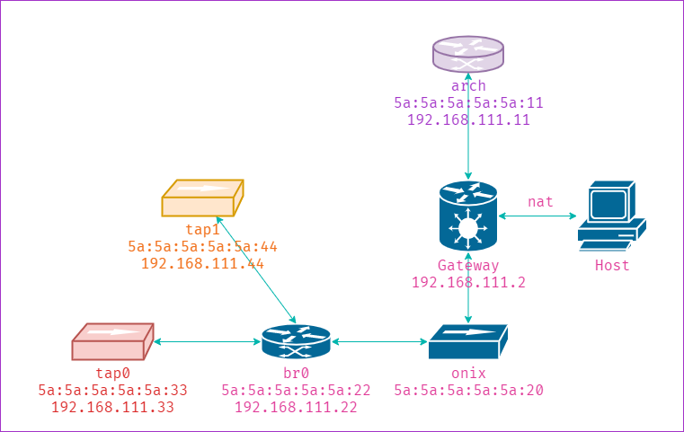

# 基础网络配置

## 打印网络地址

- %b: 打印二进制
- %m: 打印 mac 地址
- %r: 打印 ip 地址

## 测试网络配置

测试网络需要一个新的网卡，以避免正常的通信中断，测试网卡修改网卡名称为 `onix` [^netname]，修改方法有两种：

### 方法一

修改一下文件：

```
/etc/systemd/network/10-onix.link
```

写入其中的内容：

```shell
[Match]
PermanentMACAddress=5a:5a:5a:5a:5a:20

[Link]
Name=onix
```

### 方法二

或者，修改文件：

```
/etc/udev/rules.d/10-network.rules
```

其中的内容：

```
SUBSYSTEM=="net", ACTION=="add", ATTR{address}=="5a:5a:5a:5a:5a:20", NAME="onix"
```

## 测试网络拓扑

网络的拓扑如下图所示：



其中：

- Host 表示 Windows 主机；
- Gateway 是 VNet8 网卡用于虚拟机和主机之间以 NAT 通信；
- arch 表示 Archlinux 默认网卡；
- onix 表示 新添加的网卡；
- br0 是一个网桥 [^bridge]，可以粗略的理解为虚拟交换机；
- tap0/tap1 是 tap 设备 [^tuntap] [^scapy_tuntap]，可以用于应用程序操作二层数据包；经过配置普通用户也可以访问，无需 root 权限，方便调试；这两个设备是完全相同的，不过，一般情况下 tap0 用于 qemu，tap1 用于调试数据包的发送。

## iptables 配置

另外还需要让 iptables [^iptables] 允许 br0 接受/发送/转发 数据包，不然会有离奇的 bug [^bug0]。

```
sudo iptables -A FORWARD -i br0 -o br0 -j ACCEPT
sudo iptables -A INPUT -i br0 -o br0 -j ACCEPT
sudo iptables -A OUTPUT -i br0 -o br0 -j ACCEPT
```

## Scapy

Scapy [^scapy] 是一个 Python 程序，可以用于网络包的发送和嗅探。可以很容易的对其编程，以供调试网络之用。

## Wireshark

Wireshark [^wireshark] 可能是最流行的网络数据包分析工具了，应该无需多做解释。

## 参考

[^netname]: <https://wiki.archlinux.org/title/Network_configuration#Change_interface_name>
[^bridge]: <https://wiki.archlinux.org/title/network_bridge>
[^tuntap]: <https://www.kernel.org/doc/html/v5.8/networking/tuntap.html>
[^scapy_tuntap]: <https://scapy.readthedocs.io/en/latest/layers/tuntap.html>
[^scapy]: <https://scapy.readthedocs.io/en/latest/index.html>
[^iptables]: <https://wiki.archlinux.org/title/Iptables>
[^bug0]: https://superuser.com/questions/1211852/why-linux-bridge-doesnt-work
[^wireshark]: <https://www.wireshark.org/>
