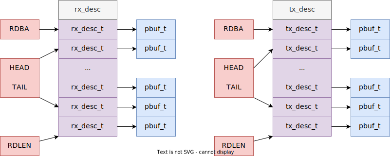

# 数据包高速缓冲

这是一种缓存机制，我们应该尽可能避免调用 `memcpy` 函数。

- MTU(Maximum Transmission Unit) [^mtu] [^rfc894]：1500

[^mtu]: <https://en.wikipedia.org/wiki/Maximum_transmission_unit>
[^rfc894]: <https://datatracker.ietf.org/doc/html/rfc894>

## e1000 收发机制

## 参考

- <https://savannah.nongnu.org/projects/lwip/>
- <https://github.com/ringgaard/sanos>
