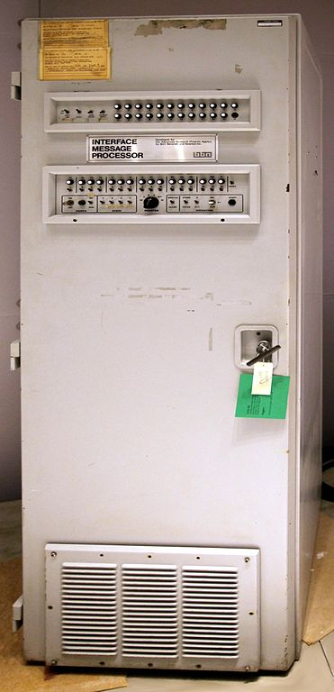

# 网络协议简介

> 协议：通信双方需要共同遵守的规则；

## 网络简介

IP(Inter-net Protocol)

- IP 地址：标识网络中主机，长度 4 字节，带有地理信息；
- 子网掩码：标识那些 IP 地址应该在子网（局域网）中；
- 网关(Gateway)：连接另一网络的节点；
- 转发：多网络设备，从一个网络收到的数据，发送到另一个网络中；
- 路由：从网络中寻找一条从 `src` 到 `dst` 路径；
- LAN(Local Area Network): Ethernet、WiFi；
- WAN(Wide Area Network)；

## ARPAnet

1950s，美国国防部(United States Department of Defense DoD)，成立了高级研究计划局(Advanced Research Projects Agency ARPA)；

1966, J. C. R. Licklider, Bob Taylor 发起了 ARPAnet [^arpanet] 项目，项目主管是 Larry Roberts，想法是在远程计算机之间共享资源，为了应对来自苏联的核威胁，还需要网络能够在部分瘫痪的情况下继续运转，但这应该是兰德公司的一个谣言。

1969, Kleinrock 等人建立了 ARPAnet，这可以称为世界上首个广域网 (Wide Area Network WAN)，此时协议为 1822 协议，以**线路交换** (Circuit Switch) 方式连接，此时计算机通过一个外部的小型计算机 (Interface Message Processor IMP) 相连，类似于现在的路由器，以执行链路状态路由，可靠的消息转发。前四个 IMP:

- 加州大学伯克利分校 (UCLA)
- 斯坦福大学
- 加州大学圣巴巴拉分校 (UCSB)
- 犹他大学计算机学院

|                                    |                             |
| ---------------------------------- | --------------------------- |
|  |  |

1822 协议基本上由 消息类型、数字主机地址 和 数据字段 组成。为了向另一主机发送消息，发送主机格式化了包含 目标主机地址 和 消息数据，然后通过硬件接口发送该消息。然后，IMP 将消息传递到其目标地址，方法是将消息传递到本地连接的主机，或将其传递到另一个 IMP。当消息最终传递到目标主机时，目标 IMP 会将 **准备接收下一条消息(Ready for Next Message RFNM)** 的确认信号发送到源主机 IMP。

1969，实现了远程登陆 Telnet [^rfc15]，并在 RFC855 [^rfc855] 中扩展。

[^rfc15]: <https://datatracker.ietf.org/doc/html/rfc15>
[^rfc855]: <https://datatracker.ietf.org/doc/html/rfc855>

1970, 实现了 **网络控制协议(Network Control Protocol NCP)**，1822 协议被证明不足以处理不同应用程序之间的多个连接。网络控制协议解决了此问题；NCP 是一种单工协议，它使用两个端口号，建立两个连接，用于双向通信。为每个应用层应用程序或协议保留一个奇数端口和一个偶数端口。NCP 是 Berkeley 套接字接口的前身。NCP 最开始是 Network Control Program 的缩写，但是开发 TCP 协议时，需要它的前身一个名字，于是缩写的含义就被改成了 Network Control Protocol。

1971 实现了文件传输(FTP) [^rfc114] [^rfc354]；

[^rfc114]: <https://datatracker.ietf.org/doc/html/rfc114>
[^rfc354]: <https://datatracker.ietf.org/doc/html/rfc354>

1973 实现了电子邮件(SMTP) [^rfc524] [^rfc561]，电子邮件在 ARPAnet 中占据了很大比例；

[^rfc524]: <https://datatracker.ietf.org/doc/html/rfc524>
[^rfc561]: <https://datatracker.ietf.org/doc/html/rfc561>

1980，美国国防部将 TCP/IP 协议作为所有军用计算机网络的标准通信协议。

1983，TCP/IP 协议成为阿帕网的标准，取代了早期的 NCP。

1990, ARPAnet 正式退役。

[^arpanet]: <https://en.wikipedia.org/wiki/ARPANET>
[^arpanet1]: <https://www.youtube.com/watch?v=7tG7LZgOb-U>

## Requests for Comments

为了改进 ARPAnet，史蒂夫·克罗克（Steve Crocker）于 1969 年发明设计了一个系统来鼓励和促进开发 ARPAnet 工程师之间的交流，这个系统至今仍在使用，RFC 现已成为互联网规范、通信协议、程序和事件的官方文档。它依赖于请求评论(Requests for Comments RFC)来提供工程师之间的反馈和协作。RFC 是由工程师、工程师团队或仅仅是有更好想法的人撰写的一篇论文，用于定义一项新技术或增强现有技术。

> RFC: 描述一种新协议或技术的文章；

提交 RFC 的过程被设计成张贴技术理论的 **公告板**。老派的写论文或写书的方法太慢了。RFC 提供了一种非正式和快速的方式来共享新技术和增强的想法。在 RFC 编写和发布之后，其他工程师和开发人员可以对其进行评估、批评和使用。如果其他工程师或开发人员可以改进理论或标准，RFC 提供了一个开放的论坛。这些论文很多都很长，技术性很强，大多数情况下对于睡眠困难的人来说是很好的阅读材料。

RFC 可以提交给 因特网工程任务组(Internet Engineering Task Force IETF)进行审查。IETF 的工程师审阅提交的论文，并给每篇论文分配一个编号。从那时起，RFC 编号成为论文的有效名称。例如，第一个 RFC 是关于主机软件的，称为 RFC1 [^rfc1]。RFC1 是 Steve Crocker 在 1969 年提交的。最新(2023-06-14)的是 RFC9412 [^rfc_index]。

随着 ARPAnet 的发展和研究人员和工程师的改进，他们使用 RFC 作为加强和确保网络基础的工具。TCP/IP 是 RFC 开发的产物。

[^rfc1]: <https://datatracker.ietf.org/doc/html/rfc1>
[^rfc_index]: <https://www.rfc-editor.org/rfc-index.html>

## TCP/IP

1973 年，Vint Cerf 等设计了协议 [^rfc675]，可以称为 TCP/IPv1； 

[^rfc675]: <https://datatracker.ietf.org/doc/html/rfc675>

1974 年，两位互联网先驱 Vint Cerf 和 Bob Kahn 发表了 **分组网络互连协议** [^tcpip0]。文章介绍了传输控制协议(Transmission Control Protocol TCP)，它是协议套件中的一个协议，最终将取代 NCP。

|                           |                          |
| ------------------------- | ------------------------ |
|  |  |

[^tcpip0]: [V. Cerf and R. Kahn, "A Protocol for Packet Network Intercommunication," in IEEE Transactions on Communications, vol. 22, no. 5, pp. 637-648, May 1974, doi: 10.1109/TCOM.1974.1092259.](https://www.cs.princeton.edu/courses/archive/fall06/cos561/papers/cerf74.pdf)

TCP 协议描述了通信的主机到主机部分。TCP 解释了两台主机如何建立这种通信，以及它们如何在传输数据时彼此保持联系。NCP 没有像 TCP 那样解决这些问题。

直到 1978 年，网络的发展产生了一套新的协议，称为 TCP/IP 协议。1982 年，TCP/IP 取代 NCP 作为 ARPAnet 的标准语言。RFC 801 [^rfc801] 描述了从 NCP 到 TCP 的转换是如何发生的以及为什么发生。1983 年 1 月 1 日，ARPAnet 切换到 TCP/IP，网络呈指数级增长。

[^rfc801]: <https://datatracker.ietf.org/doc/html/rfc801>

1980 年，RFC760 [^rfc760] IP 协议，RFC761 [^rfc761] TCP 协议，RFC768 [^rfc768] 定义了 UDP 协议；

[^rfc760]: <https://datatracker.ietf.org/doc/html/rfc760>
[^rfc761]: <https://datatracker.ietf.org/doc/html/rfc761>
[^rfc768]: <https://datatracker.ietf.org/doc/html/rfc768>

1981 年，RFC791 [^rfc791] IPv4，RFC793 [^rfc793] TCP 协议；

[^rfc791]: <https://datatracker.ietf.org/doc/html/rfc791>
[^rfc793]: <https://datatracker.ietf.org/doc/html/rfc793>

1990 年，ARPAnet 推出了历史的舞台。Internet 已经从 ARPAnet 发展起来，TCP/IP 不断发展使之满足 Internet 不断变化的需求。

## 参考

- Andrew G. Blank - TCP/IP JumpStart Internet Protocol Basics (2002)
- Michael A. - On the way to the Web the secret history of the Internet and its founders (2008)
- Johnny Ryan - A History of the Internet and the Digital Future (2010)
