# CRC 校验和

CRC(Cyclic Redundancy Check) 循环冗余校验码 [^crc] 常用于数字网络和存储设备的检错，来保证数据的完整性。

互联网协议校验和的计算定义在 RFC1071 [^rfc1071]。

为了应对突发错误：报文中连续的错误数据符号序列。这一点很重要，因为突发错误是许多通信信道中常见的传输错误。包括磁性介质和光学存储介质；

## Hardware Offload

为了提高网络传输的效率，一般会将校验和的计算交给网卡；可以使用 ethtool [^ethtool] 来控制网卡的相关功能。但是我没有找到相关的功能让 Linux 来计算 校验和，比如 [^bug0]；

## Frame Check Sequence



以太网数据包的最后四个字节被认为是帧校验序列(Frame Check Sequence FCS)，通过对前面所有数据的计算得到一个 4 字节的值，发送前写入 FCS 字段，接收方收到后重新进行计算，如果计算结果不匹配（数据计算结果不为零）则认为数据在传输的过程中出错，如果出错则丢弃数据包；

计算方法：

```c++
#define CRC_POLY 0xEDB88320

u32 eth_fcs(void *data, int len)
{
    u32 crc = -1;
    u8 *ptr = (u8 *)data;
    for (int i = 0; i < len; i++)
    {
        crc ^= ptr[i];
        for (int j = 0; j < 8; j++)
        {
            if (crc & 1)
                crc = (crc >> 1) ^ CRC_POLY;
            else
                crc >>= 1;
        }
    }
    return ~crc;
}
```

## 循环冗余校验码

代数编码：编码就找到一一对应关系；

- 循环码：
    - 线性码
    - 循环移位后的码还是码

### 基础定义

设：

- 数据 $D$，长度 $k$ 比特；
- 帧 $T$，长度 $n$ 比特；
- FCS 为 $F$，长度 $n - k$ 比特；
- 除数 为 $P$，$n - k + 1$ 比特的块；

预先确定的 $P$ 应该能整除码字 $T$，因此 $T \bmod P = 0$，没有余数；

码字 $T$ 可以表示为：

$$
T = 2^{n - k}D + F
$$

其中 $2^{n - k}D$ 的结果将 $D$ 向左移 $n - k$ 位；现在我们求 $F$ 使得 $T \bmod P = 0$；

设：

$$
{T \over P} = {2^{n - k}D \over P} + {F \over P} = Q + {R \over P} +  {F \over P} = Q + {R + F \over P}
$$

其中对于前一项 $Q$ 是商，$R/P$ 是余数；

现在要求 $R + F$ 整除 $P$，朴素的想法是直接令 $R + F = 0$，于是 $F = -R$ 或 $F = R$，这是由于，对于 $GF(2)$，$R + R = 0$，（对于程序员的一个提醒：这里的 $+$ 运算等于按位异或）。

设当 $T$ 通过有噪信道传输时发生了错误 $E$，接收到的码字为

$$
V = T + E
$$

仅当 $V$ 完全被 $P$ 整除时，CRC 方案不能检测错误，相当于 $E$ 完全被 $P$ 整除时，CRC 方案不能检测错误。

### 多项式定义

CRC 码也可以用多项式表示来定义；

设消息多项式为 $D(x)$，预先确定的除数为 $P(x)$，于是：

$$
{x^{n - k}D(x) \over P(x)} = Q(x) + {R(x) \over P(x)}
$$

$$
T(x) = x^{n-k} D(x) + R(x) 
$$

在接收端，将收到的码字除以 $P(x)$，假设收到的码字是

$$
V(x) = T(x) + E(x)
$$

其中 $E(x)$ 是错误多项式，则有：

$$
{T(x) + E(x) \over P(x)} = {E(x) \over P(x)} 
$$

因为 $T(x)/P(x)=0$，那些正巧包含 $P(x)$ 为一个因子的错误将会溜掉，其余的将在 CRC 译码器上捕捉到。多项式 $P(x)$ 又称为 CRC 码的生成多项式。CRC 码又称为多项式码 (Polynomial Code)。

> 假设要传输的码字发生 $1$ 比特错误。错误多项式 $E(x)$ 可以表示为 $E(x)=x^i$, 其中 $i$ 决定错误比特的位置。如果 $P(x)$ 包含两个或两个以上的项，则 $E(x)/P(x)$ 一定不为零。因此 CRC 码可以捕获所有 1 比特错误；


> 假设发生了 $2$ 比特的错误，即 $E(x)=x^i+x^j, i>j$，我们也可以写成 $E(x) = x^j(x^{i - j} + 1)$。如果我们选择 $P(x)$ 不能被 $x$ 整除，那么可以检测所有两个错误的充分条件是对所有不大于 $i-j$ 的值 $k$（即帧的长度），$P(x)$ 都不能整除 $x^k + 1$。例如对所有小于 $32768 = 2^{15}$ 的 $k$ 值， $x^{15} + x^{14} + 1$ 都将不整除 $x^k + 1$ 。

CRC 码的另一个有趣的特点是它的检测突发错误的能力，一个长为 $k$ 的突发错误可以表示为：

$$
x^i(x^{k - 1} + x^{k - 2} + \cdots + 1) = x^iE(x)
$$

其中 $i$ 决定突发错误在接收到的码字从右端数有多远；

如果 $P(x)$ 有 $x^0$ 项，则它不含因子 $x^i$，故若 $E(x)$ 的次数小于 $P(x)$ 的次数，则余数永远不可能为零。因此一个有 $r$ 个校验比特的多项式码，可以检测到所有长度 $k \leqslant r$ 的突发错误；如果突发错误的长度 $k = r + 1$，当且仅当突发错误与 $P(x)$ 完全一样时，它除以 $P(x)$ 的余数为零，一个突发错误的第一个和最后一个比特必须为 $1$, 中间的比特可以为 $1$ 或 $0$。因此突发错误与 $P(x)$ 的完全吻合决定于中间的 $r-1$ 个比特。在没有其他条件的情况下，我们假如所有的组合都是等可能的，遗漏的概率为 $1 \over 2^{r -1}$；我们可以证明当长度 **大于** $r + 1$ 的突发错误发生时，或几个短的突发错误发生时，一个坏帧被漏掉的概率为 $1 \over 2^r$

### 国际标准

- CRC-12: $P(x) =x^{12} + x^{11} + x^3 + x^2 + x^1 + 1$
- CRC-16: $P(x) =x^{16} + x^{15} + x^2 + 1$
- CRC-CCITT: $P(x) =x^{16} + x^{15} + x^5 + 1$
- CRC-32: 

$$
\begin{aligned}
P(x) =& x^{32} + x^{26} + x^{23} + x^{22} + x^{16} + x^{12} + x^{11} \\
+& x^{10} +  x^8 +  x^7 + x^5 + x^4 + x^2 + x^1 +  1
\end{aligned}
$$

所有这四个多项式都含有 $(x + 1)$ 作为一个因子，假设错误多项式有奇数个项（对应于奇数个错误）。一种有趣的现象是在二元算数（即模 $2$ 运算）下，没有一个含奇数个项的多项式以 $x + 1$ 作为一个因子。把 $(x + 1)$ 作为 $P(x)$ 的一个因子，则可以捕捉到所有由奇数个比特组成的错误，也就是可以捕获一半的错误。

其中 CRC-32 的 $P(x)$ 写成二进制为：

`0b1_0000_0100_1100_0001_0001_1101_1011_0111 = 0x104C11DB7`

## 多项式的除法

计算：

$$
\begin{array}{lr} 
& 3x^2 + \ \ 2x + \ \ 5 \\ 
4x^3 + 5x^2 +  9x + 12 \!\!\! & \overline{) \ 12x^5 + 23x^4 + 57x^3 + 79x^2 + 69x + 60} \\ 
& \underline{12x^5 + 15x^4 + 27x^3 + 36x^2 \ \ \ \ \ \ \ \ \ \ \ \ \ \ \ \ \ \ \ \ } \\ 
&  8x^4 + 30x^3 + 43x^2 + 69x \ \ \ \ \ \ \ \ \  \\
& \underline{8x^4 + 10x^3 + 18x^2 + 24x \ \ \ \ \ \ \ \ \ } \\ 
& 20x^3 + 25x^2 + 45x + 60 \\
& \underline{20x^3 + 25x^2 + 45x + 60} \\ 
& 0x^3 +\ \ 0x^2 + \ \ 0x + \ \ 0  \\
\end{array}
$$

## 参考

- Ranjan Bose & 武传坤 -《信息论、编码与密码学》
- https://github.com/Michaelangel007/crc32
- http://ross.net/crc/download/crc_v3.txt
- https://commandlinefanatic.com/cgi-bin/showarticle.cgi?article=art008

[^crc]: <https://en.wikipedia.org/wiki/Cyclic_redundancy_check>
[^rfc1071]: <https://datatracker.ietf.org/doc/html/rfc1071>
[^ethtool]: <https://man7.org/linux/man-pages/man8/ethtool.8.html>
[^bug0]: <https://stackoverflow.com/questions/60684565/c-crc32-checksum-does-not-match-wireshark-on-ethernet-frame-check-sequence>
