# 以太网协议实现

## 网络协议栈

## MAC 地址

MAC Address(Media Access Control Address)，MAC 地址就是在媒体接入层上使用的地址，也叫物理地址，其被固化在网卡的 ROM 中。MAC 地址长度为 6 字节，48 位；该地址由 IEEE 管理，可以通过 IEEE 购买注册 MAC 地址 [^regauth]；其前 3 个字节表示组织唯一标志符 (Organizationally Unique Identifier，即 OUI)，由 IEEE 的注册管理机构给不同厂家分配的代码，以区分不同的厂家，后 3 个字节由厂家自行分配，称为扩展标识符 (Company ID CID)。同一个厂家生产的网卡中 MAC 地址后 24 位是不同的。

## Length/Type

如果值 <= 1500，则描述数据包的长度，若值 >= 1536(0x0600) 则表示类型，中间的空洞未定义；

具体值参考 [^802]，其中比较重要的有：

- 0x0800：IPv4 协议
- 0x0806：ARP 协议
- 0x86DD：IPv6 协议

## 参考

- IEEE Std 802.3™-2015 (Revision of IEEE Std 802.3-2012), IEEE Standard for Ethernet
- [LwIP 应用开发实战指南](https://doc.embedfire.com/products/link/zh/latest/tutorial/ebf_lwip_tutorial.html)

[^regauth]: https://standards.ieee.org/products-programs/regauth/
[^802]: https://www.iana.org/assignments/ieee-802-numbers/ieee-802-numbers.xhtml#ieee-802-numbers-1
