# ARP 协议

ARP(Address Resolution Protocol) 协议定义在 RFC826 [^RFC826]，用于解析局域网中 IP 地址对应的 MAC 地址。

另外，还有 RARP(Reverse Address Resolution Protocol) 协议，定义在 RFC903 [^RFC903]，用于解析 MAC 地址对应的 IP 地址；

## ARP 报文



```c++
typedef struct arp_t
{
    u16 hwtype;       // 硬件类型
    u16 proto;        // 协议类型
    u8 hwlen;         // 硬件地址长度
    u8 protolen;      // 协议地址长度
    u16 opcode;       // 操作类型
    eth_addr_t hwsrc; // 源 MAC 地址
    ip_addr_t ipsrc;  // 源 IP 地址
    eth_addr_t hwdst; // 目的 MAC 地址
    ip_addr_t ipdst;  // 目的 IP 地址
} _packed arp_t;
```

其中：

- 硬件类型 `1` 表示以太网
- 协议类型 `0x0800` 表示 IPv4
- 操作类型：
    - 1：请求
    - 2：回复

## 网络协议栈



ARP 协议放在 **网络层** 不太合适，更多的认为它是 **数据链路层** 的协议，这是有争议的，但这种分类意义不大，它更像是网络层和数据链路层的胶水，使两层能够联系起来。

## 参考

[^RFC826]: <https://datatracker.ietf.org/doc/html/rfc826>
[^RFC903]: <https://datatracker.ietf.org/doc/html/rfc903>
