# IP 协议

IP 协议定义在 RFC791 [^rfc791]：

> The Internet Protocol is designed for use in interconnected systems of packet-switched computer communication networks.

因特网（互联网）协议是为了连接 **分组交换** 的计算机网络通信系统而设计的；

## IP 地址

IP 地址的分类定义在 RFC990 [^rfc990]，不过已经被 CIDR(Classless Inter-Domain Routing) [^rfc4632] 无类别域间路由 替代，这样可以实现；VLSM(Variable Length Subnet Mask) 可变长子网掩码，方便子网的管理。

公网 IP 地址的分配由 Internet Assigned Numbers Authority (IANA) [^iana] 管理，将网络号码分配给不同地区的管理机构 [^ip_addr]，2019-11-25 IPv4 地址耗尽 [^ipv4_exhaustion]；

| 类别 | 第一个字节二进制 | 第一个字节范围 | 网络个数 | 主机个数 |
| ---- | ---------------- | -------------- | -------- | -------- |
| A    | 0xxx xxxx        | 0~127          | 125      | 16777214 |
| B    | 10xx xxxx        | 128~191        | 16368    | 65534    |
| C    | 110x xxxx        | 192~223        | 2097152  | 254      |
| D    | 1110 xxxx        | 224~239        |
| E    | 1111 xxxx        | 240~255        |

### 私有地址

| 地址块         | 地址空间                      | 地址数量 |
| -------------- | ----------------------------- | -------- |
| 10.0.0.0/8     | 10.0.0.0 ~ 10.255.255.255     | 16777216 |
| 172.16.0.0/12  | 172.16.0.0 ~ 172.31.255.255   | 1048576  |
| 192.168.0.0/16 | 192.168.0.0 ~ 192.168.255.255 | 65536    |

### 受限广播地址

`255.255.255.255`

### 多播地址

多播允许单个主机同时通过互联网向数个主机发送数据流。它通常用于音频和视频流，例如基于 IP 的有线电视网络。

### 环回地址

`127.0.0.0/8`，一般是 `127.0.0.1`

### 本机地址

`0.0.0.0`

### 本网络地址

`0.0.0.0/8`

## IP 数据报

- 版本(Version)：4 bit，该值为 4，表示 IPv4；
- 头长度(Internet Header Length IHL)：4 bit，表示 IP 数据包头（黄色部分）的长度 / 4；如果没有选项，头长度为 20 / 4 = 5；所以 IP 头最长为 15 * 4 = 60；
- 服务类型 (Type of Service TOS)：8bit, 用于指示数据包的延迟，吞吐量、可靠性等；
- 总长度 (Total Length)：16bit，数据包的总长度，包括 IP头 和 数据区域；
- 标识 (Identification)：16bit，分片编号
- 标志(Flags)：3bit：
    - 0 bit: 保留
    - 1 bit: 0：可能分片，1：不分片
    - 2 bit: 0：最后一个分片，1：不是最后一个分片
- 分片偏移 (Fragment Offset)：13bit，表示当前分片所携带的数据在整个 IP 数据报中的相对偏移位置；
- 生存时间(Time to Live TTL)：8bit，用于防止 IP 包出现在循环网络中，IP 数据包每经过一个路由器，该值减一，如果 TTL 为 0，则丢弃，同时可能返回一个 ICMP 消息，表示目标不可达；
- 上层协议: 8bit，1：ICMP 6：TCP 17：UDP
- 校验和：用于检测IP头是否出错，与数据区域无关；
- 选项：0 ~ 40 字节；如果没有对齐到 4 字节，最后需要填充 0 对齐到 3 字节，因为头长度的单位是 4 字节；

## IP 校验和

IP 校验和定义在 [^rfc1071]：

- 将待校验和的相邻两字节配对形成 16 位整数，并对其求和取反；

- 为了生成校验和，校验和字段本身置位 0，然后计算校验和并填入其中；

- 要检查校验和，对所有数据计算校验和，如果结果为 0（求和结果全为 1，取反为 0），则正确；

### 一些性质

- 具有交换律和结合律
- 字节序无关
- 延迟进位
- 增量更新

## 网络栈

## 参考

- https://www.iana.org/assignments/protocol-numbers/protocol-numbers.xhtml
- https://en.wikipedia.org/wiki/Reserved_IP_addresses

[^rfc791]: <https://datatracker.ietf.org/doc/html/rfc791>
[^rfc990]: <https://datatracker.ietf.org/doc/html/rfc990>
[^rfc1071]: <https://datatracker.ietf.org/doc/html/rfc1071>
[^rfc4632]: <https://datatracker.ietf.org/doc/html/rfc4632>
[^iana]: <https://www.iana.org/numbers>
[^ip_addr]: <https://www.iana.org/assignments/ipv4-address-space/ipv4-address-space.xhtml>
[^ipv4_exhaustion]: <https://en.wikipedia.org/wiki/IPv4_address_exhaustion>
