# ICMP 协议

ICMP (Internet Control Message Protocol) Internet 控制报文协议，定义在 RFC792 [^rfc792]，用于在主机之间传递控制消息，比如测试网络连通性，主机是否可达，路由是否可用等，虽然没有传输信息，但是确实网络中很重要的协议。

## ICMP 数据报

不同类型的数据报格式有所不同，具体参考 RFC792；

## ICMP 类型

- 0：Echo Replay，查询应答
- 3：Destination Unreachable Message，目标不可达
- 8：Echo，查询

## 协议栈

## 参考

- <https://en.wikipedia.org/wiki/Internet_Control_Message_Protocol>
[^rfc792]: <https://datatracker.ietf.org/doc/html/rfc792>
