# TCP 协议简介

TCP(Transmission Control Protocol) 传输控制协议，最新的定义在 RFC9293[^rfc9293]；

TCP 协议为了在不可靠的 IP 协议上提供可靠的字节流而设计的协议，它有很多机制：

- 连接机制
- 确认重传
- 滑动窗口
- 拥塞控制

## TCP 报文

说明：

- 头长度：TCP 头部长度，单位 4 字节，数据长度 = IP 数据长度 - TCP 头长度；
- 紧急指针：用于紧急数据；
- 选项：MSS(Maximum Segment Size)，最大分段大小，一般为 1460 (IP_MTU(1500) - IP_HDR(20) - TCP_HDR(20))

标志位的说明：

- **F**IN: Finish，没有更多的数据发送，序列号用于终止连接
- **S**YN: Synchronize，序列号用于同步建立连接
- **R**ST: Reset，连接重置
- **P**SH: Push，提交功能
- **A**CK: Acknowledgement，确认号有效
- **U**RG: Urgent，紧急指针有效

下面两个是后加的 [^rfc3168]，用于显式拥塞控制：

- **E**CE: ECN(Explicit Congestion Notification)-Echo，显式拥塞响应
- **C**WR: Congestion Window Reduced，拥塞窗口减少

## 协议栈

## 参考

[^rfc9293]: <https://datatracker.ietf.org/doc/html/rfc9293>
[^rfc3168]: <https://datatracker.ietf.org/doc/html/rfc3168>
