# TCP 客户端连接

## 三次握手

## TCP 状态转移图

## 初始序列号

关于 ISN(Initial Sequence Number) **初始序列号** 的选择在 RFC9293 [^isn] 中有讨论，主要注意的地方有两点：

- 尽力防止连接断开恢复之后，旧连接的数据包，影响到新连接；
- 防止攻击者恶意攻击；

## 其他

由于需要测试的过程中需要重复使用服务端连接，需要做一些配置 [^timewait]，其中的原理需要等到 TCP 连接断开后再做解释；

## 参考

[^timewait]: <https://stackoverflow.com/questions/6380057/python-binding-socket-address-already-in-use>
[^isn]: <https://datatracker.ietf.org/doc/html/rfc9293#name-initial-sequence-number-sel>
