# TCP 选项

当 TCP 头长度大于 20 (头长度字段 > 5) 时，表示 TCP 包含选项：

RFC9293 [^option] 中说明 TCP 实现 **必须**：

- MUST-69：TCP 选项列表结尾必须用 0 填充到四字节对齐；

- MUST-4：必须支持如下选项：

    | 类型 | 名称 | 长度 | 描述         |
    | ---- | ---- | ---- | ------------ |
    | 0    | EOL  | -    | 选项结束     |
    | 1    | NOP  | -    | 无操作       |
    | 2    | MSS  | 4    | 最大分段尺寸 |

- MUST-5：必须在任何段中都支持接收 TCP 选项；

- MUST-6：必须忽略任何它没有实现的 TCP 选项而不会出错；

- MUST-68：除 EOL 和 NOP 选项外，所有的选项必须有 长度(length) 字段，包括所有未来的选项；

- MUST-7：必须准备处理不合法的选项长度，比如 0，推荐的做法是重置连接并记录日志；

## EOL

| 类型 |
| ---- |
| 0    |

表示选项列表结束；

## NOP

| 类型 |
| ---- |
| 1    |

此选项一般用于占位，保证后面的选项对齐；

- MUST-64：接收方必须处理没有对齐机器字的选项；

## MSS

| 类型 | 长度 | 值  |
| ---- | ---- | --- |
| 2    | 4    | -   |

在建立连接的时候（`SYN` 标志位有效），用于告知对方，最大分段尺寸；

- MUST-65：除建立连接以外的数据包，必须没有此选项；
- MUST-14：**必须** 实现 MSS 选项；
- MUST-15：**必须** 假设默认 MSS，IPv4 为 (576 - 40)，IPv6 为 (1280 - 60)；
- MUST-16：有效 MSS **必须** 小于等于接收方的 MSS (可能因为 TCP/IP 选项挤占了一部分)；

## 其他选项

- SACK：(Selective Acknowledgment) 选择确认 [^rfc2018]；
- WS：(Window Scale) 窗口扩大 [^ws]；
- ECHO：回显 [^echo]；
- TS：(Timestamps) 时间戳 [^ts]；

## TCP 重置

作为一般规则，当一个明显不是为当前连接准备的段到达时，就会发送 Reset(RST)，如果不清楚是这种情况，则不能发送重置；

1. 如果连接不存在（`CLOSED`），则发送重置，以响应除 `RST` 和 `SYN` 之外的任何传入段。如果传入段设置了 `ACK` 位，则复位从该段的 ACK 字段中取其序列号；否则，复位序列号为 0, `ACK` 字段设为传入序列号与数据长度之和；连接保持在 `CLOSED` 状态；

2. 如果连接处于任何非同步状态(`LISTEN`, `SYN-SENT`, `SYN-RECEIVED`)，并且传入段确认尚未发送的内容 (段携带不可接受的 `ACK`)，或者传入段的安全级别或分区与连接请求的级别和分区不完全匹配，则发送重置；如果传入段有 `ACK` 字段，则复位从该段的 `ACK` 字段中取其序列号；否则，复位序列号为 0，`ACK` 字段设为传入序列号与数据长度之和；连接保持在相同的状态；

3. 如果连接处于同步状态 (`ESTABLISHED`, `FIN-WAIT-1`, `FIN-WAIT-2`, `CLOSE-WAIT`, `CLOSING`, `LAST-ACK`, `TIME-WAIT`)，任何不可接受的段 (窗口外序列号或不可接受的确认号) 都必须用一个空的确认段(没有任何用户数据) 来响应，其中包含当前发送序列号和指示下一个预期接收序列号的确认，并且连接保持在相同的状态；如果传入段的安全级别或分区与连接请求的级别和分区不完全匹配，则发送重置，连接进入 `CLOSED` 状态。重置从传入段的 `ACK` 字段中获取序列号；

## 处理重置

在除 `SYN-SENT` 之外的所有状态下，所有的重置 `RST` 段都是通过检查其 `SEQ` 字段来验证的，如果其序列号在窗口中，则重置是有效的，在 `SYN-SENT` 状态 (响应初始 `SYN` 时接收到的 `RST`)，如果 `ACK` 字段确认该 `SYN`，则 `RST` 是可接受的；

接收方首先对 `RST` 进行验证，然后改变状态，如果接收方处于 `LISTEN` 状态，则忽略它，如果接收方处于 `SYN-RECEIVED` 状态，并且之前处于 `LISTEN` 状态，则接收方返回到 `LISTEN` 状态；否则，接收方终止连接并进入 `CLOSED` 状态，如果接收方处于任何其他状态，则终止连接并通知用户并进入 `CLOSED` 状态；

TCP 实现应该允许接收到的 `RST` 段包含数据 **SHLD-2**。有人建议 RST 段可以包含解释 RST 原因的诊断数据。目前还没有为这类数据建立标准；

## 参考

[^option]: <https://datatracker.ietf.org/doc/html/rfc9293#name-specific-option-definitions>
[^rfc2018]: <https://datatracker.ietf.org/doc/html/rfc2018>
[^ws]: <https://datatracker.ietf.org/doc/html/rfc7323#section-2>
[^ts]: <https://datatracker.ietf.org/doc/html/rfc7323#section-3>
[^echo]: <https://datatracker.ietf.org/doc/html/rfc1072>
