# TCP 窗口管理

## 滑动窗口

## 两种机制

- Nagle 算法：发送端有很多小块数据，直接发送会产生很多，那么可以缓存到一起发送；
- 糊涂窗口综合征：接收端接收窗口很小，而发送端有很多数据发送的时候，会产生很多数据包；

## 持续计时器

在连接对端通告接收窗口为 0, 阻止 TCP 继续发送数据时设定。由于连接对端发送的窗口通告不可靠（只有数据才会被确认， ACK 不会被确认），允许 TCP 继续发送数据的后续窗口更新有可能丢失。因此，如果 TCP 有数据要发送，但对端通告接收窗口为 0, 则持续定时器启动，超时后向对端发送 1 字节的数据，判定对端接收窗口是否已打开。与重传定时器类似，持续定时器的值也是动态计算的，取决于连接的往返时间，在 5 秒到 60 秒之间取值；

## 保活计时器

在应用进程选取了插口的 `SO_KEEPALVE` 选项时生效。如果连接的连续空闲时间超过 2 小时，保活定时器超时，向对端发送连接探测报文段，强迫对端响应。如果收到了期待的响应， TCP 可确定对端主机工作正常，在该连接再次空闲超过 2 小时之前，TCP 不会再进行保活测试。如果收到的是其他响应，TCP 可确定对端主机已重启。如果连续若干次保活测试都未收到响应，TCP 就假定对端主机已崩溃，尽管它无法区分是主机故障（例如，系统崩溃而尚未重启），还是连接故障（例如，中间的路由器发生故障或电话线断了）；

## 参考

- TCP/IP 详解 卷2：实现
