# TCP 拥塞控制

路由器（网关）因无法处理高速率到达的流量而被迫丢弃数据包的现象称为 **拥塞**；

为了缓解这一情况，TCP 的通信双方实行 **拥塞控制机制**；

针对丢包的情况，TCP 采取的机制是重传，包括 **超时重传** 和 **快速重传**；

## 拥塞检测

当拥塞状况出现（或将要出现）时，我们可以减缓 TCP 发送端的发送速率；但没有一个明确的信号告知拥塞状况已发生。只能来推断拥塞发生，通常是看是否有 **丢包发生**；

一般通过观察收到重复的 ACK 来检测丢包发生，当收到乱序数据包时，接收方会向发送方发送 ACK，以明确想要得到的数据；

## 慢启动

在传输初始阶段，由于未知网络传输能力，需要缓慢探测可用传输资源，防止短时间内大量数据注入导致拥塞。慢启动算法正是针对这一问题而设计。在数据传输之初或者重传计时器检测到丢包后，需要执行慢启动。

慢启动的目的是，使 TCP 在用拥塞避免探寻更多可用带宽之前得到 cwnd 值，以及帮助 TCP 建立 ACK 时钟。

每个好的 ACK 到来时 cwnd 的值加一个 mss，直到出现丢包，确定慢启动阈值；

$$
\text{cwnd}_{t+1} = \text{cwnd}_{t} + \text{mss}
$$

## 拥塞避免

一旦 cwnd 超过慢启动阈值，意味着可能有更多的资源用于传输，于是进入线性增长阶段，每收到一个好的 ACK，cwnd 做如下更新：

$$
\text{cwnd}_{t+1} = \text{cwnd}_{t} + \text{mss} \times \text{mss} / \text{cwnd}_{t}
$$

## 快速重传和快速恢复

快速重传：当丢包开始出现时，不一定是网络出现了拥塞，不用等到重传定时器超时，此时立刻重传数据包，可能就会恢复正常；

快速恢复：发生丢包时，需要重新慢启动，但是在快速重传之后，会将拥塞窗口置为线性增加阈值，然后重新线性增加；

## 参考

- TCP/IP 详解 卷1：协议
- TCP/IP 详解 卷2：实现
