# DHCP 协议

DHCP (Dynamic Host Configuration Protocol) 动态主机配置协议，定义在 RFC2131 [^rfc2131]，提供了一种 TCP/IP 网络传递配置信息的框架，DHCP 基于 Bootstrap Protocol(BOOTP) [^rfc951]，加入了自动分配可重用网络地址和添加配置选项的功能。DHCP 基于 UDP 协议客户端端口号为 68，服务端端口号为 67。

## DHCP(BOOTP) 报文



```c++
typedef struct dhcp_t
{
    u8 op;            // BOOTP 操作类型
    u8 htype;         // 硬件类型，以太网为 1
    u8 hlen;          // 硬件长度，以太网为 6
    u8 hops;          // 数据包每经过一个路由器加 1
    u32 xid;          // Transaction ID，随机数，用于匹配消息请求和响应对应
    u16 secs;         // seconds 请求开始的时间
    u16 flags;        // 最高位 1 << 15，表示广播
    ip_addr_t ciaddr; // client ip address 客户端 IP 地址，如果客户端知道自己的的 IP 则填入，否则为 0
    ip_addr_t yiaddr; // your ip Address 响应 IP 地址
    ip_addr_t siaddr; // server ip address 服务端地址
    ip_addr_t giaddr; // relay agent ip address
    u8 chaddr[16];    // client hardware address
    u8 sname[64];     // host name 服务器主机名
    u8 file[128];     // boot file name 引导文件名
    u32 magic;        // 魔数
    u8 options[0];    // 选项
} _packed dhcp_t;
```

```c++
enum
{
    DHCP_BOOTREQUEST = 1, // BOOTP 请求
    DHCP_BOOTREPLY = 2,   // BOOTP 响应
};
```

## DHCP 选项

DHCP 的选项定义在 RFC2132 [^rfc2132]；


```c++
// DHCP 消息类型
enum
{
    DHCP_DISCOVER = 1, // 客户端 发现 DHCP 服务器
    DHCP_OFFER = 2,    // 服务器相应 DISCOVER 报文，以及提供一些配置参数
    DHCP_REQUEST = 3,  // 客户端请求配置，或租借续期
    DHCP_DECLINE = 4,  // 客户端向服务器说明网络地址已被使用
    DHCP_ACK = 5,      // 服务器对 REQUEST 报文的响应，包括网络地址；
    DHCP_NAK = 6,      // 服务器对 REQUEST 报文的相应，表示网络地址不正确或者租期超限；
    DHCP_RELEASE = 7,  // 客户端要释放地址来通知服务器
    DHCP_INFORM = 8,   // 客户端向服务器，只要求本地配置参数，客户端已经有外部配置的网络地址；
};
```

## 参考

[^rfc2131]: <https://datatracker.ietf.org/doc/html/rfc2131>
[^rfc951]: <https://datatracker.ietf.org/doc/html/rfc951>
[^rfc2132]: <https://datatracker.ietf.org/doc/html/rfc2132>
