# DNS 域名解析

到目前为止，我们使用 IP 地址来识别主机。对大众来说，这些地址太烦琐而难以使用和记忆，因此互联网支持使用主机名称(hostname) 来识别包括客户机和服务器在内的主机。为了使用如 TCP/IP 等协议，主机名称通过称为 **名称解析** 的过程转换成 IP 地址。在互联网中存在不同形式
的名称解析，但是最普遍、最重要的一种是采用分布式数据库系统，即人们熟知的域名系统(DNS Domain Name System)。

DNS 使用 UDP 或 TCP 协议，端口号为 53，一般先使用 UDP 查询，如果出错，再使用 TCP 协议；

## DNS 协议

DNS协议定义在 RFC1035 [^rfc1035]；

### 名称和标签

假设查询的域名为 `www.example.com`：

### 查询的格式

### 回答的格式

### 资源记录类型

- A: IPv4 地址；
- AAAA: IPv6 地址；
- CNAME: (Canonical NAME) 规范名称，用于只想另一个域名；

## 参考

- TCP/IP详解 卷1：协议
- DNS 与 BIND

[^rfc1035]: <https://datatracker.ietf.org/doc/html/rfc1035>
